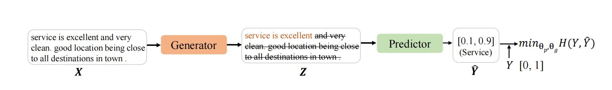
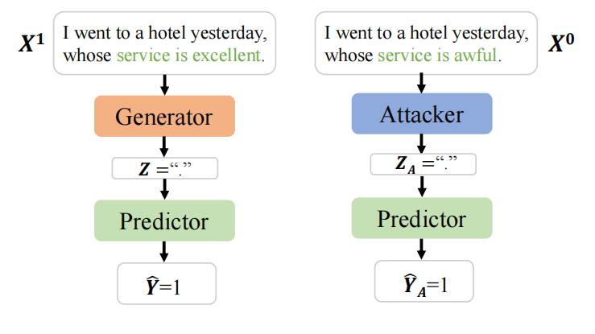
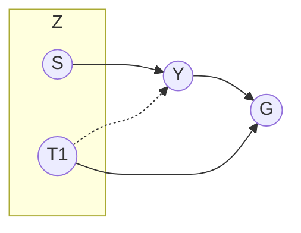
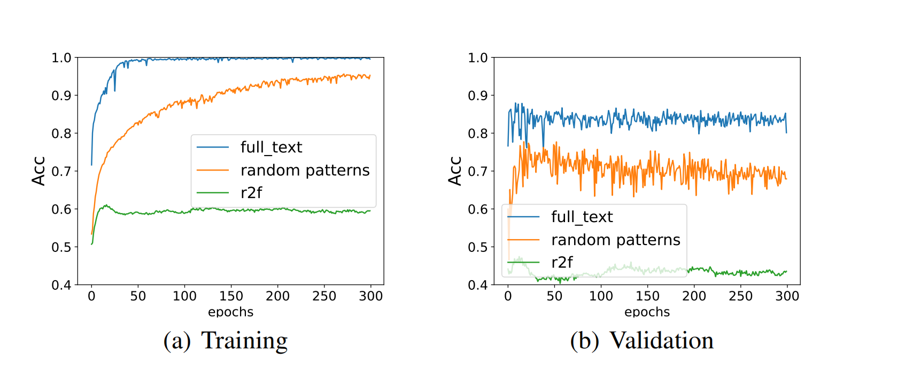
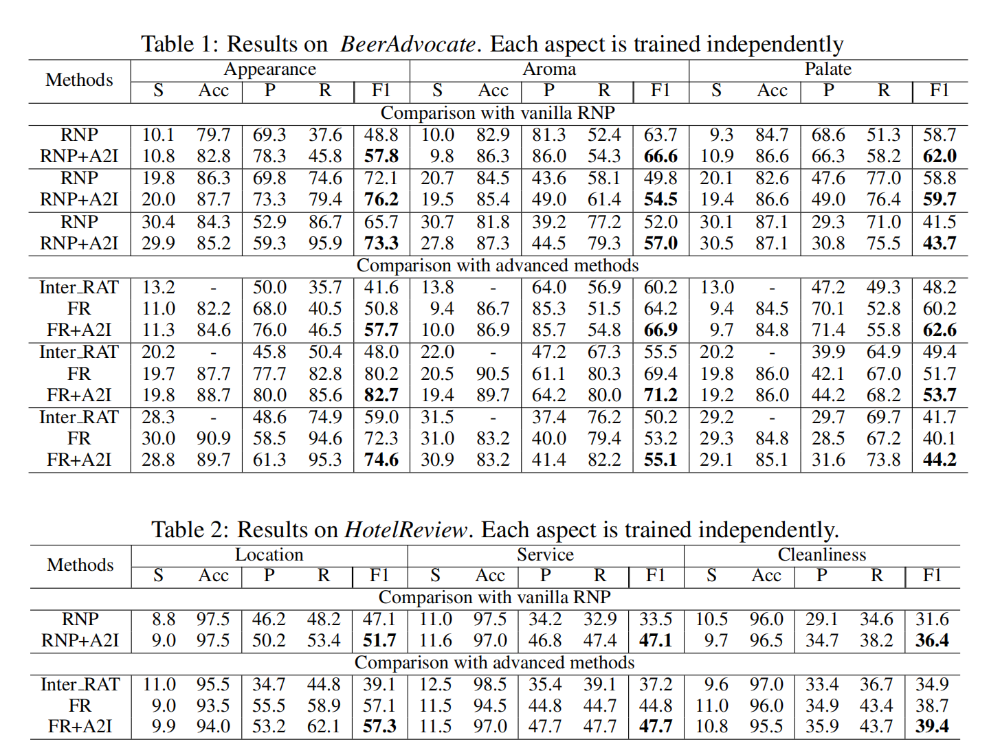
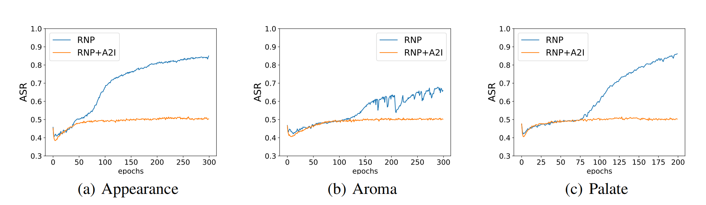

# ATTACKING FOR INSPECTION AND INSTRUCTION
HAVEN 2023/11/30

---
## 概述
这篇论文是博士的最新研究成果，目前还没有发表(这或许意味着我在论文成功录用之前并不能将这篇笔记公开)。在11月，我有幸在研究的中期(或者是初期)参与了这项工作，在GNN中构造了一个baseline用来做对照实验，并且为博士的模型修改提供了基础代码。

通过阅读这篇论文，可以得知很重要的一点，那就是传统的深度学习认知方式是有问题的：**在深度模型架构中采样(X,Y)不能代表X,Y事实的概率分布P(X,Y)**。之前有些研究习惯性地假设深度模型的预测结果能够反映实际的概率分布，但你永远达不到真实，中间总有个模型参数$\theta$作为分布的条件阻碍着。

此外，这篇论文还分析了传统可解释性模型中存在的一个重要问题：**采样偏好(Sampling Bias)**，即，生成器模型在采样时可能存在一定的偏好，把无关项作为判据。这个问题在几乎所有的深度可解释性网络中都存在。论文介绍了其产生原因，这有助于更加客观全面地看待深度模型，并且使用可解释性技术对模型加以修正。

最后，论文也提出了一种与模型无关的可解释性框架:**Attacking for Inspection and Instruction(A2I)**，基于对抗样本学习的思想，显著提升了模型的鲁棒性。

## Introduction

### Baseline
可解释性技术自2015-2016年发展至今，已经有约7年的历史。可解释性技术分为事后的(Posh-hoc)和事前的(ante-hoc)。前者是在模型完成预测之后，分析其预测的根据；而后者使用自解释机制(self-explaning)，使用可解释性框架来训练模型，这样的模型本身的推理方式是可解释的、符合人类要求的，由于预测结果直接产生于解释信息，因而更加可信、可移植。

RNP(Rationalizing Neural Predictions)及其变体是最广泛使用的提升NLP(自然语言处理)模型可解释性的方法。

RNP涉及一个含有生成器(Generator)和预测器(Predictor)两个模型的合作游戏(cooperative game)：首先，生成器接受完整文本的输入$X$，从中挑选出我们人类能够解释的子集$Z$并输出。$Z$被称为合理化解释(rationale)。$Z$接下来送入预测器进行预测。整个流程如下图所示。

随着训练的进行，生成器的输出 $Z$ 越来越符合人的解释，所以模型在预测时更能关注到真正重要的信息。这样训练出来的模型，不仅预测精度不会下滑，而且更健壮、更合理、更可信。

如上图所示，以酒店评论的情感分析为例：理想状态下，生成器接受完整输入，输出"service is excellent"这个片段，这样预测器就被迫关注到句子的重要信息，而自动忽视了其他无关信息，输出[0.1,0.9]，意味着这条评论为负面情感的概率为0.1，而正面情感的概率为0.9。然后针对预测器的结果同时给两个模型做梯度下降即可。

虽然一听很合理，但实际上RNP有时候会引发采样偏好，导致模型的退化(degeneration)和非理性(irretionality)。

举个例子，假如对一个评论数据集做情感分类，在训练前期，如果生成器的输出包含"."而预测器恰好正确地分类为正例，那么预测器很可能认为"."就是判断样本为正例的依据。久而久之，生成器觉得每次自己选了"."预测器就能分类正确，它就越来越倾向于选择"."。

RNP对此没有设置任何抑制机制，所以这个问题会不断被放大，最后就导致了生成器的"采样偏好"：生成器对每一个样本都优先选出"."，而预测器根据"."把这个样本分为正例。生成器仅为了迎合预测器的喜好来选择$Z$，而忽视了事实。

有强采样偏好的RNP，依旧会把无关紧要的信息作为判据，跟普通的模型别无二致，这就是"退化"。而它当然也是没法用的，因为它是不理性的。

### A2I

用来检查和指导的攻击(Attack for Inspect and Instruction,A2I)是本论文提出的，用来检查和消除采样偏好的方法，是对RNP的改进。

A2I引入了一个攻击器(Attacker)模块。攻击器和生成器结构相同，都是接受完整文本输入，而输出自己选中的文本片段。在RNP训练到一定程度时，我们把生成器替换成这个攻击器，攻击器专门挑一些$Z$，让预测器接受$Z$之后尽可能分类错误。

如下图，左边是一个RNP，右边把生成器替换成攻击器：在RNP训练阶段，预测器把"."当作分为正例的依据，那么在Attacker阶段，攻击器提取负类样本的"."喂给预测器，预测器就错误地预测为正例了。

如果你承认预测器不是瞎蒙的，那么预测器就是“有根据”地分类出错了，而这个错误是生成器的采样偏好导致的。这样我们就检查出了采样偏好。

反之，如果RNP几乎不存在采样偏好，那么预测器永远能注意到最重要的内容。这个时候攻击器的输出对预测器而言类似于噪声，也就是无意义信息。这个时候预测器自然无法完成判断，所以其预测结果类似于随机选择，也就是[0.5,0.5]。

综上，从可解释的角度考虑:
- 对于RNP模型，我们训练的目标有二：第一，生成器要尽可能选出帮助预测器正确预测的内容；第二，在攻击器攻击的情况下，预测器分类要尽可能倾向于随机选择[0.5,0.5]。

- 对于攻击器，我们的训练目标是：要尽可能让模型产生错误的预测结果。

接下来，我们进一步阐述问题，并介绍具体的做法。

## Problem Definition
还是以二元情感分析为例。

我们有数据集$\mathcal{D}$。$\mathcal{D}$包含很多$(X,Y)$对，这些$(X,Y)$对来自于实际背景下语段$X$及对应情感$Y$的分布$P(X,Y)$。$X=X_{1:l}$是输入的原始文本，长度为$l$;$Y$是离散的情感类别标签。

枚举每一个$X$，我们有条件概率分布$P(Y|X)$，这是非可解释的普通模型训练的目标，要尽可能向实际情况近似这个概率分布。

对于可解释性模型，对于任何一个$(X,Y)\in \mathcal{D}$，生成器首先输出一个二进制掩码$M=f_g(X)=M_{1:l}\in\{0,1\}^l$ ,也就是一个与$X$等长的掩码向量。然后我们把$X$和$M$ 逐元素相乘，得到生成器输出$Z$:

$$Z=M \odot X=[M_1X_1,\cdots,M_lX_l]$$

为了简化表示，接下来我们把$Z$记作生成器的输出$f_g(X)$。

我们认为，原始文本$X$包含一系列文段$\{T_1,\cdots,T_n,S\}$，$S$指实际的合理化解释rationale，能在事实上作为判断为$Y$类的依据；而$T_i$表示其他的与分类$Y$独立(无关)的文段。生成器的工作就是从这个集合$\{T_1,\cdots,T_n,S\}$中挑出一个，作为输出$Z$。注意$Z$不是一个新的东西，只是从集合中挑出的元素的别称。

现在，同上文同理，我们得到了一个新的数据集$\mathcal{D}_z$,里面包含一系列$(Z,Y)$对。这时候 **RNP认为** $\mathcal{D}_z$采样自实际背景下的概率分布$P(Z,Y)$。

那么，**对于RNP中的预测器而言**，有条件概率分布$P(Y|Z)$，这是它的预测目的，我们按下不表。因为$Z$是从$X$中挑的，而$P(Y|X)$是合理的，所以主要问题是构造一个目标函数让$P(Y|Z)$也变得合理。我们用**互信息最大化**(Maximize Mutual Information)$I(Y;Z)$作为挑选$Z$的目标。互信息是信息论里一种度量，可以看作一个随机变量中包含另一个随机变量的信息量。互信息越大，说明$Z,Y$之间相互包含的信息量越多。

$$Z^*=\argmax_{Z\in\{T_1,\cdots,T_n,S\}} I(Y;Z)=\argmax_{Z\in\{T_1,\cdots,T_n,S\}} (H(Y)-H(Y|Z))=\argmin_{Z\in\{T_1,\cdots,T_n,S\}}  H(Y|Z)$$

这样一来，最大化互信息的目标函数就变成了让一个熵最小的目标函数。

在实际情况下，熵$H(Y|Z)$常常用交叉熵的最小值$H_c(Y,\hat{Y}|Z)$来近似表示。$\hat Y=f_p(Z)$是预测器的输出，$Y$是真实值。可以证明，交叉熵的最小值其实等于这个熵。所以RNP的训练目标变成了挑选出让交叉熵最小的生成器参数$\theta_g$和预测器参数$\theta_p$。我们用$f_g(X)$表示$Z$，用$f_p(Z)$表示$\hat Y$，那么目标函数$\argmin_{Z\in\{T_1,\cdots,T_n,S\}}  H(Y|Z)$表述如下：

$$\min_{\theta_g,\theta_p} H_c(Y,f_p(f_g(X))|f_g(X)), s.t. ,(X,Y)\sim \mathcal{D}$$

除了这个目标，为了让生成器生成的rationale更加符合人的语言习惯和判断方式，即“更智能”，本文还对生成器的功能进行了生成约束:
$$\Omega(M)=\lambda_1 \lvert\frac{\lVert M \rVert_1}{l}-s\rvert+\lambda_2\sum_{t=2}^l\lvert M_t-M_{t-1}\rvert$$

其中，$M$代表选中的rationale掩码，第一项控制选择的稀疏度，即在整个文段中，被当作rationale挑出来的部分占比应该尽可能接近$s$；第二项控制连贯性，即尽可能选出连续的掩码，因为人类分析语言的依据常常是某一个连贯的子句。

对于攻击器，我们同样引入约束$\Omega'(M)$，与生成器不同的是，$\Omega'$仅保留$\Omega(M)$的第一项，因为最终攻击器应该选中无关信息，而无关的信息可以是分散的字段，不需要要求连续。

## Method and Motivation

### Method
总结刚才的问题，结合Introduction中的内容，我们给出如下训练目标：

$$gen \& pred:\min_{\theta_g,\theta_p}H_c(Y,f_p(f_g(X))|f_g(X))+\min H_c([0.5,0.5],f_p(f_a(X))|f_a(X))$$

$$attacker:\min_{\theta_a}H_c(1-Y,f_p(f_a(X))|f_a(X))$$

其中，$f_g,f_p,f_a$分别代表生成器、预测器和攻击器。请回顾上文，这两个公式表示了当时提及的训练目标：
- 对于RNP模型，我们训练的目标有二：第一，生成器要尽可能选出帮助预测器正确预测的内容；第二，在攻击器攻击的情况下，预测器分类要尽可能倾向于随机选择[0.5,0.5]。

- 对于攻击器，我们的训练目标是：要尽可能让模型产生错误的预测结果。

那么A2I实际是如何训练的呢？

1. RNP训练一次，得到原始的RNP模型；
2. RNP的生成器替换为攻击器，再训练一次，得到训练后的攻击器和修改后的预测器；
3. 将攻击器替换为生成器，再训练一次，得到修正后的生成器和修改后的预测器 ；
4. 重复2，3，直到步骤3测试时准确率提升到50%左右。

在步骤1，RNP的两个模块共同更新参数；在步骤3，攻击器的更新目标相当于生成器目的取反(预测尽量错)，**预测器的更新目标是要将预测的概率尽可能拟合到0.5附近（还是目标不变，到acc=50时停下？），然后二者分别更新参数。**

### Motivation

这部分内容涉及的逻辑推理会稍微多一些，目的是为了从逻辑上论证我们看待可解释性模型存在的一些问题。

#### Notation
首先，对要讨论的对象做一个统一的标记。

我们记$X^1,X^0$分别为对应标签$Y=1$和$Y=0$的原输入文本。

记$Z,Z_A$分别为生成器和攻击器所选择的rationale，注意它们不是新的变量，而是原始文本中某些片段的别称；有时候也会直接使用$Z$所代表的那个变量参与运算。

记$T$为集合$\{T_1,\cdots,T_n\}$中的任何一个元素，即无关文本片段。

#### How does the sampling bias come into being?
采样偏好是怎么产生的？我对论文的理解是：采样偏好由训练初期的随机选择引发，由训练过程中的梯度下降不断加剧。

在训练的初期，生成器由于没经过训练，不可避免会错误地把一些无关文本片段当作rationale选出。这些无关文本原本与实际标签$Y$没有任何关系，即，互信息为0；当模型根据这次的选择预测结果进行更新之后，互信息就变得大于0了：还记得我们的训练目标吗？这样一来，原本无关的事物由于前期的错误采样被强行牵扯上了关系，采样偏好就开始出现。

在训练的中间阶段，这个现象会被加强。例如，我们选取无关文本$T_1$作为$Z$，那么在反向传播时将执行函数$$\theta'_g=h(\theta_g,T_1,Y)$$

$h$是反向传播函数。根据整个流程，能够得到一个因果图的局部：

我搜集了网络的资料，发现其实仅仅凭借这张图不足以说明相关性，但对于理解原理有所帮助。$T_1$原本与$Y$没有任何关系，但是在更新参数的时候($G$),$T_1,Y$都参与计算了，所以$G$是$T_1,Y$的共同结果。而更新参数之后互信息增大，于是在接下来的挑选过程中，$T_1$也会称为$Y$的原因，如虚线所示。

如果数据集恰好又存在一定的规律性，那么这个参数更新将会持续进行，$T_1$与$Y$的互信息会逐渐增大。

因此，我们揭露了RNP思考方式的一个误区：用$\mathcal{D}_Z$来模拟实际概率分布$P(Z,Y)$是错误的。由于生成器参数$\theta_g$的影响，$\mathcal{D}_z$更应该是在模拟概率分布$P(Z,Y|g)$。显而易见，这两个概率分布是不同的，至少，我们说变量的独立不能等同于变量的条件独立。在$g$的条件下，很多事实上独立的无关片段都被强行扯上关系了。

#### Sampling bias can make trivial patterns indicative to the sentiment label and result in a bad predictor.

采样偏好会导致什么？会导致预测器变成坏的。

考虑生成器的输出$Z=T$的情况，此时$Z$是事实上与$Y$独立的文本，即：$$P(Y=1|T)=P(Y=1)=0.5=P(Y=0)=P(Y=0|T),T\in\{t_+,t_-\}$$
在RNP的背景下，由于生成器具有采样偏好，在正样本中更倾向于采样到$t_+$，在负样本中更倾向于采样到$t_-$：
$$\left\{ 
\begin{array}{c}
    P(Y=1|Z=t_+,g)>P(Y=1)=0.5=P(Y=0)>P(Y=0|Z=t_+,g), \\ 
    P(Y=0|Z=t_-,g)>P(Y=0)=0.5=P(Y=1)>P(Y=1|Z=t_-,g).
\end{array}
\right.
$$

假如说$t_+$="."，$t_-$=","，那么如果$g$多次从文本$X^1$中挑出"."，从$X^0$中挑出","，即$P(Y=1|Z=“.”,g)$和$P(Y=0|Z=“,”,g)$非常高，那么预测器仍就能根据"."和","进行预测并达到很高的准确率，即便这些标点与情感原始的互信息非常低。这种情况下，我们说预测器是坏的。

#### Attack as inspection
如何使用攻击器检测采样偏好问题呢？

在这里，攻击器是一个架构与生成器相近的模块，我们记作$g_a$，但是它是逆反的：它在正样本挑出的$Z$其实在负样本中更为常见，而在负样本中挑出的$Z$实际上在正样本中更为常见，也就是：
$$\left\{ 
\begin{array}{c}
    P(Y=1|Z=t_+,g_a)<P(Y=1)=0.5=P(Y=0)<P(Y=0|Z=t_+,g_a), \\ 
    P(Y=0|Z=t_-,g_a)<P(Y=0)=0.5=P(Y=1)<P(Y=1|Z=t_-,g_a).
\end{array}
\right.
$$

那么显而易见，经过$g_a$挑选的内容被输入预测器，预测的准确率应该会非常低。还是以刚才为例，如果我们的攻击器经过训练之后，在正样本中挑选出来","，由于预测器是被生成器误导过的，它认为","是分为负类的依据，于是它就把这个样本分为了负类，这就导致了分类错误。

当然，攻击器事先不知道生成器经常在正样本中挑"."并且在负样本中挑","。所以实际上攻击器的“逆反”效果是通过训练实现的。还记得A2I训练的方式吗？如果我们以预测错误率越高越好为目标，那么久而久之，攻击器就产生了这种“逆反”的功能了。攻击器的目标函数如下所示，请大家体会：
$$\min_{\theta_a}H_c(1-Y,f_p(f_a(X))|f_a(X)),s.t.,(X,Y)\sim\mathcal{D}$$

其中，$f_a(\cdot)$是攻击器的函数。其参数为$\theta_a$，其运行方式为:$Z_A=f_a(X)$。

而结合上文，如果预测器不够强大的话，使用攻击器仍旧会让其预测的准确率很低。所以如果搭载攻击器之后预测准确率很低，就说明之前的训练存在采样偏好，需要重新训练生成器和预测器。

#### Attack as instruction

当我们通过攻击器检测到采样偏好问题之后，如何利用攻击器指导模型消除问题呢？

如果一个预测器足够强大，它应该永远关注到跟情感最为关联的部分。而在此情形下，攻击器即便绞尽脑汁挑出那些误导性信息，也没法误导预测器，只能被当作噪音。而通过上面因果图等的分析，我们知道这是正确的，因为这些噪声本来就不应该对预测起到任何影响；而因为搭载攻击器的时候，只能挑选出这些噪音，所以预测器将会找不到分类依据。这个时候预测器的预测效果将类似于随机分类，也就是准确率0.5。

因此，在搭载攻击器的训练阶段，我们设置预测器的训练目标如下：
$$\min_{\theta_p} H_c([0.5,0.5],f_p(Z_A)),s.t.,Z_A=f_a(X),(X,Y)\sim\mathcal{D}$$

这会让预测器面对误导性信息的时候尽可能倾向于随机分类。

#### The instruction will not cause harm to a good predictor

因为我们在搭载攻击器的过程中也更新了预测器的参数，一个自然的问题是：这种参数更新是否会导致预测器的性能下降呢？答案是不会。

论证这个问题，就是论证：当$Z$真的是事实上能决定分类的部分，即，$Z=S$，预测器的分类不会受到影响。

在此，我们设$S=s_+$为决定样本为正例的事实依据，设$S=s_-$为决定样本为负例的事实依据。并且将目光放在模型搭载攻击器训练的阶段。

攻击器的作用是，尽可能在一个样本中找出那些可以决定预测器把该样本分到另一个类别的东西。如果说一个预测器确实训练得不错,那么攻击器挑选误导信息时将非常艰难：通常情况下，一个情感为负面的语句鲜少出现正向情感的文段 *(这是个总体上的假设)*.

与上面分析的逻辑相同，如果预测器根据$s_+$把样本分为正类，那么攻击器将尝试从负类中找出来$s_+$，而很显然这件事很难办到。最终，攻击器只能挑选一些中性词$Z_A$来让预测器的预测偏离正类。

因此，当预测器训练得比较充分时，攻击器并不对它产生负面影响。

## Experiments

### Controlled experiment

博士精心设计了对照试验，证实了：随机挑选的文段内容确实能成为预测器分类的依据。

实验使用3个RNP模型变体：

1. 蓝线是让RNP的生成器永远输出原始文本，而不做任何处理；
2. 橙线是让RNP的生成器随机挑选文段，挑选的比例受实验者控制；
3. 绿线是使用事先训练好的1的预测器，以及2的生成器组装而成的。

在不同的批次下训练三个模型，得到的准确率曲线如下图所示。

可以看出，虽然蓝线和橙线的训练精度都在不断提升，绿线的训练精度却维持在0.5-0.6附近。这说明对于在完整文本上训练的分类器，随机挑选的文段几乎没法作为它的分类依据。这说明，随机挑选的内容不具备足够的情感信息。**所以我们可以认为A2I预测器在受攻击时[0.5,0.5]的分类目标是合理的。同时，随机挑选的内容不具备充足的情感信息却仍旧能够让模型训练达到不错的精度，很明显模型使用其中大量的无关信息作为分类依据。**

右图是三个模型的验证结果，其中，r2f效果糟糕无需多言，橙线的准确率不如蓝线，作者认为这可能是随机挑选的文段体量更小训练更容易，导致模型出现了过拟合。

### Experiments on benchmark
在可解释性的实验中，模型的分类准确率不是重点考量对象，我们着重看：与事实的合理解释相比，生成器选择合理解释rationale的准确率precision，召回率recall和F1分数。

使用了BeerAdvocate数据集和HotelReview数据集。BeerAdvocate数据集是顾客对啤酒评论的数据集。每一条样本涉及外形(apperance)、气味(aroma)和色泽(palate)三个方面。预测器需要基于不同的方面进行分类，生成器也需要针对不同的情境挑选不同的rationale。HotelReview数据集类似，是针对宾馆的评论，有位置(location)、服务(service)和清洁(cleanliness)三个方面。

基准实验使用了RNP、FR、Inter_RAT三种不同的可解释性模型架构，以及分别使用了A2I的训练方式进行训练。结果如下表。

可以看出，不论使用哪种模型架构，采取A2I的训练模式效果明显都更好，这说明A2I成功地提升了模型的健壮性和挑选rationale的合理性。

#### Attack experiment
为了进一步验证模型的预测器在A2I的加持下更加强大，作者还开展了攻击测试。对于固定批次下训练的模型，拿出预测器，搭载一个训练好的攻击器进行测试。

我们用ASR(Attack Success Rate，进攻成功率)作为评价依据。进攻成功定义为:给定$(X,Y)$，如果$f_p(f_a(X))=1-Y$，进攻就算成功。因为攻击器成功地让预测器预测错了。进行多次进攻所得成功率即为ASR。

我们控制RNP挑选rationale的稀疏度约20%，开展了攻击实验，结果如下图所示。

可以看见，如果不使用A2I，随着训练的进行，模型越来越容易被攻击器误导。而使用A2I的模型，到训练后期稳定在0.5附近，类似于随机分类，这说明攻击器对其产生不了影响。

实际场景下，ASR代表着一个模型的可泛化性以及鲁棒性。如果一个模型能够达到接近50%的ASR,这个模型也拥有在其他数据集上的更好表现，其安全性和可靠性也可以得到保证。

## Other issues
有人可能会质疑：如果一条语料中既有积极情感又有消极情感怎么办？比如，在一条对啤酒的评论中，评论者对口味的情感是正向的，但是对外观的情感是负向的。那攻击器就能挑选出情感方面的词了，这个时候它的信息不是琐碎的，那预测器总是会合理地被误导，这是否说明A2I这个架构是有问题的？

其实这正是我们想看到的：别忘了攻击器在攻击的时候，预测器也有自己的目标，那就是尽可能让分类倾向于随机。当攻击器选择其他方面的情感词时，预测器依旧会这么做，那么，训练过程中，预测器不仅越来越能根据重要的情感词分类，还能够成功地关注到分类的方面。这反而对预测器是一件好事。

第二个问题是：假如说有一个$(X,Y)$，其中$Y=1$但是$X$的内容实际上包含大部分正向情感，还有少部分负向情感，攻击器也会挑出这部分负向情感误导预测器，但这次不仅内容确实是有意义的，而且也是同一方面的，这时候会怎样？

在这种情况下，攻击器训练阶段，预测器会尽可能把这些少量的负向情感视作无意义信息(根据预测器的目标)。这其实有助于预测器关注到最重要最核心的情感。最后，预测器只能挑选出最明显的情感。