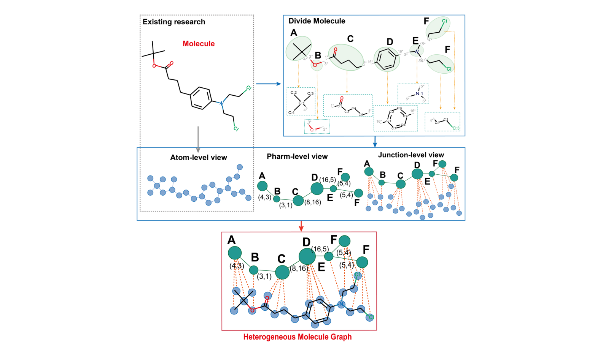
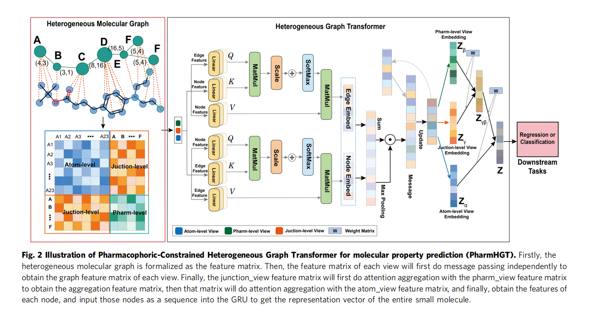
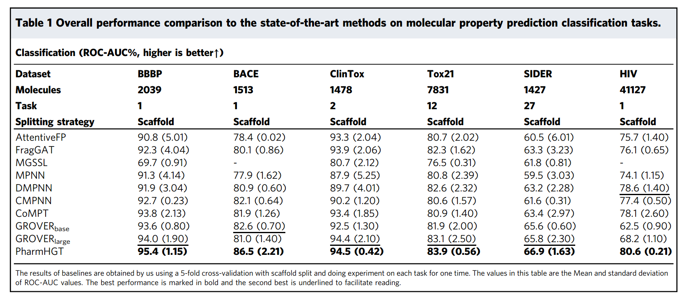
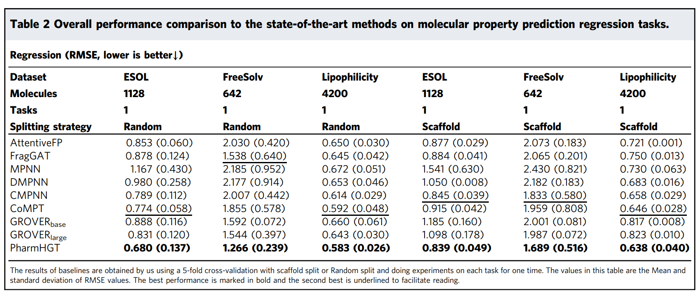
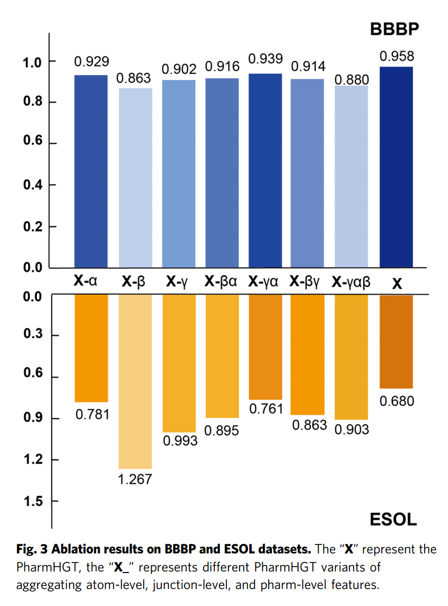

# PharmHGT
Haven 2/11/2023

---
## Preface
这篇论文之所以说自己的研究是开创性的，是因为它首次提出了使用异构图来构建药物分子的特征。所谓异构图，就是同一个图中存在不同类型的结点和边。

因为异构图分析和构造起来都比较困难，所以之前的研究大都专注于研究如何把药物分子的特征转化为同构图，也就是只使用一种边（化学键）和一种结点（原子）。这种构造特征图的方法很容易丢失一些重要的信息，尤其是药效相关的，因为药效经常由官能团（药效团）而不是单个的原子决定。

通过使用异构图分析方法，PharmHGT在分子性质的分类任务和分子属性预测任务上都获得了优秀的结果。

此外，论文还通过实验证明了，在使用PharmHGT的时候，不能忽略其中的任何信息，如果信息提取得不充分，它的结果也不会好。

除此之外，从我个人的实验中，如果数据集的划分没有按照论文的方法，比如比例不同，结果也可能存在各种各样的问题。但是实验使用的两个数据集的规模都在千级别，这么少的数据量，真的能反映实际的模型性能吗？

## Related Work
下面是三类基于同构图的相关研究。
##### 基于分段和同构图的分子表征

- FraGAT:顾名思义，基于Fragment的GAT。首先把药物分子进行分段，分段的依据是切掉分子中所有的无环单键构造片段，然后使用了GAT多层面地提取每一个片段的特征，最后构成基于分段的分子表征。这项研究是首个提出把分子给分段的。

- MGSSL：这是个自监督学习的网络。这项研究的最大贡献就是提出了一个比较好用的分子分段方法：BRICS。BRICS很显然比切掉所有无环单键管用，但我不清楚BRICS是怎么弄的，这个之后如果有需要可以研究一下。MGSSL不充分的地方在于，没有考虑到BRICS分段之间的反应关系，还是孤立地提取特征的，这种情况下执行消息传递依旧会忽略大量信息。MGSSL的启示是：如果能人工构造更充分的特征，模型的表征能力也会更好。

##### 消息传递网络
MPNN出现的意义是提出了一种GNN基于图执行有监督学习的范式，而且能成功预测小的有机分子的量子特征。MPNN像是GNN中的深度学习模型，允许从图中自动地提取特征。D-MPNN在做MP的时候给每条边规定了方向，单项的MPNN，CMPNN给每条边也赋予了特征。这样在执行MP的时候就附带了原子之间的关系。 然而就论文中的内容来看，不论是D-MPNN还是CMPNN，都没法很好地应用到分子预测中。因为这里就放弃了药效团和分段对整体的影响。这反而是更加严重的问题，因为有机物分子毕竟不是单纯的小分子，仅靠化学键和原子就能确定性质。

##### Transformer架构

- GROVER：使用Transformer在大量的无标签样本上自监督学习，从而学习到了充分的特征。

- CoMPT：图Transformer中，同时给边添加了特征做结点和边的共同的注意力。

## PharmHGT

PharmHGT的目的就是不仅要获取到分子基本的化学特征，还要获取到跟药效有关的片段特征和反应特征。在这种异构图中，不同类型的结点和边，所拥有的特征维度也有不同，这样这个图就彻底异构了，不同类别的特征之间无法进行合并。

PharmHGT主要要提取三类特征：原始分子图中原子和键的特征、提取为药效团之后药效团的特征以及彼此之间反应关系的特征、原子和键转化为药效团过程中的转化关系和链接关系特征。下图很鲜明地反映了 PharmHGT所要提取的分子特征。

若干原子团形成一个药效团，这里叫Pharm。那么一个分子在原子层面的图通过特定的划分方式就能够形成Pharm层面的图。然后，每一个原子归属于哪一个药效团称为连接关系Junction。最后就形成了红框里面这个具备更多复杂特征的图，也就是我们实际要用的异构图。

如果表示出来这些结点和边的特征，就可以很轻松地把这个图表示成邻接矩阵。我们可以拿到上面说的：原子层面(atom-level)、药效团层面(Pharm-level)、连接层面(Junction-level)三个邻接矩阵。然后把这三个邻接矩阵分别提取出来，转化为Q,K,V，结点对边、边对结点分别做注意力。之后做注意力得到受到了注意的点特征和边特征。

之后呢，将这个拼合的总特征进行一次池化作为MPNN的输入，再进行一定轮次的消息传递。最后，对于三个层面的特征，进行不同程度的线性变换，得到最终的embedding，最后的输出用基于特征的手法连接一个简单分类器或者回归器，完成分类和预测的工作。

## Experiments

实验主要分为两种任务进行：分类和回归。

对于分类任务，主要使用的是BBBP数据集。BBBP数据集有2035个含有标签的分子，标签代表这个分子是否具有脂溶性，能够穿透血脑屏障。除此之外，还有BACE、Clintox、Tox21、SIDER和HIV几个数据集，主要都是有标签数据，用来完成分类模型的训练。在实际复现的过程中我主要使用的是BBBP数据集。

分类评估指标是ROC-AUC曲线面积，越大说明模型越优。

对于回归任务，主要使用的数据集是ESOL数据集，这个数据集包含1128种化合物的溶解度。主要还是通过一些简单的特征来实现回归预测的任务。我的代码复现主要使用的就是ESOL数据集。除此之外，论文还使用了FreeSolv数据集和 Lipophilicity数据集。

回归评估指标是RMSE指标。这个我不知道是啥，但是理论上越低模型越强。

实验表现如下所示。下图展现了模型和其他几个baseline在这些分类数据集上的表现。

下图展现了PharmHGT在回归数据集上的表现。

从中可以看出，由于综合考虑了更多的特征，模型的效果比其他仅仅使用同构图的baseline要更加出色。在PharmHGT之前，GROVER这个模型在多项任务种是表现最出色的。这也验证了MGSSL这项研究所得出的结论：参考更多的特征能够让模型的性能更好。

## Ablation Study
为了探究模型的性能由自身的哪些因素影响，科学家也对其开展了一系列的消融实验。刚才提到，模型一共使用了三个层面的特征：原子层面(atom-level)、连接层面(junction-level)、药效团层面(pharm-level)。于是我们制造了其他对比模型对这三类特征进行了不同程度的舍弃。
- PharmHGT-$\alpha$：只保留atom-level的特征。
- PharmHGT-$\beta$：只保留Pharm-level的特征。
- PharmHGT-$\gamma$：只保留junction-level的特征。
- PharmHGT-$\beta \alpha$：将带有反应信息的Pharm-level特征和atom-level特征进行聚合。
- PharmHGT-$\gamma \alpha$：将junction-level的特征和atom-level特征进行聚合。
- PharmHGT$\beta \gamma$:将Pharm-level的特征和junction-level的特征进行聚合。
- PharmHGT-$\gamma \alpha \beta$：原始模型，先汇聚了atom-level,junction-level,得到的图再跟Pharm-level的特征进行聚合。

下图反映了这些模型在执行分类和回归任务中的效果。

考虑到来自所有视图的异构特征信息的PharmHGT在所有架构中显示出最好的性能。排除atom-level,Pharm-level或junction-level视图都会导致性能下降，而当仅保留具有反应信息的Pharm-level图时，PharmHGT_$\beta$表现最差。这表明，**缺乏来自原子的信息并不能有效地代表分子的特征。** 当结合两种特征信息时，PharmHGT_$\gamma \alpha$将junction-level图聚合成一个atom-level图，在具有一个或两个视图的模型中性能最好。这证明了**整合来自分子片段的特征信息可以提高预测性能**。PharmHGT的研究结果表明，**进一步整合反应信息可以获得最有效的分子表征。**

---
## Talk is Cheap,Show Me the Code.

Haven 2/11/2023

我认为论文中介绍实在笼统，比如信息是怎么做汇聚的，三个层面的特征是否有区别，特征具体又是怎么提取的？这些问题在论文有限的篇幅中都无法充分地说明，所以通过代码来理解论文中的算法实际上是至关重要的。我觉得但凡碰见一篇优质论文或者学长要你读的论文，在算法上没法完全弄明白的时候一定要参考代码。下面，我将从论文的整个流程由浅入深地出发介绍算法是如何完成的。

#### train.py
该文件是程序入口文件，主函数逻辑是：读取参数、读取数据、执行train函数，并且适时输出评估信息。

主要定义了两个函数：

`train`:读取数据为dataloader$\rightarrow$读取训练用模型参数，包括确定学习率缩减逻辑、设定评估指标、损失函数、以及最优结果的选择逻辑。最后分epoch训练模型：全是套路，训练部分就不细说了。在每个epoch把所有的训练都跑完之后，模型设置为评估模式，用验证集中的数据对模型进行一轮评估，输出评估结果。在所有的epoch结束之后自动开展测试并且输出测试的结果。

`evaluate`：开展测试的函数，主要内容是将测试数据传入模型执行一轮前向传播，然后拿到结果跟正确结果进行比对，计算评估指标。

#### data.py

这是处理数据以及人工整合特征的内容。可以直接运行程序，返回随机划分的训练集、验证集和测试集。除此之外，还定义了一些处理数据的函数，这些函数在`train`函数中被调用。

`create_dataloader`：入口函数，读取一个csv文件，然后将数据集处理成`MolGraphSet`格式，之后再把这个`MolGraphSet`处理成一个`GraphDataLoader`。

`MolGraphSet`:我们不需要得到其他多余的特征，我们只要SMILES字符串。现在有很多方法能够将SMILES字符串提取为可用分子对象，并且自动查询其中能起到作用的药效团Pharm。

对于数据集csv中的每一个样本，我们拿到它的标签label以及它的表示方式SMILES。然后，对SMILES执行导入的`MolFromSmiles`函数，将其转化为分子对象，存入属性`self.mols`中。然后，对这个分子对象执行函数`Mol2HeteroGraph`函数，集中提取三个不同层面的特征，获得一个异构图对象，存入属性`self.graphs`中。最后在调用这个dataset的时候，拿到手的是`self.graphs`和`self.labels`两个属性。

`Mol2HeteroGraph`：提取特征的核心函数。这个函数有点抽象。

首先，你要知道它一些单词的意思。在这个函数中，a=atom,b=bond,p=pharm,r=reaction,j=junction。这个异构图的边分为4种类型，分别记作('a','b','a')、('p','r','p')、('a','j','p')和('p','j','a')。它们是异构图的属性`edges`的key,而value则都是列表，用来存储起点和终点构成的元组。稍微分析一下就知道是什么意思了吧：恰好是atom-level、pharm-level和junction-level的特征边。

对于atom-level，相对容易，我们调用分子对象的`GetBonds()`函数，获取到所有的边，然后，基于无向图就是双向图的常识，分别存入(起始原子，结束原子)和(结束原子，起始原子)两条边。

对于pharm-level，关键是找到一个分子中哪些是药效团，然后把这些药效团单列出来视为整体。所以我们对分子对象调用`GetFragmentFeats(mol)`函数，获取到所有的药效团表征。

对于`GetFragmentFeats(mol)`函数，其实主要是对分子对象调用了外置的`FindBRICSBonds(mol)`收集用来区分药效团的键，用`FragmentOnBonds`模拟把它们打断,得到一系列的药效团。然后，对每一个药效团，干两件事：第一，统计一下哪些原子在这个药效团里面；第二，将这些药效团中的原子和键都单独提取出来(因为只是名义上切断了，实际还没有，需要自己构造断片)，先转化为SMILES再转化为新的分子对象，对这个新的药效团分子对象，使用函数`maccskeys_emb`获取到它的分子指纹列表,这东西能够唯一地表征一个分子对象的化学性质和结构性质等等。这个列表，我们称为药效团的第一个embedding，反映的是物理化学性质。

之后我们又使用函数`pharm_property_types_feats`获取这个分子对象的药学特性列表。这里使用的是一个专门用来提取药效特性的特征计算工厂，参考了文件`BaseFeatures.fdef`。只要我们把一个分子对象丢到这个计算工厂里，那么就能得到一个特征列表。为了embedding的方便，我们把特征列表转化为长为“所有特征”的01向量，如果有某个特性，就是1，否则，这个位置就是0.这就是我们得到的第二个embedding.

至此，药效团的特征embedding都已收集完毕。那么该药效团的总特征就是这两类特征的首尾拼接。函数`GetFragmentFeats`返回两个东西，一个是每个原子所属的药效团的下标，另一个是每一个药效团的特征向量构成的列表。

因为现在我们还只是在统计边的特征，所以我们拿到函数返回的原子分布，再重新获取一次BRICSbond，得到两个药效团之间的连接关系是哪两个原子之间的。然后把起始点的元组存放在边('p','r','p')里。这个BRICSbond刚才是用来断开的，就相当于上图中绿色的边。

最后就剩下junction-level的边了。这里还是拿到每个原子在药效团中的分布，把这种归属关系用单向边的形式分别存放在('a','j','p')和('p','j','a')中。

最后，我们使用`dgl.heterograph(edges)`函数，对边列表生成异构图对象。这样，图就算做好了。现在还需要对图中的结点和边赋予一些特征。

在构造成异构图之后，刚才的字符三元组就被拆开了。这个时候，结点有'a','p'两种，边有'b','r','j'三种。我们可以很容易地找到每一类节点和边的集合。

首先，对于每个原子，我们先赋予下标，再通过自己构造的函数`atom_features`挑选我们需要的原子特征，并且进行编码送到原子特征集合属性`f_atom[]`中。

其次，对于每个药效团，我们刚才已经使用函数`GetFragmentFeats`成功构造了它们的特征向量，所以在赋予每个药效团下标之后，直接把它们的特征向量封装在列表中，然后打包成tensor放到`graph.nodes['p'].data['f']`表示所有p类结点的特征数据，是一个大tensor.

最后，我们还要额外存储原子与药效团之间、药效团与原子之间的连接关系特征，这里定义为`graph.nodes['a'].data['f_func']`和`graph.nodes['p'].data['f_func']`。这两个特征的获取都是拼接得到的torch数组。它的前半部分是原子特征向量，所以`graph.nodes['p'].data['f_func']`这部分暂时为空；它的后半部分是药效团的特征向量，所以`graph.nodes['a'].data['f_func']`这部分暂时为空。空的地方补充0.实际操作的时候当需要junction-level时，只要我们拿到原子与药效团的关系，就能很轻松地构造出这样的juction-level特征。

截至目前，我们已经收集到原子特征、药效团特征和junction-level特征。现在还差原子间化学键的特征和药效团之间反映关系的特征。

我们通过`graph.edges[('a','b','a')]`获取所有的化学键，对于每一条化学键，我们先对其赋予下标，然后从异构图中拿到这个键两侧的原子（因为这时候异构图中还没化学键的特征），再根据这两个原子从原来的分子对象中找到这个键，判断这个键的类型，再根据类型获取到我们所需要的键的特征向量，按照下标一行行放好，打包成一个tensor,放进`g.edges[('a','b','a')].data['x']`中，此时'x'就是边的特征矩阵啦。

我们通过`g.edges(etype=('p','r','p'))`获取所有的反应关系键，然后分别拿到这些边的起始点和终止点，再从刚才的`GetBricBonds`的返回值中挑出对应的特征向量，按照下标存放好，打包成一个tensor放到`    g.edges[('p','r','p')].data['x']`中。

至此，所有的特征都已经提取完毕。接下来介绍一下网络的特征。