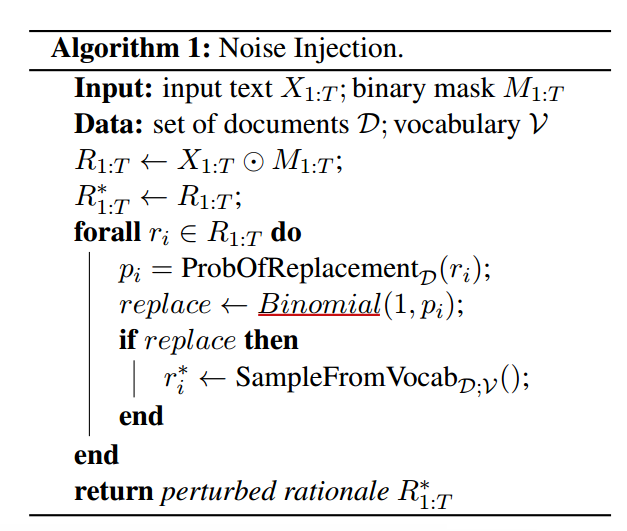
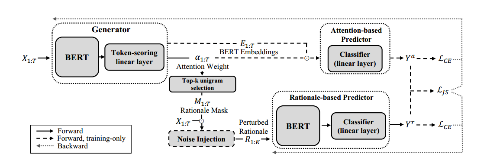
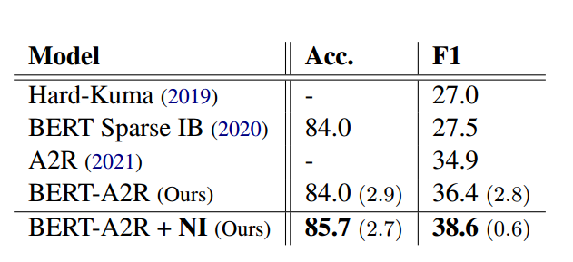
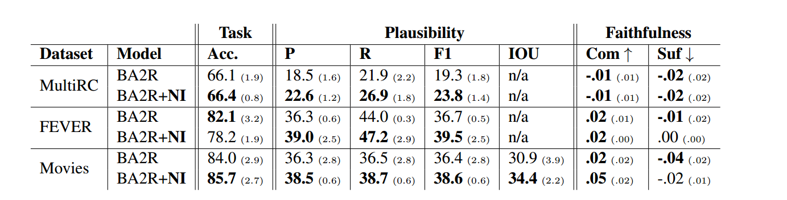

# Unsupervised Selective Rationalization with Noise Injection
HAVEN 2023/9/30

---
### 概述
这篇论文的主要工作是使用一种输入编码加扰动(noise injection)的方式来增强合理化解释（rationale）的可靠性。
**rationale**是一种提高模型可靠性的方法。比如说现在有一个分类器，能够对输入的评论所蕴含的情感进行判断“正向”还是“负向”。但在常规的机器学习背景下，直接训练得到的模型不仅透明度低，而且极有可能学习到无意义的知识，例如，如果训练集里面的正样例都是感叹句，负样例都不是感叹句，那么模型在之后几乎肯定会根据这个标点来区分情感了，这显然不是我们所希望看到的。
为了解决这种问题，我们可以使用rationale方法：我们拿人工做好重点句段标注之后的数据集，利用无监督的学习方式训练出一个**生成器模型（generator）**。这个模型会通过某些方式来对句子中可能跟情感分析有关的词进行突出强调（一般可能直接删掉无用的词语）。之后我们再把生成器模型输出的句子投入到**预测器（predictor）** 让它学习，如此一来，预测器即便拿到一个富含无意义信息的句子，也能根据所学知识寻找出跟情感相关的内容，并且做出自己的判断。
### 研究背景
虽然刚才的想法很好，但实际上仍然存在问题。因为我们只不过把一个黑盒子换成另一个黑盒子，把不确定性和风险从预测器转移到生成器上了。虽然用模型提取重点的想法很好，但是这个模型也不可避免地会犯错。如果我们没有严格监督生成器的学习，那可能它也会学习到某些没用的东西，或者说根本没有理解训练数据的内在规律。这样，最终训练出的预测器也仍然会是有问题的。在数据量规模巨大的时候，我们很显然没法一直看着生成器训练，有没有一种方法能在不改变整个框架和训练策略的前提下，自动提升生成器模型的可靠性呢？

这就是这篇文章所要分享的工作内容了。在这篇文章中，作者提出，只要我们在生成器和预测器之间对传输的数据随机**注入噪声(noise injection)**，就能有效地限制不可靠推理的形成。除此之外，文章的另一个贡献是提出了一个新的基准：使用现有的电影数据集来评估无监督学习得到的生成器的可靠性。

其实在之前，已经有人在这个问题上开展过一些探索，具体是什么由于我没有仔细研究过，所以就不展开说了。不过有一点可以肯定，就是虽然它们多多少少提升了效果，但不可避免地引入了一些新的训练目标和更大的模型复杂性。相比于前人的结果，这项研究更加轻量便捷，同时因为不涉及模型架构的更改，使得想做调整和修改都非常容易。
### 不可靠解释的产生
在之前的研究中，我们倾向于把生成器和预测器之间的交互称为一个**合作游戏**，这个游戏一轮接着一轮不断进行。每一轮游戏中包含着2个阶段：

- 第一阶段： 生成器接受输入$X_{1:T}$,然后输出合理化解释(rationale)的内容。这个内容用二进制掩码$M_{1:T}\in \mathcal{M}$表示。$\mathcal{M}$是一个二进制掩码的集合，它里面所有的元素$M$都满足：$$X_{1:T} \odot M_{1:T}\in \mathcal{S}_{rationale}$$
即，假如按照$M_{1:T}$操纵$X_{1:T}$，若$M_n=0$,则删掉词$X_n$;否则保留词$X_n$，结果一定是一个可靠的rationale，里面一切内容都正确地提供了分类依据。
- 第二阶段：预测器接受第一阶段的rationale进行预测，得到输出$Y$。

如果是在训练模型，那么最后的目标是为了最小化损失函数$\mathcal{L}$。这个过程可以公式表示如下：
$$M_{1:T}\leftarrow gen(X_{1:T};\theta_{gen}),M_{1:T}\in \mathcal{M}$$
$$\min_{\theta_{gen},\theta_{pre}}\mathcal{L}(pre(X_{1:T}\odot M_{1:T};\theta_{pre}),\mathop{Y}\limits^\sim)$$

其中，$\mathop{Y}\limits^\sim$是实际类别。通常情况下，$\mathcal{L}$采用交叉熵损失函数(Cross Entropy Loss)$\mathcal{L}_{CE}$，因为一般认为这样计算损失能够最大化互信息(maximize mutual information,MMI)。互信息是一个用来量化两个随机变量之间关系的度量。如果两个变量是独立的，互信息就是0；否则大于0，此时一个变量可以在一定程度上预测另一个变量。通过最大化互信息，能够尽可能增加预测器和真实值之间的相关性，从而最大化用模型捕捉数据信息的能力。这个目标表述如下：
$$\max_{M_{1:T}\in\mathcal{M}}I(X_{1:T}\odot M_{1:T},\mathop{Y}\limits^\sim)$$

但是，这种做法存在一个巨大的问题，就是它并不排斥不可靠的解释。即便有时候生成器给出的解释跟实际大相径庭，预测器也不会有意见，更没办法纠正生成器的错误。这是因为预测器和生成器归根结底是黑盒子，**我们当然知道，合理的解释能够带来高的精度，但我们没法笃定地说，我们的解释给的越合理，模型判断的精度就越高。**如果预测器足够强大，或许不需要什么解释就能输出高准确率的结果。

而回想刚才讲到的训练过程，看起来是生成器需要为了顺从预测器而更新自己的参数，使得预测结果跟真实值相差缩小。随着训练迭代的不断加深，生成器会逐渐发现预测器的一些偏见（永远不存在一个绝对完美公正的预测器），**生成器会在不断的训练中错误地赋予这种偏好高价值，然后迎合这个偏好，而不是纠正它，因为可能使用含有偏见的判断依据反而能让预测结果更准确。** 而这种问题一旦出现，我们人类是分辨不出来的。这样的话，模型本质上仍旧没有得到性能的提升，反而在坏的道路上越走越远。

### 在线注入噪声(Online Noise Injection)
####  NI算法
科学家证明，只要在训练的时候，对生成器生成的rationale随机注入噪声，就能够很大程度上避免这种问题。下面描述算法**Noise Injection**：

现在我们在训练中后期阶段来看待这个问题。此时生成器几乎不再随便猜rationale包含些什么了，同时已经开始钻预测器的牛角尖了。那么此时，如果我们看见rationale里面包含了完全不相干的信息，基本可以断定生成器在迎合预测器的偏好。此时使用上面这个随机注入噪声的算法，就可以将里面这些不相干的词语替换掉。生成器不知道自己生成的rationale被我们掉包了，在看见预测器对它的迎合没有反映的时候，生成器就会怀疑自己的rationale出了问题，也开始怀疑预测器的偏好是否可靠。随着训练的进行，我们不断用算法扰乱不重要的词，加强重要词的频度，生成器就会逐渐忘记并且舍弃迎合偏好的想法，而专注于生成合理的、符合事实的rationale。即便没法断定这样预测性能一定比不加噪声更好，我们至少能保证这个模型在以后更多任务中都能展现均衡的、值得信赖的性能。

换句话说，怎样界定我们的生成器模型没有钻牛角尖呢？在一轮游戏G的任意两个训练阶段i和j中，预测器的预测一切样本的效果几乎不发生变化，而不是越来越高（预测器是提前训练好的分类器，目标是得到合理的生成器），这样就可以认为生成器没有钻牛角尖。
$$\forall G\in\mathcal{G},\forall i,j\in stages(G),pre_{G,i}(\cdot)\approx pre_{G,j}(\cdot)$$
介绍完算法之后，不难看出，注入噪声是小事，基于何种概率注入噪声，什么词才算是噪声，才是这个算法的核心所在。因为我们必须要满足：真正重要的词几乎不会被随机换掉，不重要的词几乎每次出现都被换掉这个条件。对于这个概率的计算，即ProbOfReplacement函数和SampleFromVocab函数。说明如下。
#### ProbOfReplacement函数
这个函数的作用是计算每一个词被替换的概率。我们要实现的效果是：跟主题越无关的词被替换掉的概率越大。**TF*IDF**分数能够很好地满足这个要求。TF*IDF分值越高，说明这个词跟主题越相关。同时，如果我们直接使用TF *IDF来对词做embedding，这项任务甚至会更加简单。论文给出了一种概率计算方式：
$$\mathcal{P}_i=\frac{w_{max}-TF*IDF(w_i)}{\Sigma_{w\in d}[w_{max}-TF*IDF(w)]}p|d|$$
$$w_{max}=\max_{w\in d}TF*IDF(w)$$

其中，$d\in\mathcal{D}$表示全部文档集合中的一篇文档，$d$也是该文档含有的单词构成的有重集。$p$是一个超参数，用来做概率的整体扩充或收缩，以控制加扰的力度。这下概率就变成减函数了，满足我们的预期。

#### SampleFromVocab函数
这个函数的作用是从词汇表中挑选一个词来做替换。我们要实现的效果是，跟主题有紧密联系的词，被挑选出的概率要尽可能小。鉴于此，我们基于整个文档集合$\mathcal D$和全局词汇表$\mathcal V$计算每个词的选中概率。
$$\mathcal{P}'_i=\frac{w_{max}^*-ATF*IDF(w_i)}{\Sigma_{w\in d}[w^*_{max}-ATF*IDF(w)]}$$
$$w_{max}^*=\max_{w\in d}ATF*IDF(w)$$
其中，$ATF*IDF$是这个词在所有$d\in\mathcal{D}$上$TF*IDF$分数的宏观平均。这样函数就变成减函数了，满足我们的预期。
### 模型
模型的基本结构如下图所示，这个模型是由A2R模型架构演化而来的，但是因为我们不必知道什么是A2R，所以直接看下面的模型架构即可。由于是A2R部分组件替换成了Bert然后运用了noise-injection算法，所以被称为**Bert-A2R+NI**架构。

这个图里面有2个Bert。它们的作用都是给输入进行编码，同时，上面那个Bert还有另外的用处，那就是计算注意力权重。因为有了Bert，所以我们顺势用一个线性层作为分类器，称为基于注意力的分类器（Attention-based Predictor），意思是这个分类器的分类依据是注意力权重。上面的Bert最终得到了每一个词的注意力权重打分，我们回归原文档，取出注意力权重打分最高的K个单词（也就是unigram,它这里的一元组），这就是生成器认为的最重要的单词了，即原始的rationale。我们加入noise-injection模块来对这个rationale加扰，然后把新的词放入下面的Bert层进行转化，这一步被认为效果等效于最初字符串放到上面的Bert中做转化。这样一来，下面的线性层分类器就是基于合理解释的分类器(Rationale-based Predictor)了。

下面，我们认为前面的Bert生成器是比较可靠的，不必再做更新，对两个预测器线性层更新权重。更新的目标是

- 各自与真实值之间的交叉熵损失尽可能小；
- 各自的预测结果尽可能相似。

我一开始比较疑惑为什么要让两个模型的效果尽量相似。后来感觉可能得这么解释：回归我们开展这项研究的目的是什么？是为了提升模型的可靠性，而不是提升模型的准确度。我们刚才已经从理论和一些背景研究中阐明了，使用注入噪声算法理论上可以让模型学到更加有用的东西，从而变得更可靠稳定。基于注意力的分类器相当于是没有加扰的模型，它的输入是全文，它可能会因为自己的偏好获得好的准确度。我们刚才说过，不钻牛角尖的生成器可能没法获得那么好的效果，但是我们可以尽可能拟合原模型的效果，这样就实现了性能不发生大改变的同时，可靠性显著提升的效果了。

补充说明一点，图中的部分参数解释如下：
- $Y^a$:基于注意力的预测器的预测结果；
- $Y^r$:基于合理化解释的预测器的预测结果；
- $\mathcal{L}_{CE}$：交叉熵损失函数；
- $\mathcal L_{JS}$:两个模型预测结果分布之间的Johnson-Shannon散度，这个数越接近0，$Y^a$、$Y^r$的概率分布就越相似。
### 模型效果

使用这种架构，作者在电影数据集ERASER进行了实验测试，效果由于同期同规模的模型，而加扰之后的模型效果也明显优于不加扰的模型。甚至比在A2R中引入BERT的提升效果还要显著。这可能是我们之前讨论时没有预期的结果，说明了模型可靠性提升的同时，性能也会同步提升。

另外，针对NI算法，作者又在3个不同的电影数据集上，使用Bert+A2R模型进行了加扰对比测试。测试结果如下图。

可以看见，除了FEVER以外，另外两个数据集上加扰的性能和可信度都得到了提升。而在FEVER，一个指标降低的同时往往伴随着另外指标的显著提高。说明NI的确对提升性能和模型可靠性有帮助。

此外，相关测试还揭示了大容量生成器更适合使用这种噪声机制，相关实验略过，因为写累了。

最后，这项研究说明了使用NI方法能够提升模型的性能和可信度，告诉我们NI用来训练大容量的生成器模型有很大帮助。