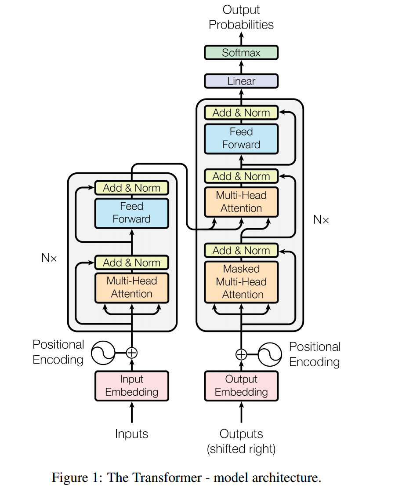

# 
BERT: 
## 
Pre-training of Deep Bidirectional Transformers for Language Understanding

Haven 2023.10.26

---
## Preface
如果说大模型的根基是Transformer架构，那么大模型领域最基础的两个大分支就是BERT和GPT了。这两个分支分别从Transformer的编码器和解码器出发，不断发展壮大。最初，OpenAI发布了GPT-1，展现了强大的自回归能力。不久之后，BERT发布了。

BBERT的诞生可以追溯到2018年，由谷歌的研究团队开发并发布。该模型的核心思想是通过预训练一个深度双向变换器来学习丰富的语言表示。与传统的单向模型不同，BERT利用了上下文信息，通过将左右两侧的输入序列拼接在一起，并使用自注意力机制来捕捉单词之间的依赖关系。这种双向的建模方式使得BERT能够更好地理解句子中的语义和语境。

与GPT系列模型相比，BERT在许多方面具有显著的优势。首先，GPT模型采用自回归的方式生成文本，而BERT则是基于编码器的架构。这使得BERT更适合于各种NLP任务，如问答、命名实体识别和情感分析等。其次，BERT在预训练阶段使用了Masked Language Model（MLM）任务，通过随机遮盖一些单词并预测它们，迫使模型学习上下文信息。这种预训练策略使得BERT能够更好地捕捉单词之间的关系，并在下游任务中进行微调时表现出色。

在BERT出现不久之后，GPT-2发布，参数量相比第一代大了十倍。进而也就拥有了出众的推理能力。BERT在次之后规模没有做的更大，之后GPT系列就成为了主流。但是，即便时间来到大模型遍地的时代，BERT却依旧没有淡出人们的视野。这得益于BERT独特的架构和预训练方式，又得益于其可接受的参数量和推理成本。

综上所述，BERT作为一种基于预训练的深度双向变换器模型，为NLP领域带来了革命性的变革。它通过充分利用上下文信息和自注意力机制，提高了对复杂语义任务的理解能力。虽然与GPT系列模型存在一些差异，但BERT的出现无疑为NLP研究和应用提供了新的思路和方法。

## Introduction
预训练模型(Pre-training Models)被证明能够有效地提升自然语言处理任务。凡是在实际训练过程中已经拥有了能直接使用的参数的模型都叫做预训练模型。这些模型在到你手里之前就已经在巨大的数据集上进行了充分的训练，所以能够直接应用到你的任务中，这样不仅比你在自己的小数据集上训练的效果好，而且还减少了计算量。比如最常见的Word2Vec就是预训练模型，你使用Spacy下的预训练词语embedding，能够直接得到可靠的词向量。

有时候我们不仅仅是拿预训练模型作为工具，更多是要在其基础上进行调整以更好地应用到下游任务中。将预训练的语言模型应用到下游任务的方法一般分为两种：基于特征的方法(*feature-based*)和微调方法(*fine-tuning*)。

feature-based方法是指**将语言模型的输出结果作为额外的特征引入到原任务的模型中**，说的通俗点，就是把预训练模型作为一个组件引入到自己的模型中。你的模型获取到预训练模型的输出，然后把它们作为新的特征放入定制的模型里解决下游问题。例如使用预训练词向量模型作为你自己模型的特征输入等等。ELMo是典型的feature-based范例。

如果使用了feature-based方法，那么你只能把预训练模型作为一个固定的组件。在实际训练过程中，预训练模型部分的参数固定，只训练其他部分的参数。

fine-tuning方法是指**在已经训练好的模型基础之上，引入少量可学习参数，或者在新的语料中直接更新模型的参数**。这个方法就需要对模型的原有架构进行一定的调整。拿到模型之后，可以认为模型已经初始化为比较合适的参数，我们只需进行少量的训练更新就能够达到理想的效果。GPT系列模型以及所有的国产大模型在应用到特定任务的时候几乎都是必须使用微调来解决问题。

从二者的原理就可以看出，使用fine-tuning对预训练模型本身就有比较高的要求。这个模型本身必须具备解决多种问题的能力，否则，如果功能单一，它永远也不可能被用在多类任务当中。

对于feature-based和fine-tuning的详细介绍，可以参考[这篇文档](https://blog.csdn.net/sinat_25394043/article/details/104308576)。

BERT就是这样的一种模型，它首次提出了可以完全采用fine-tuning来让同一个模型适配所有下游任务。事实上，BERT在多种词语级和句级自然语言处理任务中都斩获最好成绩，效果比之前基于特征的模型都要优秀。

下图展示了BERT模型的基本工作原理。

BERT首先在大规模语料中进行无监督训练，得到通用的基础模型，然后针对特定的任务和语料，进行一定的有监督微调。

## Related Work
这一块原本和BERT关系不太大，之所以想写是因为对其中一些东西比较感兴趣。对于预训练模型的研究，其实很早就已经开始了，早期人工智能的研究状况难道不是很有吸引力的吗？

#### Unsupervised Feature-based Approaches

预训练的word embeddings是现代NLP领域最不可或缺的一部分，因为它不仅不需要从头训练，而且效果非常好。学习一个很好的word embedding的研究其实在很早以前就已经开始。只要提基于特征的方法，几乎都是在说预训练的词向量化。
##### Non-neural Method
###### 1.n-gram
1992年，科学家使用n-gram构建了一套通用的词语表征方法,这是论文Class-Based n-gram Models of Natural Language(Computational linguistics, 18(4):467–479.)工作的一部分。这个方法仅仅使用概率论和信息论的知识，而并没使用神经网络等深度模型。很神奇吧，其实原理也很简单。

上图中的$Pr(W)$就是当时语言模型的表示。没错，语言模型在当时是一个概率值。

人在说话的时候词语是一个一个说出来的，每说出一个词语，一定与上文有所关联。我们从概率的角度出发，开展广泛的统计，从而就能根据前面出现的词语来预测下一个说出来的词语。

那么我们往前看几个词呢？我们把要预测的词跟要看的词打包成一个词元gram。如果往前看0个词，就是1-gram，看1个词，就是2-gram$\cdots$。对于n-gram来说，理论上n越大，预测越准确，但是不稳定性也就越高(容易过拟合)，所以一般都取n=3。这篇论文也是使用3-gram模型。

这个模型不用训练，它的参数通过一次统计就已经确定。这个模型包含词汇表中所有可能的3-gram，我们通过统计来得到模型中每一个3-gram出现的概率，然后在之后的预测中，使用链式法则求解：
$$Pr(w_K)=Pr(w_3|(w1,w2))Pr(w_4|(w_2,w_3))\cdots Pr(w_k|(w_{k-2},w_{k-1}))$$

所以，模型存储的就是这样的3-gram概率。有时为了提升预测效果可能要添加$Pr(w_1)Pr(w_2|w_1)$，那还得存储部分的1-gram和2-gram。

所以，如果一个语言公司拥有20000个词的词汇表，它模型的参数就能达到惊人的$A_{20000}^3\approx 8T$，也就是8万亿参数。现在GPT-4的参数估计只有1~2T的规模，这个数据量放在当时真的很不可思议，有点赛博朋克的感觉。

说点题外话，这篇论文跟大模型论文读起来体验很不一样，感觉是两个时代的产物，这种研究模式对数学的要求更高，力争在有限的资源和信息下高成效地完成任务，所以读起来更有意思。之后如果有机会，也会写一下这篇论文的笔记。论文的高质量解析在[这个链接](https://zhuanlan.zhihu.com/p/349559133)。
###### 2.GloVe
在静态词向量表示中，2015年出现的GloVe模型采用更加精巧的设计，没有使用神经网络，但是效果非常好，比2013年使用神经网络训练得到的CBOW和skip-gram都要优秀。

GloVe模型就是一个巨大的embedding层，层的每一行代表一个单词的词向量。整个训练过程中只有这个层的参数不断更新。

GloVe模型最重要的部分在于构建训练的目标函数，即，如何构建一个映射，使得得到的词向量既能考虑到全局统计信息(根据词语在文章的词频来计算向量，多篇文章中出现次数相近的词，向量的相似度也要越高)，又能考虑到句子内部词语的关系(词语经常邻接，向量相似度就高)。因为这里还是介绍性质的说明，所以如何得到目标函数暂时不表，最后得到的目标函数是：$$J=\sum_{i,j}^Vf(X_{i,j})(w_i^T\hat w_k+b_i+\hat b_j-\log X_{i,j})^2$$
训练时投入两个词的词向量$w_i,\hat w_k$和共现矩阵的一行值$X_{i,j}$。最后更新的是$w_i$的表示。具体的推导思想可以参考[这个链接](https://zhuanlan.zhihu.com/p/141531626),说的很通俗简洁，是我达不到的高度。如果要精读，也可以结合[这篇博客](https://zhuanlan.zhihu.com/p/604113742)。

##### Neural Method
使用神经网络制作预训练词向量，最优秀的研究成果是2013年Google的skip-gram模型和CBOW。这两篇论文在NLP领域是非常有名的。在NLP入门阶段，skip-gram和CBOW也是必不可少的基础知识。

从大致原理上看，skip-gram和CBOW是两个非常类似的模型。从下面这张图就能看出来。

skip-gram 和 CBOW的训练结果都是个大矩阵，这个矩阵的第0维是词语独热编码向量的长度V，一般是词表中词的个数；第1维是每一个词的词向量的长度N。

两种模型的训练方式不同：对于给定的文本窗口，CBOW输入周围几个词的独热编码之和，输出是一个概率分布，其中中心词“学习”对应位置的概率应该尽可能大；skip-gram输入词语“学习”的独热编码，输出是一个概率分布，其中它周围词语“我”“正在”“写”“代码”四个词对应位置的概率值应该尽可能大。

下面我稍微详细一点，介绍skip-gram的基本原理。

###### 为什么要使用独热编码
使用独热编码能够将词语转化为一个向量，这个向量是词语在词汇表中的唯一标识。它的好处在于：
- 直接表示，无需经过模型计算。
- 位置信息明确，每一个独热编码精准定位到一个词语。
- 非常稀疏，传播过程中计算量低。

###### 模型运行机制

skip-gram的训练过程相对直观，具体流程如下图所示。

整个网络分为3层：2个前馈层$W,(W')^T$，用于编码和反编码；和1个softmax层，用于将反编码的输出转为概率分布(反编码是我自己造的说法)。

在skip-gram中，我们输入一个词(这里称为中心词)，输出概率分布，要求周围那些词(这里称为背景词)的概率要尽可能高。那么，在中心词被编码之后执行的矩阵乘法，就是**将输入词作为中心词的编码与所有词作为背景词的编码相乘**。这里很关键，必须要明确skip-gram中有两种不同的编码。从实际意义上来看也不是没有道理：将一个词当作中心词汇看待和当作一个陪衬的词来看待，肯定是不一样的，所以每一个词都因为其双重身份而拥有两种不同的编码。

训练过程中，$W,W'$同步更新，最后每一个词拥有两个不同的编码。此时$W,W'$的编码，都包含了充分的、符合逻辑的上下文语义信息。你可以选择将$W$和$W'$的平均值作为实际的编码。也可以尝试单纯使用$W$或$W'$作为编码。
###### 其余实现细节
分层softmax,负采样技术。这两个技巧之前上课的时候学到了，之后可能可以稍微总结一下这些知识。这些其实都是NLP最基础和最重要的内容。
___
##### ELMo
刚才上面提到的这些编码，都是静态的，即一个词对应一个唯一的向量，一经训练就不能再改变。对于多义词，在不同的意思下语境也完全不同，而如GloVe这样的编码方法仅仅是根据统计学特征和上下文相邻等位置特征进行编码的，并没有参考语义信息。所以ELMo这样的动态表征方法是值得借鉴的。

在实际工作中，我们把embedding层后面添加一个ELMo，对编码进行二轮动态编码，在原有的信息基础之上再充分理解上下文语义信息，然后再做下游的任务，往往会有更好的效果。

ELMo使用了分层的LSTM单元，并且使用了前向LSTM和后向LSTM两个结构，对于句子中的信息进行双向表征。前向LSTM就是常规的LSTM，预测的目标是在已知前文的基础上，预测到当前词的概率尽可能大：$$p(t_1,t_2,\cdots,t_N)=\prod_{k=1}^Np(t_k|t_1,t_2,\cdots,t_{k-1})$$
而后向LSTM训练的目标是在已知后文的基础上，反向预测到当前词的概率尽可能大：
$$p(t_1,t_2,\cdots,t_N)=\prod_{k=1}^Np(t_k|t_{k+1},t_{k+2},\cdots,t_{N})$$

ELMo训练的目标则是二者的结合，具体来讲，是这两个概率的对数和尽可能大。

从图中也能看到，ELMo的输入和输出是一样长的，这就意味着ELMo可以逐层堆叠。实验发现，堆叠到一定规模时，层数越高的输出越能捕获词语的语义信息，层数越低的输出越能捕获词性的信息和语法的信息。

下面简单放一张图展现ELMo的性能：

biLM是ELMo的另一个名字。可以看见，GloVe对词语的认识是不含上下文的，而且概率上，最接近的词语也没有体现出语义关系；而ELMo的词语总是基于语句背景，而且不同意思的词语所计算出的最近邻也不一样，准确分辨出了语义的差别。

实际应用的时候，我们直接把预训练好的ELMo组件当作一个好用的工具添加到自己的模型架构中就可以了，训练时冻结ELMo的参数即可。

对于ELMo的进一步了解，可以参阅[原文](https://arxiv.org/pdf/1802.05365.pdf)或者结合[这篇博客](https://zhuanlan.zhihu.com/p/51679783)帮助理解，博客写的很好很容易懂。

#### Unsupervised Fine-tuning Approaches

这一块想必大家都很了解了：基于微调的下游任务方法最典型的代表是GPT系列。如果一个模型能够仅仅通过微调调整一些参数，就可以应用到下游的多个不同的任务中，这个模型首先得很优秀，拥有很强的泛化性才可以。在BERT发布的时候，GPT第一代刚刚产生，是当时唯一的具有通用能力的模型，所以能够通过微调来直接应用在下游任务，而不必修改模型的架构。BERT的参数量也支持微调，而且比GPT更容易应用到多种任务中，表现出强大的性能，所以这在当时也是BERT的一大卖点。

#### Transfer Learning
迁移学习是指在解决目标任务时，利用从一个相关源任务学到的知识和模型自己进一步调整和训练。

迁移学习乍一看和微调一样，都是在一个大规模训练好的东西上做一些调整，但是二者不是同一个东西。微调作为迁移学习的一种具体方面或方法而存在。

迁移学习的目的比较多：

- 通用模型适用于特定任务：也就是微调的目的。要被微调的模型通常已经拥有很强的通用性，微调的目的只是让模型在这方面更强一点。

- 希望加快训练速度：如果要做很深的模型但数据量不够，可以先从别人那里拿大规模训练好的模型，然后自己在这个基础上继续训练一段时间。相当于拿到一个非常不错的初始化参数。

- 希望将A任务的模型用到B任务上：比如说希望识别动物，可以尝试在训练好的识别蔬菜的模型上进一步训练。这时候，被用来迁移学习的模型可能并不具备通用性，只是二者任务比较相似，直观上能通过简单的学习和调整达到任务迁移的目的。

而微调的目的比较单一，就是增强通用模型在下游某任务上的表现性能。

## BERT
相关知识的梳理和补充完毕，终于可以开始说BERT啦！为了方便，把BERT的原理图放在这里。

BERT框架分为两个阶段：预训练(pre-training)和微调(fine-tuning)。预训练时，模型在大量的无标签文本上执行无监督训练；微调时，模型首先加载预训练得到的参数，然后在下游任务的特定的数据集上执行微调,不同的下游任务会微调出不同的BERT模型。

BERT模型最大的特征就是它仅仅依靠微调就能够解决诸多下游问题。不论什么下游问题，BERT都使用统一的架构，并且微调前后几乎不会发生改变。

#### Model Architecture
##### 模型的结构
实际研究中制作了两个BERT：BERT-base和BERT-large。BERT-base和GPT参数量相仿，用于比较，BERT-large比较大，性能更好，用来打榜。因为两个模型只有参数量的区别，所以主要还是介绍BERT-base。

BERT的架构使用的是个双向、多层的Transformer编码器。因为BERT的主要任务并不是针对文本生成任务，所以牺牲了解码器架构，从而换得更加强大的语言理解能力。BERT-base就是简单的12层双向Transformer encoder堆叠形成的。

##### 模型参数计算
BERT-base的注意力层L=12,隐层尺寸H=768,注意力头的数量A=12.总参数量约110M。具体是怎么算出来的呢？

这需要对Transformer的结构有比较细致的认识。Transformer的多头注意力结构如下图所示。

沐神的课程上是这么讲的：输入embedding将一个30000维的输入向量转化为一个768维的输入向量(这里我怀疑他在假设输入就是词语的独热编码)———说句题外话，一开始视频很多人有疑问为什么是30000，后来看BERT论文发现它他们的实验用的就是30000词的词汇表。

然后这个768维向量将在下边的linear层分别和$W^Q,W^K,W^V$做若干次乘法，获得$Q,K,V$矩阵。可以看图，那些分层的部分，每一层就是一个注意力头，Linear层是$H\times H/A$的矩阵，上面的Scaled Dot-Product Attention没有参数。所以这一整部分的参数量是$H^2/A\times A \times 3=3H^2$。每个头执行完缩放点积之后，得到一个长$H/A$的向量。之后这些东西进入到Concat层进行首尾连接得到$H$的向量。然后，将这个向量进行一次维度不变的线性变换，这一层的参数量是$H^2$。这样就得到了Multi-Head Attention。

然后，注意上图，不要忘了这只是走完了注意力块的下半部分。上半部分的前馈层有2层权重，接受输入是长为$H$的向量，里面第一层前馈网络将向量由$H$映射到$4H$,后一层向量由$4H$变回$H$。所以总的参数量是$2\times 4H^2$。

最后，考虑一共有12个这样的块堆叠，将所有这些参数相加，就是：$$30000\times H+12\times(3H^2+H^2+2\times 4H^2)=144H^2+30000H\approx 107.9M$$差不多也就是刚才上文中说的$110M$。

这一块我其实算了好久，归根结底是因为Transformer的认识不到位。

首先，进入多头注意力之后，所有向量的维度相比单个头都必须要除以头的数量。所以进入到注意力层的向量维度并不是768，而是768/12=64。在Transformer原文中也说了，这样做的好处是映射到多种层面的特征，而且不影响计算量，在原始的研究中，多头注意力已经被限制为64维了，所以不要改变这个，只要增加或者减少注意力头的数量即可。

此外，注意力层输出之前还要经过一次维度不变的线性变换。这个层的参数就是768*768了。

最后，不要忘了一个编码器可是有2个组件的啊！线性层中，先进行一次升维操作，再进行一次降维操作。总体维度是$H\rightarrow 4H\rightarrow H$。

为了验证我计算思路是正确的，我们再来算一下BERT-large。论文条件：L=24,H=1024,A=16，总参数量340M.
$$30000H+L\times(3H^2+H^2+2\times 4H^2)\approx 332.7M$$看起来也还比较相似，应该是正确的。

通过计算，我们还能看出，注意力参数量跟注意力头的数量没有关系。一个注意力块的参数量是$12H^2$。隐层尺寸说的就是embedding之后那个向量的维度。

##### 模型的值传递

每一层Transformer模块的输出，维度都是$H$。而且根据Transformer论文，输出内容的注意力值应该跟embedding向量的相同位置是对应的。所以这个值能够反映原来在这地方的值的一些特征。也正因如此，BERT其实可以堆叠非常多层。

#### Input/Output Representations
##### 输入特征的格式
BERT的预训练主要完成两个任务，MLM任务和NSP任务，下文会提到。为了完成这样的两个任务，输入需要一定的特殊处理。
###### 分词器
使用了WordPiece分词器。这个分词器的特点是：如果出现非常罕见或者词汇表没有的词语，就把这个词语本身按照它预设的一些前后缀进行拆分，直到这些词缀的频率都比较高为止。例如：如果词汇表没有playing这个词，WordPiece就会把playing分成"play"和"##ing"这两个东西。然后发现"play"和"##ing"都比较常见，所以就不再分了。
###### 符号格式 
输入内容是一个序列(sequence)，它可以是一个句子(sentence)，也可以是打包好的两个句子。这里的“句子”不一定是个整句，它可以是任何一个连续的文本切片。
每个输入序列的开头添加一个符号[CLS]，我们认为这个符号处的输出能够反映这个序列的类别信息(有人做实验验证过，这个[CLS]的输出仅仅在一些简单分类任务上有效果，在其他涉及理解的问题上，表现非常糟糕，所以这个[CLS]并不储存语义信息)。
在构造两个句子打包的输入序列时，两个句子之间需要额外添加一个符号[SEP]起到分隔作用。
##### 输入特征

BERT的输入是三种信息的加和：
1. Token Embedding:分词后序列的Token Embeddings。
2. Positional Embeddings:这里跟Transformer还是一样的，应该也是使用三角函数位置编码，一种可行的优化方案是使用旋转位置编码。
3. Segment Embeddings:这个embedding是一个经过训练的模型生成的向量，用来表示这个词属于[SEP]前面的那个句子还是[SEP]后面的那个句子。
##### 变量定义
我们将输入的embedding定义为$E$，将最后一层[CLS]处输出的向量记作$C\in R^H$。而第$i$个位置的input token对应的输出向量记作$T_i\in R^H$。

#### Pre-training BERT

在以往的研究中，语言模型的预训练都是类似Transformer这篇文章的方式，使用根据上文预测下文(从左向右，GPT)或者利用下文预测上文(从右向左，ELMo)。而BERT为了解决模型难以对下文进行信息抽取和理解问题，使用不同的训练范式。这种范式一般包含两类任务：掩蔽语言建模问题(Masked Language Model,MLM)、下句预测问题(Next Sentence Prediction,NSP)。这一块内容，在BERT经典架构图的左半部分有所体现。

##### MLM
所谓掩蔽语言建模，就是预训练的时候输入一个完整的句子，然后随机将几个词给屏蔽掉，让模型根据上下文来预测这个被屏蔽掉的词原本是什么。这就像“完形填空(Cloze task)”一样。在训练过程中，最后一层隐层，被屏蔽掉的位置处的输出向量会传入一个softmax层转化为整个词汇表的概率分布，根据概率来挑选最合适的词语。论文中，作者随机地MASK掉输入的WordPiece向量中15%的词汇。

一开始，作者单纯地把被屏蔽掉的词语用一个掩码[MASK]代替。但是，这导致预训练阶段和微调阶段模型的工作方式产生差异，因为微调的时候我们是有监督地修正输出，并不会使用掩码。

如果模型预训练和微调存在不同，模型面对着不同的训练目标更新，就会导致性能下降。所以在所有将被屏蔽掉的文本中，80%被替换为掩码[MASK]，10%被随机替换为词表中的其他任意词汇，10%保留原词汇。如果第$i$个词汇被MASK掉，它的输出$T_i$将会被用来预测和梯度下降，使用交叉熵损失函数(Cross Entropy Loss)。

##### NSP
下句预测问题的描述是：给定一个由两个句子拼接形成的序列输入，让模型判断这两个句子是否属于上下文关系。两个句子之间用[SEP]分隔。

许多重要的下游任务，比如说问答(QA)和自然语言推理(NLI)，基础都在于理解两个句子之间的关系。想让模型了解两个句子的关系，没办法用人造的特征抽取方法完成，只能通过大量的预训练实现。

具体来说，在每个预训练序列中，50%后句是前一句的下文，50%后句是随机挑选的句子。句首[CLS]标签在最后一层隐层的输出$C$用来判断句子是否属于上下文关系。[CLS]只在SEP任务中被使用，如果不进行微调，句首将是无意义字符。

##### Data
- BookCorpus,800M个词；
- English Wikipedia,2500M个词，只抽取纯文本，忽略表格、表单等。
这两个数据集都是文本为单位的数据集，而不是Billion Word Benchmark这样以句子为单位的数据集。使用文本级数据集的目的在于让BERT学习到长上下文关系。

#### Fine-tuning BERT
BERT微调的方式就是在特定的微调数据集上，有选择地构建序列，形式上还是`[CLS]+A+[SEP]+B+[SEP]`这样的。输入编码是在构建完序列之后对整个序列统一编码，而不是先给每一句编码然后结合在一起，因为这样编码能够表示更多句子间的关系，更容易计算交叉注意力。

输入的句子对可以是下面这几种基本关系：
- 句子A和转述或释义的句子B；
- 句子A和翻译后的句子B；
- 假设A和前提B；
- 问题A和答案B；
- 文本A和空句子∅。这一般用来做句子的分类或者分析等不需要上下文的任务。

在输出层，词语位置的输出$T_i,T_{i+1}\cdots,T_n$作为词级任务或句级任务的输出。句首[CLS]处的输出依旧用来做分类任务的判断。
## Conclusion

BERT虽然原理相对容易理解，但是涉及的相关知识很多，所以研究起来有点费劲，要花一些时间。现在很多模型都是以自回归为核心的，BERT这种独特的训练模式能够让其在处理某些问题上具有优势。我最近正在参与一项有关大模型文本纠错的任务，使用自回归模型感觉效果并没有想象中好。凭借我浅薄的认知，我认为自回归模型完成病句纠错的方式是自回归地输出跟这个病句非常相似的正确句子，但这并不是我们所希望的理解语法结构、分析到错误并且改正的过程。其实一直以来最好的解决问题的办法是使用BART模型，这个模型的训练目标是基于受损的文本重现原始文本，跟病句纠错的问题是最为相似的。而BERT虽然不及BART，但是它的预训练阶段有MLM任务，因此它拥有一定的全局注意的意识，可以说在原理上优于GPT系列。我在想，之后或需要尝试了解一下BERT体系的新成果：AlBERT和RoBERTa.或许有了大规模参数的加持，BERT更能胜任我们的任务。