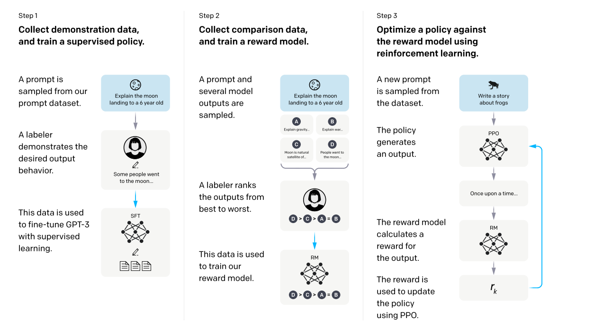
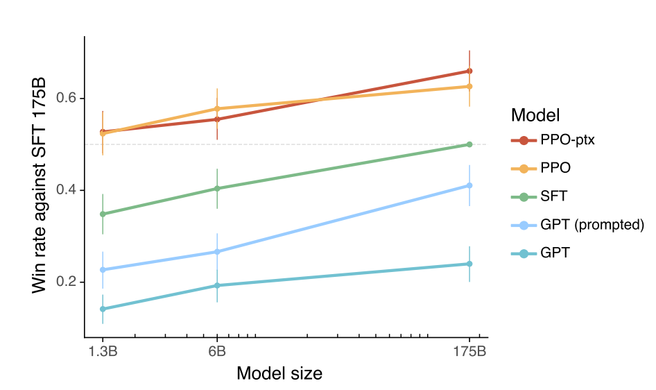

# 论文笔记：RLHF
HAVEN 2023.9.5
在这篇笔记中，我将会着重讲一下RLHF的基本流程以及强化学习部分的实现细节。
## 什么是RLHF?
**来自人类反馈的强化学习（reinforcement learning from human feedback）**。通过人类的反馈，采用强化学习的方式训练模型。从强化学习的角度来说，这个技术使用人类反馈作为奖励信号来微调我们的模型。
## 为什么需要RLHF?
当前，大语言模型可以通过提示词(prompt)来执行自然语言处理任务。例如，你可以给出一些任务示例作为输入，模型就能执行相应的动作。然而，这样做有时也会出现问题，例如，模型可能会出现编造事实、生成对人类有害的言论等，或者根本就不遵循用户的需要生成答案。这种现象叫做模型的幻觉。

我们希望模型生成的回复能够很好地贴合我们的需要，或者生成的回复更加接近人，因此我们需要对模型进行一定的微调(或者是训练)。这项任务被称为**对齐(Alignment)**。RLHF是一种为了实现对齐而采用的强化学习与人工相结合的方法。

经历这样的调整之后，模型生成的回复跟人的意图更加贴近。我们把这种模型称作*InstructGPT*。
## 怎么实现RLHF?
### 1.RLHF的训练流程
RLHF的流程很直观，如下图所示。

RLHF的流程分为三步：收集数据并训练模型、收集对照数据训练奖励模型、用强化学习算法优化奖励模型的策略。

下面，我将进一步介绍这三个步骤。
#### Step1
第一步是通常意义的微调。为了让模型的输出尽可能贴合人类的需求，自然而然，我们想到使用监督学习，让prompt作为input，让人类的回答作为gold-answer，让模型的输出作为预测值system-output,然后用一些方法让system-output逐渐贴近gold-answer。这种方法被称为**监督微调(Supervised Fine-Tuning,SFT)**.

具体来说，SFT是使用各种数据增强、优化算法等手段，利用反向传播算法，对模型中的**部分参数**进行调整，从而达到system-output贴近gold-answer的效果。
#### Step2
第二部是奖励模型的训练。既然我们在第一步已经完成了微调，那么继续微调显然已经没有显著的效果了。但是正如前面所说，即便是经过了微调的模型，也时常出现幻觉、答非所问的问题。这时候只能想其他的办法来进一步提升模型的能力。这里的巧妙之处就是：我们发现人见到模型糟糕的输出之后，会引发一些不满，希望模型的输出能更加“智能”，于是科学家直接把人的感觉当作反馈信号，用了一种方法让模型感知到这种反馈，并且调整自己生成答案的逻辑。没错，这种方法就是“强化学习”。

在这一步，我们使用排序的方式给到反馈信号。我们选择一个prompt,让模型生成4次答复。标注人员根据自己的认识对这4个答复按照谁更像“应该回答成这样”的回答，进行排序。然后，我们把这种顺序信息丢到一个叫做 **奖励模型(reward model,RM)** 的网络中做训练。在训练结束之后，RM网络能够给一个答复打出合适的分值。
#### Step3
第三步也是相对最复杂的一步，使用强化学习算法来进一步优化模型网络。我们使用训练好的RM网络作为奖励函数，并且使用一种名为PPO的强化学习算法来对我们的模型网络做微调，使得每一次模型产生的回复都能够尽可能打出高分。 

## 2.RLHF中的强化学习(RL)
在RLHF中，除了第一步跟强化学习没什么关系之外，第二步和第三步都与之有所关联。我们首先需要搞明白这个奖励模型RM网络是怎么构建和训练出来的，之后我们结合强化学习中常用的PPO算法，详细地介绍一下RM的使用方式。
#### 奖励模型RM的构建
RM是一个GPT-3架构的网络，它实际上就是把SFT末端的那个unembedding layer去掉了，所以数据到这里还是保留着向量的形式(unembedding layer的作用是把一个长向量转化为一系列的概率分布)。然后在去掉的地方添加一个线性层，这样最后得到的就不是一系列概率，而是一个标量。我们认为这个标量就是对输入的打分。这样一来，一个奖励模型的基本特征就具备了：输入是prompt+模型回答，输出是一个标量，认为是该回答的打分。这个RM网络最终被作为奖励函数(value-function)应用到第三步的强化学习中。

在参数选择上，由于175B的大参数量容易导致模型不稳定，不适合作为奖励函数，所以选择一个6B参数的SFT模型作为RM。

RM的训练是基于**两个模型对同一个prompt生成回复的比较结果**构成的数据集来完成的。模型使用**交叉熵损失**计算损失函数。最终，RM对两个回复的计算结果差异性应该反映了：在人看来，哪一个回复的质量更好一些。

为了能够加速构建数据集，参与制作数据的标注人员被基于4-9条模型的回复。因为：如果一个排序有4个结果，那么最后可以得到$C^2_4=6$条可以比较的数据。而如果一个排序有9个结果，那么最后可以得到$C^2_9=36$个比较结果。从4到9数据量仅仅增加了一倍多，最后生成的数据集增加了5倍。而且科学家认为，人们对9条回复进行排序，用时很可能比4条高不了一点。所以给标注人员一次尽可能多的回复效率是很高的。

最后，使用一种名为**pairwise ranking loss**的方式计算损失。先放公式,假设使用了K条回复：
$$loss(\theta)=-\frac{1}{C^2_K}E_{(x,y_w,y_l)\sim D}[\log(\sigma(r_\theta(x,y_w)-r_\theta(x,y_l)))]$$

其中，$r_\theta$是RM网络的标量输出。$r_\theta$网络的输入$x$是prompt,$y_w$是人更认可的回复，$y_l$是人不那么认可的回复。$\sigma$是sigmoid函数。然后求一个对数损失，之后取同prompt下的所有比较对的计算结果求平均，然后再取一个相反数，这样就得到了损失。这是一个比较规范的逻辑损失(Logistic Loss).

为什么要这样设计呢？因为在$(r_\theta(x,y_w)-r_\theta(x,y_l))$这里，我们做的是正类跟负类之间的差。因为这是一个比较性质的损失，我们就希望，模型尽可能生成的结果是一个正类而不是一个负类，所以我们需要让这个值越大越好，也就是正类跟负类之间的差值越大越好。然后做了sigmoid函数和对数转化之后，我们对整体取反，这样求差的最大值就变为了求整体的最小值，可以通过梯度下降的方式来解决。因为有时候K的值不一样，能够得到的对数值也不一样，所以这里还要取一个平均，让损失更加具有说服力。

最后，由于RM对奖励的训练可能导致一定的偏差，这时候我们再给损失添加一个偏置bias，使得损失呈现均值为0的分布。
### PPO算法对RM模型的使用
在进行完上一步之后，我们可以认为RM模型已经很可靠了，可以根据prompt和模型的回复打出合适的分数。我们通过最大化一个目标函数(objective function)来完成强化学习优化模型的任务。
$$objective(\phi)=E_{(x,y)\sim D_{\pi^{RL}_\phi}}[r_\theta(x,y)-\beta \log(\pi^{RL}_\phi(y|x)/\pi^{SFT}(y|x))]\\
+\gamma E_{x\sim D_{pretrain}}[log(\pi_\phi^{RL}(x))]$$
看到这个函数先不要慌，其实它的构成以及原理都很简单。

##### 基本原理
强化学习中有这样几个概念：

- 智能体：跟外界的环境做交互的实体；
- 环境：智能体所在的系统；
- 状态：智能体所处的情况或者位置；
- 动作：智能体可以采取的操作；
- 奖励：智能体采取了一个动作之后获得的收益；
- 策略函数：智能体决策动作方法,通常用$\pi$来表示；
- 价值函数：对于给定的状态-行为对，估算其未来所有奖励之和的函数。

在这里，$\pi^{SFT}$就是我们的智能体以及其策略函数，它可以对外界的交流做出反映，例如，外界输入了一个prompt,它就能做出反映并且生成回答(细节上其实这样讲不太对，但是不妨碍理解)。同时，它生成回答的过程实际上也是一个不断决策的过程，在生成了前一个词之后，它首先会通过$\pi^{SFT}$得到接下来可选词语概率的分布列，之后基于此挑出合适的词语来扩充回答。

强化学习中，我们希望让回答尽可能好，也就是说，在生成一次回答的整个旅程中，要尽可能使得每一个词都尽可能得到高分(打分员就是RM网络)，所以要通过RM作为“打分员”，即价值函数，来不断对SFT模型做更新。

但是，一旦SFT参数更新$\pi^{SFT}$也会改变，那么在更新前后，输入同样的prompt，得到的概率分布列就不太可能一样了。也就是说，一旦SFT发生了更新，马上会进入到新的状态，使用全新的策略选取动作。

因为每一个状态下的SFT都只会发生一次更新，如果某一次更新不好(RM误判)，SFT的效果不增反减；另外，一次生成回答的计算路径只经过SFT的很小一部分参数，只进行一次计算就更新显然没有充分地考虑到SFT巨大的参数量，这样的更新是不准确的。有什么办法能够解决这个问题呢？

这就是PPO算法的原理了。PPO算法中，我们使用一个新的模型$\pi^{RL}_\theta$来承受更新，而让$\pi^{SFT}$不做更新，只是不断地跟环境交互。这样一来，如果$\pi^{RL}_\theta$最初由$\pi^{SFT}$复制而来，就能够实现不断更新SFT但还能保持原始状态跟环境交互的效果了。

另外，为了保持原始状态$\pi^{SFT}$对$\pi^{RL}_\theta$有很大的参考价值，我们必须保证两个模型充分相似，如果相差过大，那么SFT交互得到的奖励数据显然失去了更新的作用。这里就要引入KL散度的概念了。KL散度很简单，实际上就是随机地挑选一个prompt，比较一下两个模型得到的分布列差异是否在可接受的范围之内。由于实际操作中每次更新交互的轮数是确定的，所以如果在此期间差异变得太大，就要给模型施加一点惩罚（负奖励，或者减少奖励）让它"刹住车"。

另外，如果模型效果实在不理想，我们也不能让它越跑越偏，所以在最后我们还要再添加上一轮得到的模型的预训练梯度，使得这个目标函数不论有多低，总不会比预训练梯度还要低。这样就能保证至少优化的结果不会比之前还要差劲。当然这件事也可以不做，因为这种情况不一定会经常发生。

我们回过头来看这个目标函数：

$$objective(\phi)=E_{(x,y)\sim D_{\pi^{RL}_\phi}}[r_\theta(x,y)-\beta \log(\pi^{RL}_\phi(y|x)/\pi^{SFT}(y|x))]\\
+\gamma E_{x\sim D_{pretrain}}[log(\pi_\phi^{RL}(x))]$$
这个目标函数由三部分构成，首先是$E_{(x,y)\sim D_{\pi^{RL}_\phi}}r_\theta(x,y)$，其次是$\beta \log(\pi^{RL}_\phi(y|x)/\pi^{SFT}(y|x))$,最后是$\gamma E_{x\sim D_{pretrain}}[log(\pi_\phi^{RL}(x))]$.下面我将分别介绍这三部分的功能。

##### 变量说明：
|变量|说明|
|---|---:|
|$\pi^{RL}_\phi$|这个是我们要优化的网络，其结构同SFT,输入prompt,输出回复|
|$\pi^{SFT}$|这个是原来没有被强化学习过的网络，输入prompt，输出回复|
|$\beta$|超参数，控制KLpanelty的影响力度|
|$\gamma$|超参数，控制预训练梯度的影响力度|
|$(x,y)\sim D_{\pi_\theta^{RL}}$|问题x和回答y遵循新网络的概率分布|
|$x\sim D_{pretrain}$|生成的任何词语遵循预训练模型的概率分布|
|$r_\theta(x,y)$|把一个prompt和回复y丢到RM模型里，得到了一个打分|

$r_\theta(x,y)$：对于$\pi^{RL}_\phi$得到的问题和回答，输入RM网络计算一个分数。

$\beta \log(\pi^{RL}_\phi(y|x)/\pi^{SFT}(y|x))$：KL散度，利用蒙特卡洛近似的方法计算，也就是说，虽然x,y肯定不能代替整体，但是利用随机抽样的方法得到的x以及对应的y可以看作整个环境的无偏估计，所以直接用来计算散度。因此这一项是两个概率的商取对数。这个商越接近1越好。如果这个商小于1，这一项就是负的，为目标函数起正贡献；反之则做负贡献。

$\gamma E_{x\sim D_{pretrain}}[log(\pi_\phi^{RL}(x))]$:这是一个计算量很大的函数，首先基于预训练模型SFT的概率分布抽取语句(或词)x，然后丢到更新后的模型$\pi^{RL}_\phi$中算对数概率然后求所有这样的x的期望。

另外$E$表示期望。这样回过头再看，目标函数就是两个期望的和。第一个期望是奖励函数与KLpanelty之差的期望；第二个期望是新网络的对数概率在原始预训练模型分布之下的期望。这种模型混合了预训练模型和更新后模型的对数概率期望，这种混合精度模型称为*PPO-ptx*。作为对照，测试的时候有一组只保留第一项的模型，称为*PPO*。

这样得到的结果如前面的图片所示，事实证明这种算法的确获得了很好的效果。
### 总结
经过RLHF的三步训练法，我们最终得到的模型获得了非常棒的回答能力，其回复与人类需求的对齐做得很好。在人工评估中，一个1.3B参数量的InstructGPT，其回答的质量被认为比一个175B的GPT-3要好，而前者的参数不足后者的百分之一。在对模型进行不同的处理之后，得到的赢率比较结果如下图所示。

纵轴是以SFT175B为基准，不同模型相对于其的赢率，赢率的计算方法是：同样的一系列任务分别交给两个模型A和B来做，$$win rate(A)=\frac{A做得好的任务数}{A和B一共完成的任务数}$$也就是说如果模型A比模型B好，这个赢率应该大于0.5.

SFT、PPO-ptx和PPO前面已经说明，GPT是没有经过SFT微调的模型，GPT(prompted)是在prompt里面加了一些few-shot样例的GPT模型(prompt里面用few-shot的确有提高性能的力量)。

从中可以看到，相比于没有微调的GPT，SFT已经有了很大的性能提升；而即便是与它相比，使用了PPO微调的PPO-ptx和PPO这两种模型的性能都是从很小的规模开始就更优了。从中可以看出RLHF的强大。
