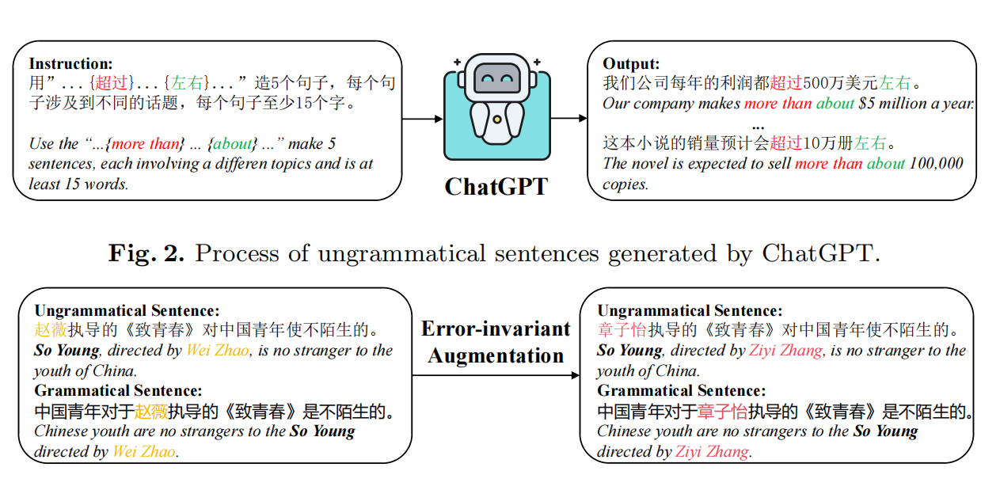

# GrammarGPT: 
#### Exploring Open-Source LLMs for Native Chinese Grammatical Error Correction with Supervised Fine-Tuning

HAVEN 7/12/2023

---
## Abstract
GrammarGPT 是港中文的研究团队制作的，能够高效识别中文语法错误的大模型。其能力已经达到能够正确纠正本土且十分隐蔽的语病了。

然而，其训练过程却十分的简单：它使用一个杂交的数据集(hybrid dataset)共1000多条数据，对模型执行指令微调，就结束了。

该研究团队使用了一个7B的模型，虽然参数量巨大，但是调起来几乎没有什么成本（这也是这个研究团队提的他们工作的一个优势）。在今年的NLPCC任务中，这个GrammarGPT达到了全榜单第3的好成绩。

这项研究对大创项目的意义在于：给我们存在问题的数据集构建方式提供了指导，并且给出了完备的脚本和操作细节，让我们得以复现。同时，参考GPT与GLM模型架构的区别，我个人认为GLM在纠错这方面还算有点潜力（因为它的预训练掺杂了完形填空任务，不过这只是个猜测）；另外GLM的论文也说了，相同参数量和复杂度的前提下，GLM的性能比同期其他模型都好(不过没有和GPT比，不知道为什么，GPT也没有跟他比)，不知道6B的效果最好能好多少。如果好可能发Paper。

## Introduction

这里他们对语病类型做了界定，这跟我们项目的界定方式存在差异：在这篇论文中，只有2种语病：有线索的(w/)和没线索的(w/o)。有线索的泛指一切能够用一套固定的模板（线索）构造的，比如说，由于...引起的、大约...左右这样子；没线索的指不能用统一的规则制定的，例如：歧义、语序不当、成分缺失等。具体可以看下面这张图:

接下来将主要介绍它的数据是怎么构建的。

## Methods

### Data augmentation
论文使用chatgpt自动生成一些数据。对于有线索的病句，首先上网搜索一些病句模板，然后让GPT用他们造句，这样就能快速生成相同模板的大量病句。这些病句对应的正确句子，因此可以通过利用模板撰写规则，直接在原句修改。

论文之后又搜集了很多无线索的病句-正确句子对，然后对这个句子对同步做数据增强：两个句子同时输入一个[命名实体替换模型](https://github.com/chatopera/Synonyms)，让它做命名实体的替换(人名，地名，景点名，专有名词，动词...)要确保替换掉的是同一个命名实体，当然gpt也能默认做到这一点。每一个句对替换几十次，就可完成有效的高质量病句扩充。具体如图所示。这里的病句来源是百度题库。

### Human-annotated data
人工标注数据集的来源主要是百度题库，并且基本都是那种无线索语病。根据他们的统计，应该标注了大概1061*0.35=380条。

### Instruction tuning
开展了指令微调，设计了指令模式如下图所示。

指令微调超参数如下表所示,或许执行一轮全量微调是值得考虑的。

## Experiments

### Metrics
评估指标是M2,分别设置了字符级(char)的评估和词级(word)的评估两个测试。
### Datasets
验证集是NLPCC2023的数据集NaCGEC，这个数据集自带的验证集有500条数据
### Results

这个S2S_BART是BART模型，在之前开会时提到这个是当时最好的模型，其实不然，GrammarGPT早在七月就已经遥遥领先了。Lang8HSK是我们之前准备使用的数据集中的一个，后来似乎是因为里面都是繁体就弃用3了。

## Conclusion
连起来了，全部连起来了，因此复现将会很快；同时这篇文章也让我们明白什么是专业性：不滥用数据集、不盲目分类：它们的做法虽然很简单，但实际上许多细节值得考虑。