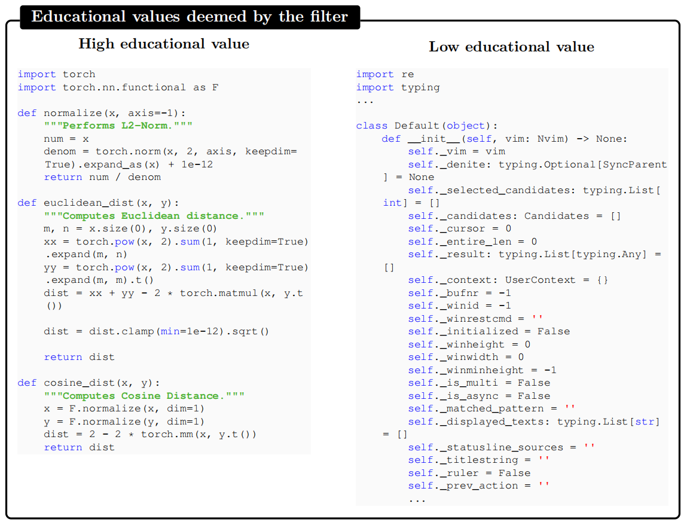
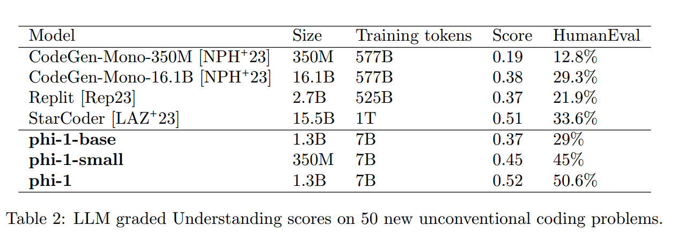
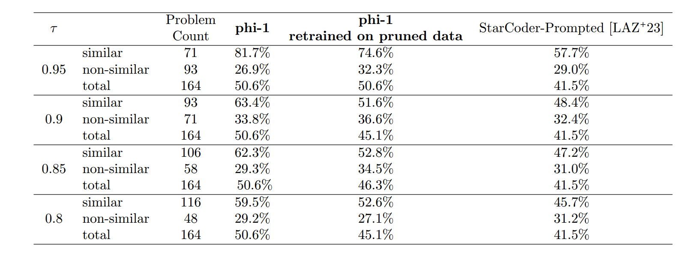

# Textbooks are all you need
HAVEN 2023/9/29

---
简述一下论文的主要观点，很简单：**高质量的数据集在微调效果上显著优于低质量且海量的数据。**

在介绍中，论文提到了大模型训练过程中存在的一种现象，*scaling laws*，就是随着网络复杂性的提升和计算次数的提升，模型的效能也会有所提升。他们探索了从另外一个角度来提升模型的性能，就是改进数据的质量。

为了验证这个猜想，他们与训练了一个模型**phi-1**，这是一个代码模型，只有1.3B参数。它的训练过程是：在7B个token的训练集上进行了8轮预训练，总共稍微超过50B个token的训练量；之后在少于200M的标签上进行了微调。但即便如此之小，它的性能也达到了空前的高度。这个只有1.3B的模型，在人类评估测试中达到50.6%的得分，远超10B甚至100B以上的部分模型，这些模型的训练量大约在几百B到1T不等。
#### 数据集的生成
那么具体如何完成这样一次实验呢？首先，需要构建一个高质量的训练数据集，称为**CodeTextbook**；以及一个高质量的测试数据集，称为**CodeExercise**。数据集的构建占据了实验的主要内容。训练数据集主要包含两部分：人工数据集和合成数据集；测试数据集主要包含合成数据集。
##### 人工数据集
首先，团队从网上搜集到了3个来自计算机社区交流的代码和文字的数据集。里面不全是能够拿来做训练的形式。有些情况下代码的核心部分仅仅占据很小一块，而其他大部分都包含繁琐的定义、数据的预处理、读写文件等周边操作，所以还要进一步对数据进行清洗。所以，团队使用GPT4来给每一个文字-代码对就教育价值进行评级打分。得到少量的（大约100k条）打分之后，基于GPT4的判断习惯训练随机森林分类器，这样就能以较低的成本来实现GPT4判断的能力了。然后用这个随机森林分类器对所有的数据进行打分，挑出其中富含教育意义的文字-代码对。

##### 合成数据集
为了让数据集能够如我们所期望的那样拥有很高的多样性（因为这样训练出来的模型更加健壮，同时能够让模型从多个不同的角度来解决问题，还能降低模型过拟合的风险），团队用GPT3.5制作了2个合成数据集。在制作这两个数据集的时候，他们参考了一种方法来提升数据的多样性：在prompt中包含一些从固定词汇中随机抽取的单词子集，并且要求它们以某种方式组合在生成的文本中。他们没有细说这个究竟是怎么完成的。

这样，数据就做好了。但是有了另外一个问题，就是他们的模型效果好可能会引来质疑：因为效果的评定方法是HumanEval人类评估实验，如果人问的问题模型恰好训练的时候碰见过，那么很可能模型的性能评估就被不符合要求地提高了。这叫做HumanEval数据的污染。为了防止这种问题的出现，团队还做了一个工作，把与HumanEval数据集重叠过高的训练数据去除。这项工作被称为数据剪枝(DataPruning)。

#### 数据剪枝
为了尽可能合适地完成数据的剪枝，团队使用了两种方法。
##### N-gram overlap
这个的原理很简单，首先我们指定一个N，然后**全切分**地把一个指令字符串划分为一个个长度为N的字串，称为N-gram.我们对HumanEval数据和训练数据做此操作，然后进行逐个的比对。如果说存在一定的重合而且N比较大，就可以认定这个训练数据跟人类数据HumanEval overlap（重叠）了，应该消除（或者去掉人类数据）。在实际工作中，科学家找到了4条HumanEval数据，它们跟训练数据中的至少1条存在13-gram重叠。但是在经过仔细比对之后，发现虽然确实存在很大的重叠，但是两个指令的含义仍旧是大相径庭。因此科学家认为，这种词对词的重叠计算方法是不够严谨的。

##### 嵌入和基于语法的相似度分析
由于吸收上面的经验，我们知道n-gram并不能精确找到HumanEval数据和训练数据之间非常相近的个例。所以采用了嵌入（embedding）和基于语法距离的组合来寻找。团队计算数据集中代码字段的embedding之间的L2距离（embedding用到的是一个预训练模型）。事实证明，embedding距离对语义相近的代码查找是可行的。基于语法的距离是计算代码片段的抽象语法树（AST）之间的字符串编辑距离，叫做AST距离。AST距离能够成功地识别代码之间的重叠部分。实际工作中，团队先是对L2距离设置了一个阈值，防止大部分的重叠字段同时出现，然后再设置了几个AST距离的匹配率$\tau$,这样就能够在不同的匹配程度之下定义“相似”和“不相似”的代码段了。
#### 模型架构
在已有的数据上训练了3个模型：

- phi-1-base:基线模型，在CodeTextbooks上训练得到。
- phi-1:在phi-1-base的基础上，在CodeExercise上进行了微调。
- phi-1-small:phi-1的缩小版，训练流程相同，但是只有350M的参数。

#### 测试结果
测试中，科学家自己构建了一个数学问题让三个模型用Python解答。观察到，模型在调优后对指令的理解和遵从程度要高得多。phi-1-base处理提示中的逻辑关系，而phi-1可以解释问题并正确生成答案。在这个例子中，即使我们的350M phi-1-small模型显示了对问题的一定程度的理解，即使最终的解决方案是错误的。

之后，科学家又构建了一个针对某特定python库的微调数据集对三个模型进行微调，从表现上看，pi -1-base和pi -1-small产生的函数调用在语法上是正确的，但在语义上是不相关的。phi-1-base显示出一些使用适当API调用的能力，但它不能遵循任务的逻辑，而经过微调的phi-1-small理解逻辑，但没有足够的能力学习正确的函数调用。

最后，科学家构建了一个非寻常的python问题集，里面的问题繁琐而多样，平时几乎没有人会写这种程序；并且用GPT4来对三个模型的表现进行打分，同时也人工评估了这些模型响应的好坏。挑选出50条测试数据的测试结果如下：

可以看出，phi-1-base和phi-1在评估上都不逊色甚至完胜它们的对手StarCoder，不论是GPT4评估还是人类评估。即便是最小的phi-1-small，也表现优异。

针对可能质疑的HumanEval数据污染问题，科学家又对phi-1在所有这些数据上做了训练。如下图：

可以看出，在条件相同的情况下，phi-1的表现几乎都比StarCoder要好。这说明了phi-1的优秀并不是污染所导致了，而确实是高质量数据集所引发的。

----
