# Attention is All You Need
Haven 2023.10.21

---
#### 引言
2017年，论文《Attention is all you need》横空出世，虽然在当时该研究仅限机器翻译这一个比较小的领域，但几乎没有人意料到这篇论文开启的是AI的全新世代。在短短6年间，transformer攻城略地，一统山河，首先从机器翻译领域发展到预训练大模型再到通用大模型，再从ViT开始，几乎打遍整个CV领域，终结了CV与NLP长期割裂分据的状况。可以说，如果transformer没有产生，眼下统一的时代就不会到来，或者说，将会更晚到来。对于一名NLP学习者来说，没有哪篇论文的地位能超过这篇奇作。因此，虽时隔六年，我仍旧以崇敬的态度重读这篇文章。读懂transformer不仅仅是从兴趣到事业的转变，更是NLP研究的开始。

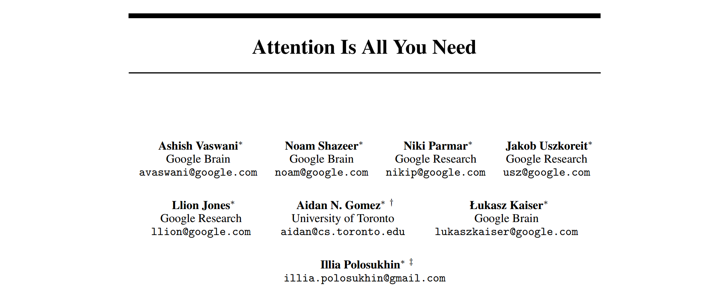

## Introduction
在transformer诞生之际，使用encoder-decoder架构来解决序列模型和转导问题等是非常普遍的做法。

什么是encoder-decoder架构呢？就是将文本数据进行编码形成一个向量，然后丢到深度学习的黑盒中进行一系列的计算，最后得到一个新的向量，再用同样的向量解码得到输出结果。如果是机器翻译任务的话，我们可以把所有的字符统一向量化，或者把不同语言的向量映射到不同的区间，然后把要翻译的话编码，之后将模型处理之后得到的向量查表解码，得到的正好是翻译之后的句子。

在transformer之前，使用RNN、LSTM等神经网络充当编解码器是主流的做法。但是这些方法有一个非常致命的问题：并行度差。

为什么这么说？因为这类循环模型对输入和输出序列的处理是沿着字符在序列中的位置顺序进行的。我们回顾一下RNN的基本框架：

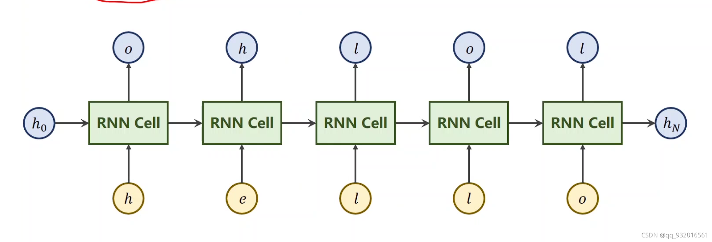

如果输入是一句话，那么这句话将会拆分成词，然后一个一个地丢到RNN中做计算。这样做的好处是：在输入第i个词的时候，RNN Cell中已经存放了前i-1个词的信息，这样进行一轮计算后，RNN Cell就又收获了这个词与前文的关系了。此外，顺序传入词语会顺次计算词语在句中的位置，从而计算它的位置编码。在RNN架构输出之前，其内部所有的中间结果都称作隐状态 $h_i$ 。$h_i$与上一个隐状态$h_{i-1}$和输入词在全句中所处的位置$i$共同决定：

$$h_i=f(h_{i-1},i)$$

如果上一个词的$h_{i-1}$算不出来，那之后的都别想算出来，所以要想并行是没有好办法的。

这不仅导致并行困难，还引发了另两个问题：

- 如果输入序列非常长，那么$h_i$将会非常多，训练速度会很慢；而如果内存有限，我们还不得不降低训练的batch和$h_i$的数量（句子切分），这样不仅变慢，训练效果也会更差。
- 这种输入模式导致模型只能关注前文，而不能关注前后文。下图是只关注前文导致生成结果错误的典型案例：

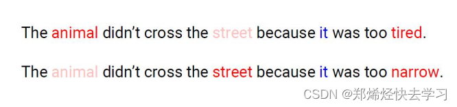

在只考虑上文时，tired和narrow都对，但如果说有关it的进一步说明只在下文提到，那么模型的输出大概率是错的。

所以，这篇论文就提出了transformer架构：不仅不再需要循环计算，而且有意引入了注意力机制，让模型不必从巨大的上下文中抽取信息，而是学会放眼全局关注重点，从而带来训练速度和效果的双重提升。
## Background
其实有关RNN的弊端，学界已有认识，部分研究尝试采用卷积神经网络来实现并行关注上下文，例如论文中提到的ConvS2S和ByteNet等。但是，随着词语之间距离的增大，这些网络抽取关系的计算成本也会增高，比如ConvS2S就是线性增加，而ByteNet是对数增加。transformer的注意力机制能够一次输入整个句子直接并行计算，将计算复杂度降低到常数级别。虽然内中用到的加权平均注意力编码会导致分析的精度降低，但是采用多头注意力机制之后这个问题被抵消了。

值得一提的是，注意力机制，或者自注意力机制，并不是这篇论文的原创。自注意力机制此前已经成功应用于阅读理解、抽象总结等任务。transformer的创新点在于完全应用自注意力机制，没有使用卷积或者RNN。有关这个机制的具体实现和应用，接下来会讲到。
## Model Architecture
刚才提到，大多数拥有良好性能的序列转导神经网络都有着encoder-decoder架构。

在这种架构中，模型的编码器encoder接受一个序列$x=(x_1,x_2,\cdots,x_n)$,并且输出一个序列$z=(z_1,z_2,\cdots,z_n)$给解码器；解码器接受序列$z$并输出预测结果$y=(y_1,y_2,\cdots,y_n)$。

Transformer遵循这个整体结构。在编码器和解码器中，它使用多个自注意力层堆叠以及点到点的全连接层。下图展现了Transformer的结构，左半部是编码器，右半部是解码器。

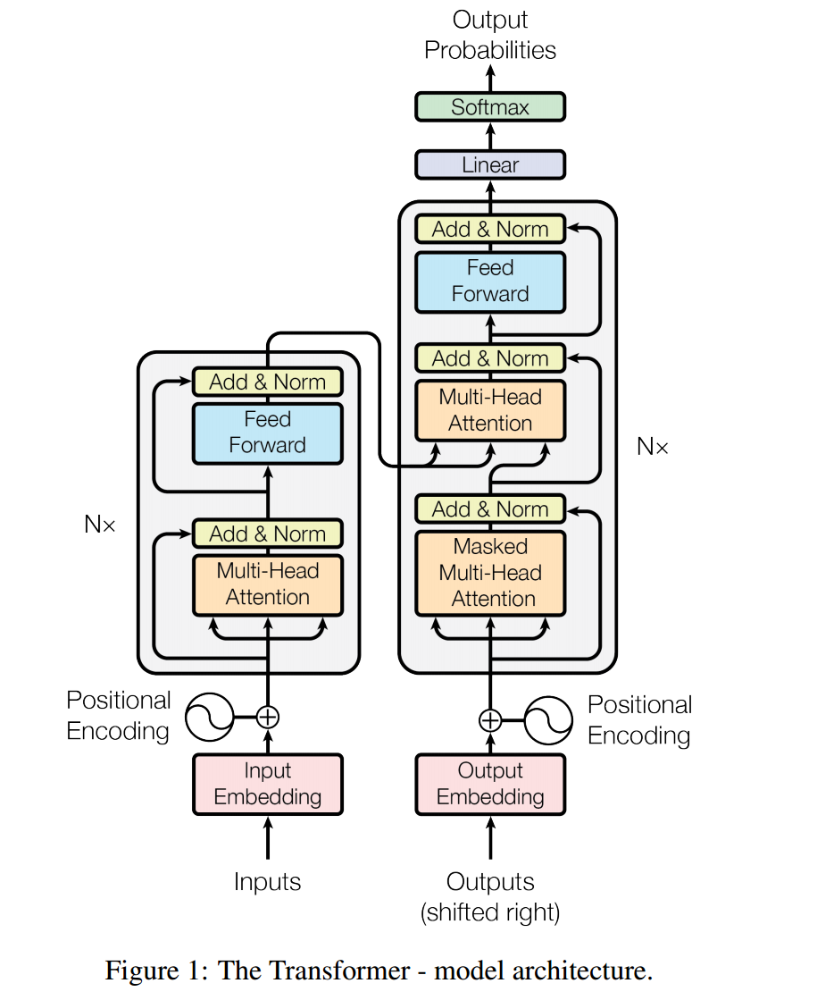

#### 1.encoder&decoder
##### encoder
编码器由6个独立且相同的层堆叠形成，每一层包含两个子层。第一层是一个多头自注意力机制层(Multi-Head self-Attention layer,MHA)，第二层是一个简单的、点对点的全连接层，这里称呼为前馈网络(feed-forward network).每两个这样的子层之间，还增设了残差连接层和层正则化层(residual connection&layer normalization)。

为什么使用残差连接？可以参考resnet，残差连接可以让模型做的特别深而不会导致梯度消失或训练越来越偏。

这里的layer normalization还跟我们之前提到的batch normalization有所不同。下图说明了二者的差异性。

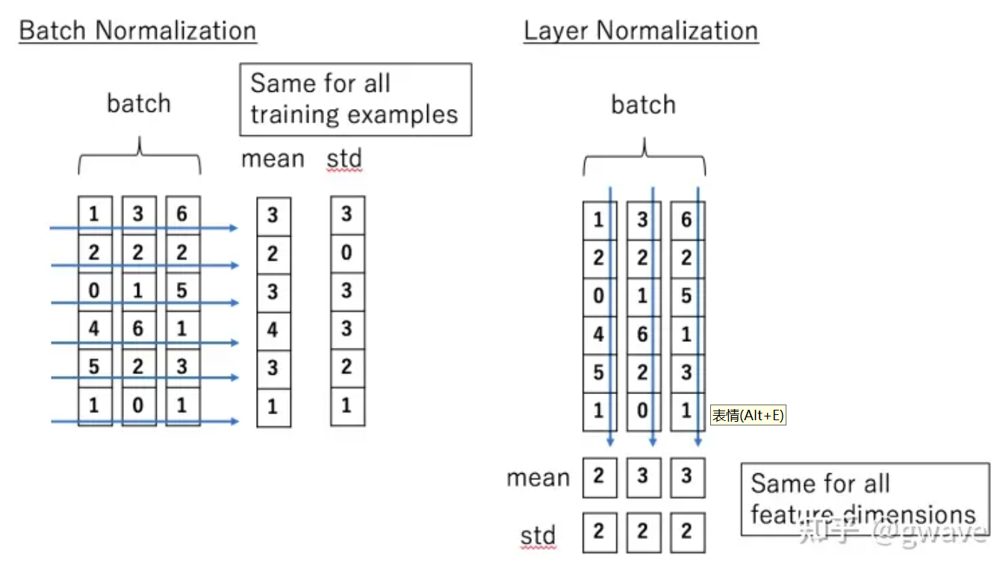

在以往的认识中，数据的每一行代表一个特征向量，BN是对每一个特征的所有样例值进行放缩、位移的正则化处理，结果是这个批次中每一个特征的取值都是相同的分布。而LN是对每一个特征向量进行经过放缩、位移的正则化处理，结果就是每一个样例的所有特征值的分布变为相同的。

虽然LN听起来有点像“身高和体重的平均值”一样不合理，但这么做主要的原因是：在NLP中，每个sequence的长短不齐，长短相差可能很大，短的sequence一般都padding了0，进行跨sequence的Norm计算时会把这些0都算进去，导致计算结果不稳定，而对一个sequence进行norm，就可以避免这个问题。这个问题跟BN要解决的ICS(内部协变量偏移)不是一回事。

总结一下，对于encoder单层中的这两个子层，它们的输出数学表述相同，都是$$output=LayerNorm(x+SubLayer(x))$$
其中，$SubLayer(x)$就是这一层的输出。$+x$是残差连接的效果。

为了让残差连接更方便，每一层(包括embedding层encoder中所有层)的输出维度全部都设定成$d_{model}=512$。
##### decoder
解码器也是由6个独立且相同的层堆叠形成。每一个层包含3个子层，除了跟编码器一样的多头注意力层（最下边那个，加了mask，之后会解释）和前馈层(即全连接层，最上面那层)，还有一个多头注意力层（3个层中间那个），用来给编码器的输出再计算一次多头注意力。

跟编码器一样，我们仍旧对每一个子层的输出添加了残差连接层和层正则化层。

现在解释为什么要加mask:论文希望Transformer完成的任务是翻译任务，是一个自回归文本生成任务。训练是模拟模型实际工作的情景，模型一个接一个地不断预测下一个词。模型在预测时只能参考自己之前“已经生成”的前文。所以训练时要把“后文”给mask掉。

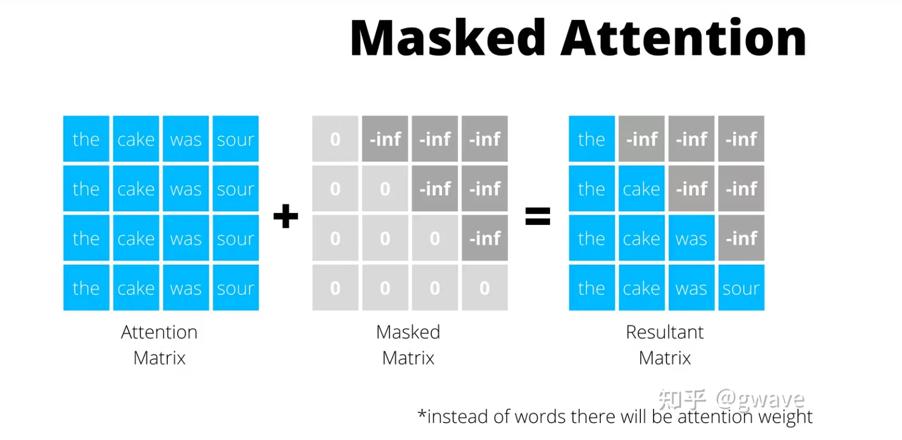

这个的实现是静态的，我们直接输入每一个状态对应的outputs(shifted right)每个阶段mask掉一部分的向量所组成的矩阵。
#### 2.Attention
现在讲解什么是注意力机制。

注意力函数(attention function)将查询(Query)、一组键值对(Key-Value)映射到输出(Output)。$$f(Q,K,V)=Output$$

其中，$Q,K,V,Output$都是向量，表示一组查询、一组键和一组值。$Output$的每一个元素是这组值的一种特定的加权和，分配给每一个值的权重是由相关查询和每个值对应的键的相似度(compatibility function)所决定的。

也就是说，我的输入可以表示为一系列Query,Query变了，那么生成词的概率分布就变了，生成的结果也就变了。这跟我们问机器不同的问题，机器回答不同的答案是一个道理。

这样讲还是有点抽象。我们直接用运行机制来总结一下注意力机制：我们丢给模型一个query（可以理解为：“翻译‘人工智能’。”），模型拿着这个query到他的词汇表中对着词语一个个问：“你跟这个问题有多相关？”问完所有的词语之后，模型把这些词语给出的相关度排一下序，然后挑出一个最合适的词语：“AI”。

下面我们详细展开说说注意力机制是怎么完成这个过程的。

##### Scaled Dot-Product Function
中文翻译为“缩放点积注意力”。
- 输入：一组query(维度是$d_k$)，一组键(维度是$d_k$),一组值(维度是$d_v$).
- 输出：每个词被注意程度的概率分布output。维度应该也是$d_k$。

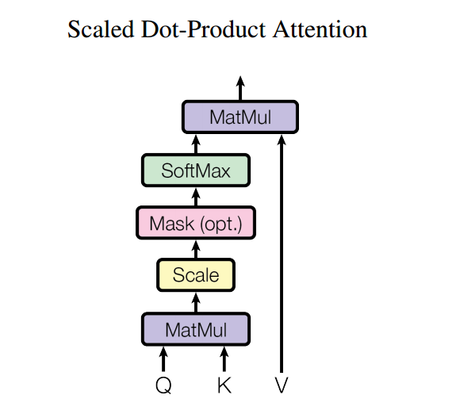

我们分别计算每一个query和所有的keys之间的点积，每一个点积除以$\sqrt{d_k}$，然后使用softmax将这些值转化为这一组value的权重分布。

在实际的操作过程中，我们一次性处理多个query。这些query被打包成矩阵$Q$,而键和值则被打包成矩阵$K,V$。这样$Q$与$K$执行一次矩阵乘法就能够得到权重分布了。将这个权重分布和值矩阵$V$做矩阵乘法，就得到了该查询下所有值的注意力权重分布。
$$Attention(Q,K,V)=softmax(\frac{QK^T}{\sqrt{d_k}})V$$

最经常使用的注意力函数是加性注意力函数(Additive Attention)和点积注意力函数(Dot-porduct Attention)，点积注意力函数除了没有$\sqrt{d_k}$因子之外，其他与上面的缩放点积注意力是一样的。加性注意力计算Q和K的相似度是通过一个独立的单层前馈神经网络完成的，而不是直接通过矩阵乘法。点积注意力比加性注意力更好，因为使用了高度优化的矩阵乘法算法，它更快、更节省空间。
###### 为什么要缩放
Transformer架构处理文本信息时，**序列越长，点积$QK^T$的分布越分散，越有可能出现极大值**。

假设查询q和键k是标准正态分布中随机抽样得到的，均值为0，方差为1，那么经历了一次点积，$q\cdot k=\sum_{i=1}^{d_k}q_ik_i$，输出的结果均值为0，而方差变成了$d_k$。因此会更容易产生极大值。

我们在之前的讨论中(从0到CNN教案)提到了softmax层的计算方法$$softmax=(\frac{e^{x_i}}{\sum_{j=1}^n(e^{x_j})})_{i=1}^n$$如果数据中存在非常大的值，那它的softmax将会被分配到一个梯度(导数)趋近0的地方，类似Sigmoid函数的梯度饱和、或者说梯度消失问题。这个情况下想梯度下降更新参数将会非常困难，因为更新的程度因为这一条数据变得非常小。

为了避免这个问题的产生，必须要对点积$QK^T$进行一定的放缩变换。放缩因子选择$\sqrt{d_k}$有两种理解方式：一是因为产生极值的概率随$d_k$的增加而增加，所以这个缩放因子也必须要跟$d_k$成正相关。二是因为统一除以$\sqrt{d_k}$之后，点积$\frac{q}{\sqrt{d_k}}\cdot \frac{k}{\sqrt{d_k}}$均值为0、方差为1。这就控制住了极限值出现的概率。

##### Multi-Head Attention(MHA)
多头注意力机制是刚才的缩放点积注意力机制的增强版，它的主要思想也很简单，就是将Q,K,V分别通过形状相同但是内部权值不同的线性层映射到不同的子空间进行注意力的计算。这样会得到一系列形状相同的注意力矩阵。我们将这些矩阵前后拼接起来，再通过一个统一的线性层，最后就能够得到最终的注意力权重矩阵了。输出矩阵跟输入矩阵的形状完全相同，恰好展示了每一个词的注意力权重值。具体原理图如下图所示。

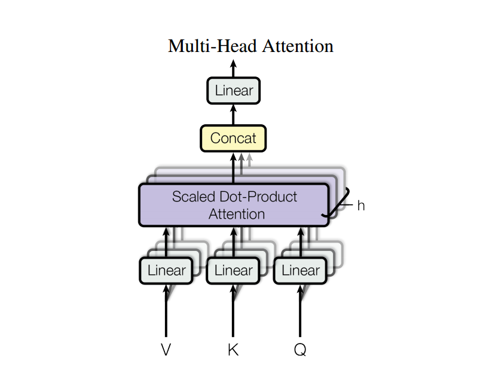

可以看到，Q,K,V分别接入3个形状相同但数字不同的线性层，映射到统一形状的矩阵$QW_i^Q,KW^K_i,VW_i^V$。原始Q,K,V向量的维度我们统一用$d_{model}$泛称，那么，$W_i^Q\in R^{d_{model}\times d_k},W_i^K\in R^{d_{model}\times d_k},W_i^V\in R^{d_{model}\times d_v}$.这样就把原始输入Q,K,V映射到我们规定的维度$d_k,d_k,d_v$中去了。

之后跟正常的注意力一样，我们计算缩放点积注意力。然后为了让维度回归到跟输入一致，我们把每一个注意力单元的计算结果首尾相接，然后经过一个线性层映射回$d_{model}$。

以上过程数学表述为:
$$MultiHead(Q,K,V)=Concat(head_1,\cdot,head_h)W^O$$ where $$head_i=Attention(QW_i^Q,KW_i^K,VW_i^V)$$
and $$W^O\in R^{hd_v\times d_{model}}$$

在本论文中，使用了$h=8$个并行的注意力层，$d_k=d_v=d_{model}/h=64$。因为每一个注意力单元的维度相比输入都削减了，所以总的计算开销跟使用一个单头的注意力模块是一样的。

下图展现了多头注意力机制的意义：使用MHA，可以让模型发现同一序列的词语之间多种多样的关系，可能有更接近全局的，也有更接近局部的。

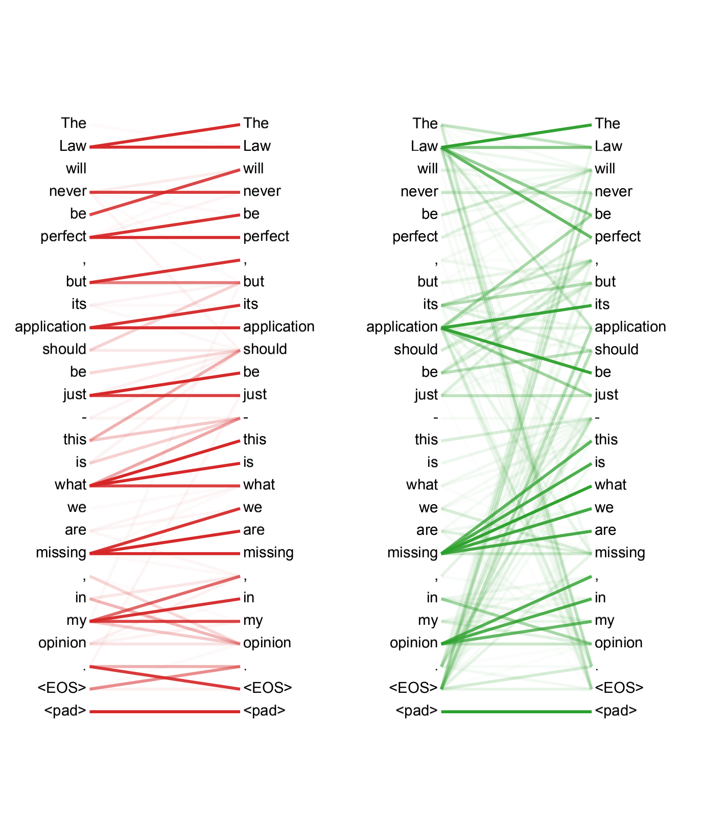

上图给出两个注意力头的计算结果，颜色深浅表示注意力值的高低。可以看出，每一个词跟其他词的关联程度有高又低，而不同的注意力头，获得的关系也有所区别。

##### Attention 的应用
Transformer架构的注意力机制有三个层面的应用。
1. 在编码器和解码器之间有一个注意力层。k和v来自编码器的输出，而q来自解码器上一层的输出（可以再回过头看一下总体架构图）。这就能够构造出q中每一个词跟k中所有词关系的强弱程度了。
2. 编码器内部包含自注意力机制层。自注意力机制层中，q,k,v都来源于该层的前一层的输出结果。所以，编码器中的每一个位置都能关注到前一层中内容的全部位置，相当于计算一条句子中某一个词语跟该句其他词语的关系。
3. 解码器内也包含自注意力机制层。跟编码器不同的是，为了模拟真实的预测场景，在解码器预测到某个位置之前，后面的内容都要被mask掉。我们通过顺序地将后文的所有内容置为$-\infty$来替代。
#### 3.为什么要选择Transformer
在这一部分，论文着重从三个方面论述了为什么要使用Transformer：
- 计算的总复杂度；
- 可并行化的计算量，通过最小的顺序操作数来衡量；
- 网络中远程依赖关系之间的路径长度。这反映了模型学习到远距离依赖关系能力的强弱。因为影响远程依赖关系学习能力的一个关键因素是网络执行前向传播和反向传播的路径长度。对于输入中两个隔得很远的位置，如果越快获得一个包含二者的特征(获得二者依赖关系的路径越短)，就说明模型学习远程依赖关系的能力越强。即便从直观上理解，这也是一个不争的事实。

下表展示了不同层内部的计算复杂度、需要执行的顺序操作(在这一层执行传播的复杂度)、要想覆盖整个序列所需的最少层堆叠数(最大路径长)。

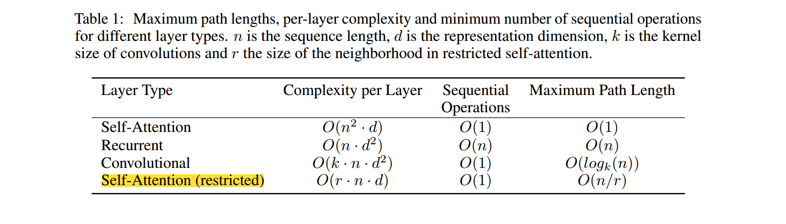

下面我将会一一解释。

##### Sequential Operations
指的是每一个模型要执行多少次顺序操作。这里的顺序操作可以理解为传播。那么面对一个长度为n的序列，除了RNN是要在一个循环层循环输入O(n)次(一次多加入1个词)之外，其他的基本只需要传播一次就够了，或者可能独特的架构要传递2至3次，但都是O(1)级别。

##### Complexity per Layer
加入我们有一个向量化的文本，里面有n个词，每一个词都被vectorize成了一个d维的向量，那么在每一个层中执行计算的复杂度是多少呢？
对于自注意力层，我们的输入是每个文本的q,k,v，对于每一个q，我都要跟所有的k执行向量乘法。由于q和k的维度都是d，所以执行一次向量点积的计算量是O(d)。然后因为有n个q，有n个k，所以总体下来做了n*n次向量的乘法，最终的计算复杂度就是$O(n^2\cdot d)$。

对于循环层。一个d维的向量输入之后会先和d\*d的权重矩阵进行一次计算，复杂度是O(d\*d)，然后在执行激活变换之后，跟隐层的输出对应相加，作为下一时刻隐层的输出。因为序列长度为n，所以整个过程下来，在循环层中执行的总计算复杂度是$O(n\cdot d^2)$。

对于卷积层，它拥有一个k\*d的一维卷积核，输入的是一个n\*d的矩阵。卷积核执行一次卷积运算，它会对每一列n个数执行卷积运算，移动次数是n，计算复杂度O(k)所以总的计算复杂度是O(nk)，对于d个特征值都这么做，那么总复杂度就是O(nkd)。而为了保证第二维度处维度不变还是d，所以需要d个卷积核，那么总的计算量就是$O(k\cdot n\cdot d^2)$。

对于上下文长度限制为r的注意力机制层，只有r个query，k的数量是n不变，那么最后计算的复杂度降低为$O(r\cdot k\cdot d)$。

##### Maximum Path Length
注意力层只需要传播一次，就能够获取给定序列中不论多远的序列之间的关系，而受限上下文中获取序列切片的关系甚至更低，所以只需要O(1)的路径长度这个任务就能够完成。循环层中，要循环经历n轮才能获得最远的词语之间的关系，所以路径长度是O(n)。卷积层有点特殊，因为一个卷积层的视野是受卷积核限制的，所以要想关注全文远距离关系，必须需要多个卷积层。如果是普通的卷积层，那么根据感受野来看，只能堆叠O(n=k)层才能获取全局信息；而如果使用了扩展卷积核，由于它自身就扩大了感受野，所以最终只要$O(log_k(n))$层就能完成全局关系的获取。下图是扩展卷积核的直观示意。

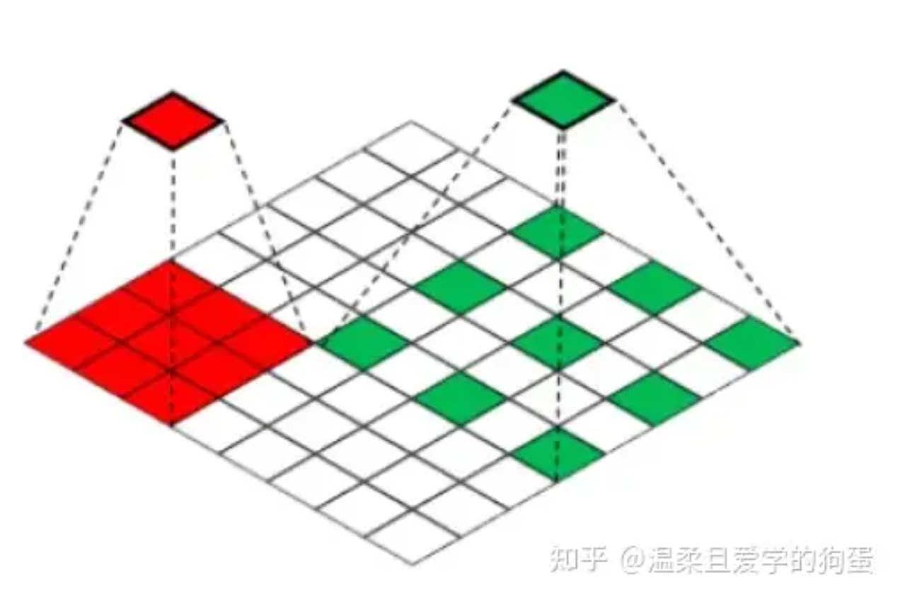

红色的是常规卷积核，绿色的是扩展卷积核。