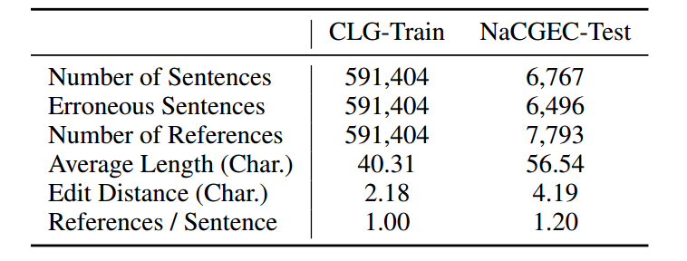
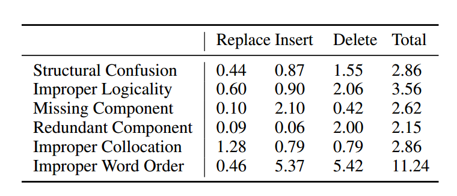
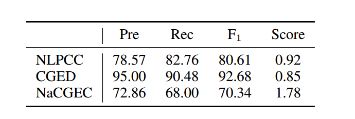
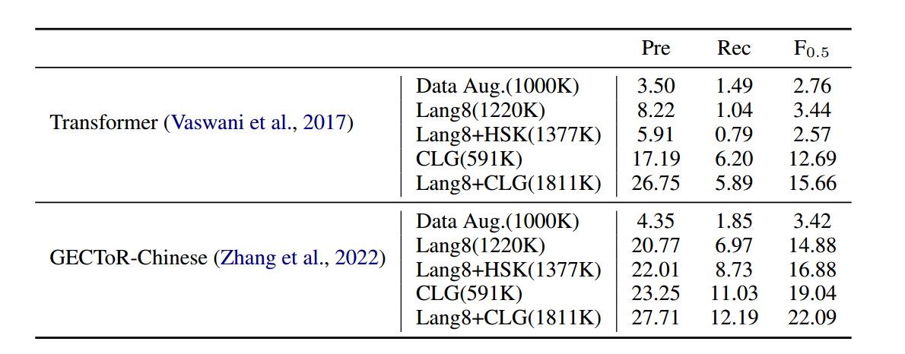
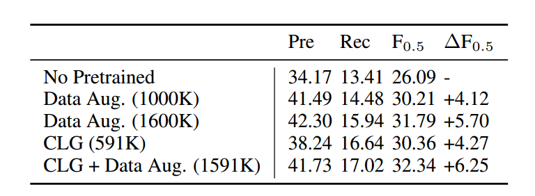
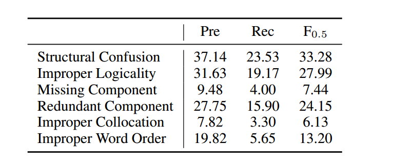
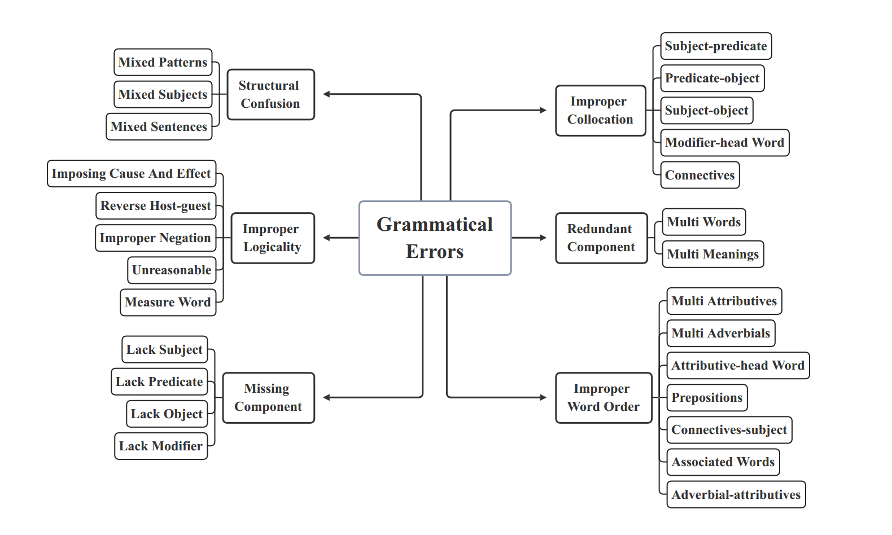

# 论文笔记：CLG-CGEC规则系统
2023.7.31 HAVEN
论文原文：
```
@inproceedings{ma2022linguistic,
  title={Linguistic Rules-Based Corpus Generation for Native Chinese Grammatical Error Correction},
  author={
        Ma, Shirong and 
        Li, Yinghui and 
        Sun, Rongyi and 
        Zhou,Qingyu and 
        Huang,Shulin and 
        Zhang, Ding and 
        Yangning, Li and 
        Liu, Ruiyang and 
        Li, Zhongli and 
        Cao, Yunbo and others},
  booktitle = {
    Findings of the Association for Computational Linguistics: EMNLP 2022
    },
  year={2022}
}
```
Github:
**<center>https://github.com/masr2000/CLG-CGEC</center>**
*在理论语言学领域，母语者是语法的权威。*

*——诺姆·乔姆斯基*
## 摘要和背景

目前主流的CGEC（中文语法纠错）主要由深度学习模型完成，但是这些模型的训练有几个问题：

- 模型训练：缺乏高质量语料库。
- 模型评价：使用NLPCC、CGED两种数据集评价，都倾向于非母语者犯的错误，所以模型在母语者这里的实际性能比较难以评估。这两种评价的样本相对都比较简短且问题明显，不符合母语者的情况。

CLG规则体系的优点是：

- 生成病句的同时还能同步生成类型标注。
- 模型的实际训练效果要好。

该研究同时制作了一个数据集**NaCGEC**是实际母语者产生的病句，值得一试。 

## 相关研究
一、数据集
 - NLPCC
 - CGED
 - HSK
 - YACLC

二、相关模型：深度学习模型

## 研究内容
### CLG规则
不考虑歧义和错别字、形近字错误。

然后只是大体描述了一下CLG规则的建立是基于语言者习惯的，而没有阐述其算法原理，需要翻补充材料和源码。

### NaGEC数据集
人工数据集，其特征是来源于汉语母语者（高考病句题、公考），经典的病句。这跟前面提到的那几个数据集都有所区别。

## 数据分析
### 数据集统计数据
下表展示了本研究构建的两个数据集的一些基本参数：总句子数、病句数、原始句子数量、平均句子长度、平均[编辑距离](https://baike.baidu.com/item/%E7%BC%96%E8%BE%91%E8%B7%9D%E7%A6%BB/8010193?fr=ge_ala)、数据集扩展比例（后者大于一是因为有些句子有多个语病，被算了多次）。



下表是一般意义上修正特定错误病句的编辑距离的统计。在模型测试的时候用于基本修改能力的评价。



### 数据集人工评测
方法：在三个测试集中随机抽取300个正确句子和300个错误句子，在确保正确性的前提下人工对这些句子是否有语病进行一个二分类。下表反映了这一点，*Score*表示注释者判断句子符合母语人士语言习惯的程度(0,1,2)。 



结论：NaCGEC的病句更加隐蔽，并且更加接近实际语言习惯。

## 实验
### 实验配置
受测模型：transformer,gector-chinese。

训练数据：5类数据集。

**评估方法**：词级MaxMatch (M2) Scorer。它计算黄金编辑集和系统编辑集之间的Precision, Recall和F0.5。

### 实验细节
涉及模型参数和训练批次等，从略。

### 实验结果



总结一下就是在CLG+benchmark上训练出来的效果相对好一点。

### 泛化性评估

下面是使用transformer基于不同的数据集训练之后用NLPCC进行评估的结果。



Data Aug是使用了数据扩充的方法：在将正确的句子分割成单词后，根据不同的概率对句子中的每个单词执行以下操作：70%的不修改，10%的在该单词之前插入随机单词，10%的用随机单词替换该单词，以及删除该词的10%。

从ΔF0.5来看，依然能够证明基于CLG训练的数据能够增强模型的纠错能力。

### 样例研究和细粒度分析

通过一些样例，可以看出CLG训练出来的模型更难在修改之后直接丧失语句原本的意义。

用CLG训练的模型在细粒度语病样例上的测试结果如下所示。



可见，一旦语病的粒度过细（隐蔽），模型的纠错能力就会大大降低。这是研究的一个问题，因为我们现在对语病搭配的理解不足，语病错误的方式非常多，很难仅通过一次研究就找到共性，解决问题。下图是已知的语病分类。



## 研究限制

由于中文的特殊性，这个CLG规则没办法用在其他语言上。

模型参数还可以更大，采用更大的模型进行测试能更好地反映benchmark的效果。

## 总结
这篇论文讲了CLG规则生成数据集的可靠性，提供了许多可参考的病句语料库，并且只使用了一种通用评价指标就是M2-score。我之前用语病分类来评估的说法是不对的。

这篇论文没讲CLG算法的实现，也没有讲M2-score的细节，所以还需要有相关的论文阅读，以及代码的理解。

启示是：虽然论文没有提，但实际上并没拿CLG做测试集。我们一开始是拿CLG做测试集，并且模型是没有训练的。所以我怀疑一开始极低的准确率是CLG不适合拿来做测试导致的。毕竟CLG生成的句子肯定不是gold sentence.

按照论文的方法，正确的解决方案应该是：用CLG数据集直接训练，然后在NLPCC和NaCGEC上进行M2-score测试。

不过该研究的实验可以对我们的模型测试产生启发：只要把其中用来训练的模型transformer替换成GLM即可。