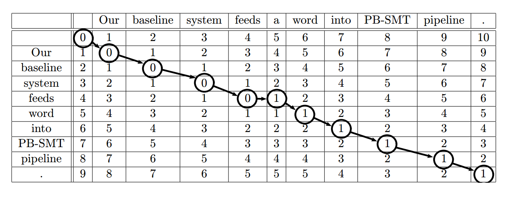
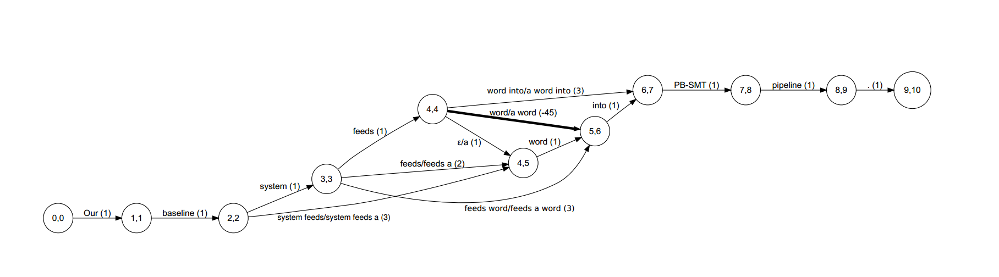
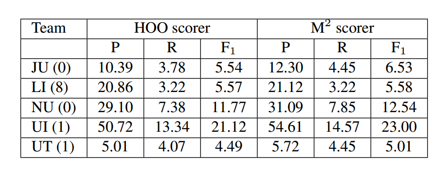
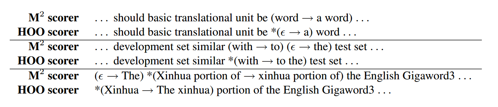

# 论文笔记：*M2-scorer* 评价指标
2023.8.1 HAVEN

论文原文：
```
@inproceedings
{dahlmeier-ng-2012-better,
    title = "Better Evaluation for Grammatical Error Correction",
    author = "Dahlmeier, Daniel  and
      Ng, Hwee Tou",
    booktitle = "Proceedings of the 2012 Conference of 
    the North {A}merican Chapter of the Association for Computational Linguistics: 
    Human Language Technologies",
    month = jun,
    year = "2012",
    address = "Montr{\'e}al, Canada",
    publisher = "Association for Computational Linguistics",
    url = "https://aclanthology.org/N12-1067",
    pages = "568--572",
}
```
Github:

**<center>https://github.com/nusnlp/m2scorer</center>**
## 摘要和背景
**为什么需要设计M2-scorer？**

纠错评估通常通过计算一组拟议的系统编辑和一组人工注释的金标准编辑之间的F1度量来完成。

这个F1的评估方式有些问题：因为病句的修改存在很多种途径，更何况有时候你也没法保证你的修改结果跟原句完全一致，这就为GEC的评测带来了巨大的困难。

比如说这里有一句话：`We have a basketball.` 病句是：`We have basketball.`组委会给出的编辑序列gold edit是：

<center>(basketball->{a basketball,basketballs})</center>

参赛选手给出的编辑序列是:

<center>(Φ->a)</center>

最终虽然这个修改方案也能把句子改对，但由于不在组委会提供的gold edit中，所以被视作错误结果了。

为了能够最大限度地发掘参赛者修改结果中正确的部分，开发了最大匹配计分器*Max-Match*(M2)用于有效地计算与金标准具有最大重叠的短语级编辑集。随后使用F1度量对编辑进行评分。


**为什么现在很多人采用M2-scorer？**

这个方法是词粒度的，所以不会存在全盘否定的情况，M2内部的编辑序列图原理能够实现充分的匹配，所以也能够保证gold edit中能包含正确结果的任意一种编辑方法。

## 算法原理
### 定义
我们把参赛者产生的输出称作**系统输出**，参赛者输出中的编辑序列称为**系统编辑**。严谨起见，我们以“标签(token)”作为句子划分的最小粒度

$S=\{s_1,s_2,s_3$,...$s_n\}$：原始病句集合。

$H=\{h_1,h_2,h_3$,...$h_n\}$：参赛者生成的改句集合。

$G=\{g_1,g_2,g_3...g_n\}$：每一个原始病句的金标准注释集。

$g_i=\{r_i^1,r_i^2,r_i^3,...,r_i^l\}$：第i个金标准注释集包含l次编辑操作，之后称为编辑。

$r_i^m=(a,b,C)$：表示一个编辑(edit)。$a,b$表示这一字符串$s_i$中编辑操作所位于的那一段子串的起始标签偏移量(token offset)和终止位置的标签偏移量。$C$在金标准注释集中代表的是一个操作的集合(之所以是集合是因为要提供不止一种改句，而不是因为为了产生一个改句有好几种可能的编辑方式。之后还会进一步说明)，而在系统编辑这边，只代表单个校正操作(因为参赛者只需要给出一种修改方案即可)。

系统输出的评估一共分为两步：

1. 为每一个原句-改句对$(s_i,h_i)$提取出一个系统编辑$e_i$。
2. 对整个测试集生成的系统注释集，用金标准注释集$G$进行评估。

**本节的剩余部分描述了解决这两个步骤的方法。我们从描述如何从原句-改句对构建编辑晶格开始。然后，我们将会证明找到最佳编辑序列相当于求解通过结点的最短路径搜索。最后，我们描述了如何使用F1度量来评估编辑。**

---
### 编辑晶格
首先需要介绍一下**编辑距离**(Levenstein Distance):将一个字符串转换为另一个字符串所需的插入、删除和替换操作的最小次数。

针对一个原句-改句对$(s_i,h_i)$，我们先把它们分词(按照标签粒度/短语粒度进行划分)：

$$s_i=sw_i^1,sw_i^2,...sw_i^m$$

$$h_i=hw_i^1,hw_i^2,...hw_i^n$$

然后我们用一个矩阵来表示这两个句子之间的关系，称之为Levenstein矩阵。该矩阵中每一个格子代表着原句的一个子句变到改句的一个子句的编辑距离。

我们用原句`Our baseline system feeds word into PB-SMT pipeline.`，改句`Our baseline system feeds a word into PB-SMT pipeline.`来实现一下：


表格中每一个格子都表示从一个子句变到另外一个子句的编辑距离：

我们先认定第一个数字列和数字行上面的数字是下标，然后用坐标来表示每一个单元格，顺序是二维数组的行主序。

- 单元格(0,3)表示从空串变到`Our baseline system`需要3次插入操作，所以这个格子的值是3.
- 单元格(4,5)表示从`Our baseline system feeds`变到`Our baseline system feeds a`需要一次插入操作，所以值是1.
- 单元格(6,2)表示从`Our baseline system feeds word into`变到`Our baseline`需要4次删除操作，所以值是4.
- 单元格(5,5)表示从`Our baseline system feeds word`变到`Our baseline feeds a`需要一次修改操作，所以值是1.

通过简单地执行广度优先搜索，我们可以提取从Levenstein矩阵的左上角到右下角的所有最短路径的格。然后把这条路径单拎出来，形成一个线性图。

每个结点对应着Levenstein矩阵中的一个格子；

每条边代表一次编辑操作：插入标签、删除标签、修改标签或者不做任何处理；

此外，每条边也应该有一个权重，这个权重是执行这样一次编辑操作所需要的代价。

那么这样一条路径就能够被转化为一个随着子串的不断延伸，$s_i\to h_i$的编辑序列。以图中所示为例，这个编辑序列就可以看成是：

***添加Our→添加baseline→添加system→添加feeds→添加a→...***

另外，我们也能看到，对于一个注释，其写法也可以不同，例如下面这个添加操作 ***Φ→a***，其实我也可以说：***feed→feed a***,甚至可以说：***Our baseline.....→Our baseline...a***。

像这样在编辑中允许任意数量的不变单词当然是不现实的。特别是，我们希望避免对完整句子进行过大的编辑。因此，我们要通过一个参数$u$来限制未更改单词的数量。同时，为了允许短语级编辑(就是不是只能改词语或标签)，我们还要对得到的线型图添加传递边，以便遇见更大粒度的修改时也能够跳过去，顺利地走完整个图：前提是新添加的编辑中未更改的单词的数量不大于u，并且编辑至少更改一个单词。

设$e1＝(a1,b1,C1)$和$e2＝(a2,b2,C2)$是与晶格中的相邻边相对应的两个编辑，其中第一结束偏移b1等于第二开始偏移a2。我们可以将它们组合成新的编辑$e3=(a1,b2,C1+C2)$，其中C1+C2是字符串C1和C2的级联。传递边的代价是其各部分的代价之和。

通过这种方式，我们基于一开始得到的线型图进行充分的扩充，从而能够容纳的编辑种类也大大增加了。如下图所示。



在这个晶格图中，每条边的权重放在括号里面。因为这个图的思路同上，是一个子串延伸的过程，所以每一步至少有一个“添加”的代价1。

图中同时展示了改句的产生过程，一旦与原句产生分歧，就会用“/”区分出来，也相当于发生修改了，便于之后做match。然后从图中一些地方也能看出，一次操作其实添加了2个词或者3个词，所以代价就不再是1了。至于那个-45的权，这正是做最大匹配Max-Match的核心技巧，之后会详细介绍。

### 查找最大匹配的编辑序列
我是这样理解的：毕竟我们参加GEC比赛的时候不是向组委会提供系统编辑，而是系统输出，也就是改正后的句子。把系统输出转化为系统编辑是组委会的任务，那么如何保证正确的结果不会因为转化出意料之外的编辑序列而遭遇全盘否定，就成为一个需要思考并解决的问题。所以M2算法基于“尽可能匹配改句相比金标准正确的地方”这个思想，提出了“最大匹配”的概念和“查找最大匹配的编辑序列”这一流程。

我们的目标是找到与黄金标准具有最大重叠的编辑序列$e_i$。为了实现这个目标，设$L=(V,E)$是刚才我们得到的晶格图，我们将其系统编辑在金标准中匹配的每条边的成本更改为$−(u+1)×|E|$。

匹配是这样定义的：一个编辑$e$与金编辑$g$匹配，当且仅当它们具有相同的偏移，并且$e$的校正$C_e$包含在$g$中。

$$match(e,g)\leftrightarrow e.a=g.a\bigwedge e.b=g.b\bigwedge e.C\in g.C$$

这个地方其实应该这样想：因为我们肯定不可能让改句跟原句一模一样，所以系统编辑中肯定有部分编辑是不属于晶格图的。我们把系统编辑基于Levenstein矩阵填充到晶格图里，把重叠(match)的边更新权重，丢掉不重叠的边，再使用最短路算法，就能够得到重合最多的编辑序列。

#### 定理1：与最短路径相对应的系统编辑集合与金标准注释具有最大重叠
#### 证明：
设$e=e^1,e^2,...,e^k$是权重更新之后最短路径的编辑序列，$p$是匹配的编辑数量；

假设存在一个编辑序列$e'$，它的总路径长度更大，但是$p'>p$匹配更多。

我们有：

$$p(−(u + 1)|E|) + q ≤ p'(−(u + 1)|E|) + q'$$

$$⇔(q − q') ≤ (p' − p)(−(u + 1)|E|)$$

其中，$q$和$q'$表示晶格图中这两条路径中未能与系统编辑匹配的边的总成本。因为$ p
' − p ≥ 1,$,所以不等号右边最大是一个负数；而由于$q$和$q'$都是正数，并且肯定不会超过$(−(u + 1)|E|)$这点不言自明。所以形成了矛盾，因此我们的定理是正确的。

### 编辑序列的评估
在找到最合适评估的编辑序列之后，我们就可以对其进行评估了。我们对这个序列$\{e_1,e_2,...,e_n\}$和金指标$\{g_1,g_2,...,g_n\}$进行准确率$P$,召回率$R$和$F_1$的计算。计算方法如下：

$$P=\frac{\sum_{i=1}^{n}|e_i\cap g_i|}{\sum_{i=1}^{n}|e_i|}$$

$$R=\frac{\sum_{i=1}^{n}|e_i\cap g_i|}{\sum_{i=1}^{n}|g_i|}$$

$$F_1=2\times \frac{P\times R}{P+R}$$.

其中，$e_i\cap g_i=\{t\in e_i|\exists k \in g_i(match(t,k))\}$.

---
## 实验和结果
我们在HOO共享任务的背景下对我们的M2方法进行了实验测试。HOO测试数据2由NLP论文的文本片段以及手动创建的金标准修正组成。

通过与M2得分手在HOO共享任务中对参与团队的最佳成绩进行重新评分，并将分数与官方HOO得分手进行比较来测试M2方法，结果如下所示：



每一行就是一个参赛队伍，分别用两种评测方式评分。从结果上看，M2的得分普遍偏高，这说明M2确实能够更好地识别一些看似错误实际正确的结果。这不是毫无依据的，如下图所示。



打“*”是表示没有识别出来，可以看出一些M2能够识别出来的问题，HOO是识别不出来的，而实际看起来这些样例的编辑是正确的。

## 讨论
M2相比此前通用的HOO评价方式有这样几个区别：

- 计算的粒度是句。M2是一句接着一句地进行评分，HOO是一整个文档输入统一评分，但是HOO在输入进去之后也做了分句，所以实际没有什么区别。

- 偏移量的计算是标签级的。这使得容错性更强。HOO采用字母级偏移量计算，这容易导致一个问题就是如果修改后的句子出现一个空格或者标点，有可能导致整个句子的计算数据发生全局性的更改，这是不稳定的；其次，字母级偏移量也容易在一些地方界限不明，例如连字符、标点符号等的界定不是很清楚。

- 评分方式：这里阐述的评分方式区别需要对HOO有所了解，并且没有研究必要，所以略过。

## 总结
M2不是单纯把文件转化为M2格式然后做字符串比对，这种算法更加人性化，即便gold sentence只有1个标准答案，也同样可以按照这种算法得到非全盘否定的结果。相比字符串完全匹配不知道温柔了多少。现在可以尝试采用NLPCC数据集对初始状态下的模型进行第二轮的系统性评测了。