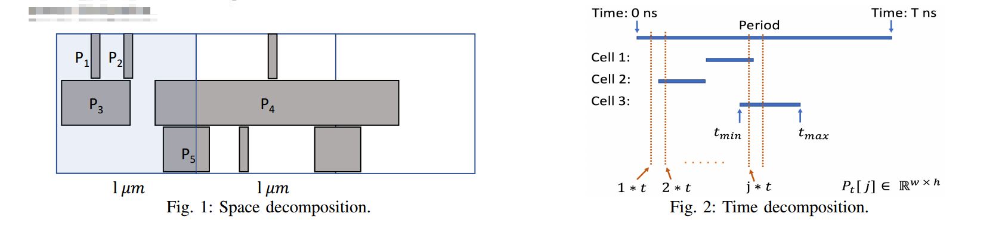
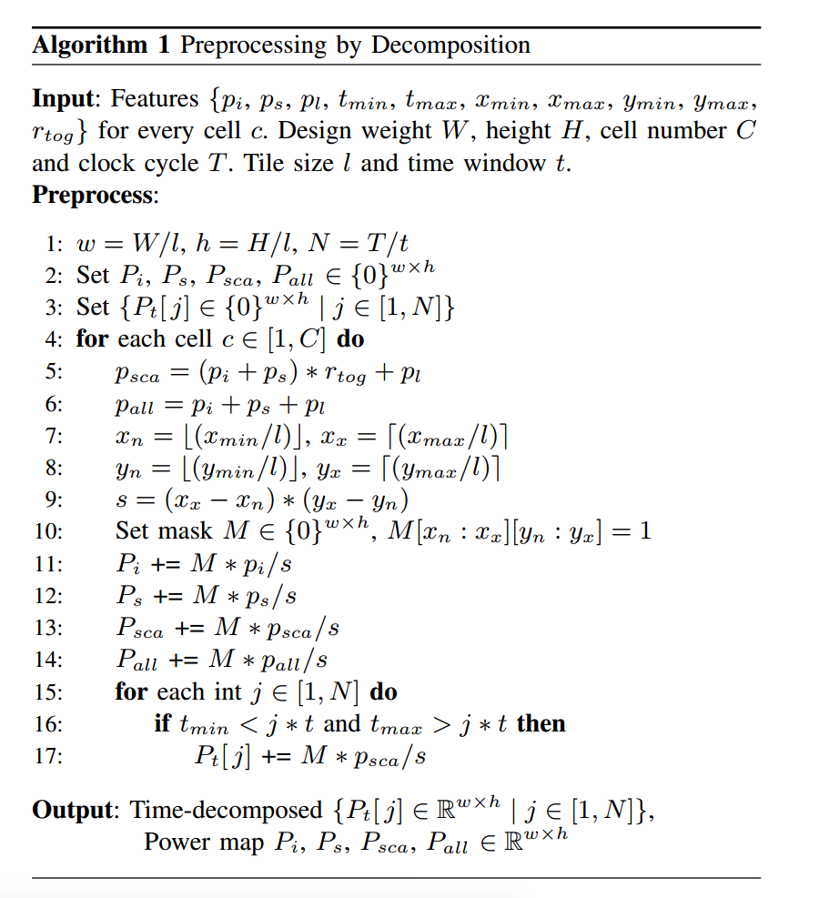
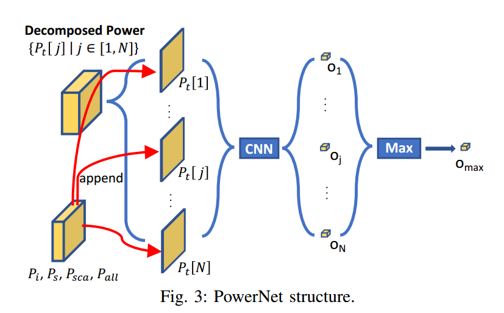
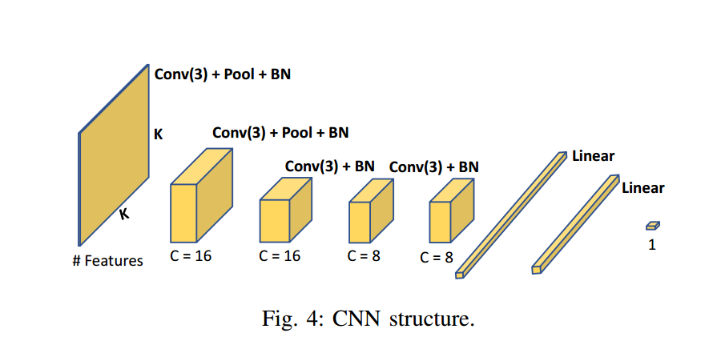

### PowerNet
#### 1.概述
Powernet是一个动态预测电压降的方法。也就是说，对于一个点的压降预测，不仅要参考空间信息，也要参考时间跨度上的变化。而为此研制的Powernet不仅能够在电路的向量分析和无向量分析（比赛的题目要求）中表现出强大的性能，而且它的设计不是针对单一电路结构的，也就是说，只要能够提供它的输入指标，它都能够做分析。

这个模型研究的意义在于，非常好理解，而且如果我们把时间因素去掉，这就是一个静态无矢量分析的优秀工具，所以值得我们尝试。
#### 2.问题建立
这项研究主要是为了解决压降的热点（一个小区域局部压降最高）位置，这个位置的预测是以人的分区为基本单位的。

为了估计每个地方的压降，我们把一个芯片(论文中叫design，我个人感觉说的就是芯片板子)分为一系列小分区（论文中叫tile，瓦片），每一个分区是$l\times l$的方形（$l$是人为确定的超参数），里面包含若干个单元(cell，应该是最小单位)，并且tile将被抽象成一个点。所以，一个尺寸为$W\times H$的芯片就可以表示成一个$w\times h$的矩阵，其中$w=W/l,h=H/l$。

注意一下这里存在的层级关系：$design\rightarrow tile(power map) \rightarrow cell$。我们要预测每个tile的压降，就是预测tile里所有cell压降的平均值。

然后，对于每一个小分区，我们有几个特征值需要计算，主要是能量消耗相关的特征值，并把这些特征计算好放到矩阵中。这时我们称$w\times h$的矩阵为能量图(power map)，能量图展现了能量密度或消耗情况的分布。

而我们的PowerNet的工作就是在这些能量图$\{P_{map1},P_{map2},\cdots,P_{mapG}\}$上训练，使得预测结果$F^*$与实际结果$F$尽可能接近。这个目标可以用数学表示如下：
$$F:\{P_{map1}\in R^{w\times h}\cdots P_{map1}\in R^{w\times h}\}\rightarrow R^{w \times h}$$
$$F^*=\argmin_F Loss(F(\{P_{map1},P_{map2},\cdots,P_{mapG}\}),IR)$$
#### 3. 算法
##### a.输入
输入特征如下所示：
###### Power：三种功率
- Internal power $p_i$：每个电源内部电容耗散的功率；
- Switching power $p_s$：电源输出端的负载电容耗散的功率；
- Leakage power $p_l$：其他泄露的功率，对功能没什么贡献，不过相对比较少
###### Signal arrival time:在一个时钟周期内，每一个单元最小和最大的信号到达时间
- Min arrival time $t_{min}$
- Max arrival time $t_{max}$
###### 坐标
- Min and max x axis $(x_{min},x_{max})$
- Min and max y axis $(y_{min},y_{max})$
###### Toggle rate:描述输出结果在一个时钟周期的变化频率
- Rate $r_{rog}$
###### IR drop
- IR drop $ir$: 每一个cell的压降，指的是标称电压与实际电压的差异值。

上面这些都是标量。基于三种功率，我们能计算出每一个cell的其他功率指标：
$$p_{sca}=(p_i+p_s)*r_{tog}+p_l$$
$$p_{all}=p_i+p_s+p_l$$
$p_{sca}$和$p_{all}$都是每一个cell的全局功率耗散。不过$p_{sca}$是考虑了时钟变化之后放缩了$p_{all}$。PowerNet能够通过学习，基于这些功耗值组合出总的单元功率（这句没太理解，论文这么说的）。

##### b.分区
在功率被提取之后，可以发现每一个cell的功率不仅仅跟自己电源的功率成正比。因为有了时间和空间上的电流分布，功率还取决于它的邻居。所以预测压降还要考虑到自己的邻居。所以我们才提出了要分tile,产生power map.

论文中给出了分割芯片生成power map的算法。这个算法最后返回两类值，一类是空间分割之后每一个power map分到的各项特征，一类是基于时间切分出来的，在$t_{max}-t{min}$这个时间区间每个power map的功耗特征。

算法虽然步骤有点多，但是原理很简单。我们只需要知道每一个cell的各种p,然后分区。

空间上，对于每一个cell，它被几个区包含，它的各种p就均分成几份；对于每一个分区，它里面包含了哪些cell，它的功耗特征P就是这些cell的各种p各取1份再相加。如上图1，按照$1\mu m$的方块来分这个芯片，黑方形是cell。对于标蓝的tile，它空间的功耗特征就是$P_1+P_2+P_3+P_4/3+P_5/2$。需要注意的是，这些东西其实都是矩阵，在实际操作中的转化方式写起来费事，到时候再讨论也可以。理解按照数字理解就行。

时间上，我们监测每一个power map.我们定义了信号到达时间$t_{max}-t_{min}$，也知道时钟周期$T$（一般是几个纳秒）和检测时间窗$t$(一般比$T$小，每隔$t$检查一次电路状态)。在信号到达时间内遍历每一个检查时间窗，把时间窗$j*t$下出现信号的cell的$p_{sca}$的空间平均$P_{sca}/(\Delta x*\Delta y)$加到这个时间窗口下功率特征$P_t[j]$中。以上图2为例，在时间窗$j*t$中，我们看到有来自cell1和cell3的信号，所以$P_t[j]=[[p_{sca1}/s],0,0,...,[p_{sca3}/s],...]=p_{sca}/s+p_{sca3}/s$(没错，这也是个矩阵)。

如果觉得还有疑问，可以从下面的算法代码展开讨论.

##### c.模型
我们用刚才的方法，先对每一个分区tile做时域的分解，得到一系列$P_t$，然后在每一个$P_t$后面添加上空间分解后的特征。这样就得到了N个输入。把这N个输入分别投入CNN模型做预测，得到N个压降预测值。限于这项论文研究的目的，还需要对这N次操作取极大值，作为这个分区的最大压降。整个过程如下图所示。

当然，我认为这个模型很容易改成静态分析。只要取其中一个时刻不就好了。

下图是powernet核心预测模型的结构CNN，它接受一个我们刚才处理好的输入矩阵，输出一个标量作为电压降的预测值。

Conv(3)指的是三维的卷积操作。其他的层与功能，其实不是重点，如果有学过一些神经网络应该能很快理解。不过，如果希望以此为基础做模型架构的改进，还是简易稍微学一下CNN,如不嫌弃，可以参阅我的快速入门介绍。
#### 4.测试
这一块的测试结果略过，主要谈谈参数。
论文测试使用5*5和1\*1的tile size。结果是5*5的更好，说明参考较多邻居，结果会比较优秀。

另外，实验证明CNN效果要比XGBOOST好。