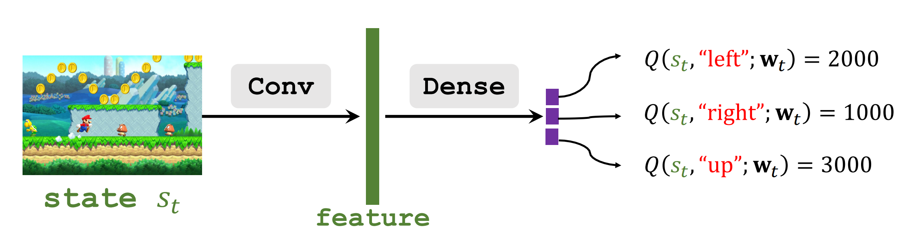

# 王树森深度强化学习课程笔记
## 基于价值的强化学习
HAVEN 2023.8.14
## 动作价值函数
### 折扣返回函数(Discounted Return)
定义：折扣返回函数就是从当前到最终所积累的未来价值之和。
$$U_t=R_t+\gamma R_{t+1}+\gamma^2 R_{t+2}+\gamma^3 R_{t+3}...$$
这个返回函数依赖于未来所有时刻的动作$A_t,A_{t+1},A_{t+2},...$以及状态$S_t,S_{t+1},S_{t+2},...$。

动作$Action$是随机的：$P[A=a|S=s]=\pi[a|s]$(基于策略函数)。

状态$State$也是随机的：$P[S'=s'|S=s]=p(s'|s,a)$(基于状态转移函数)。
### 动作价值函数(Action-Value Function)
动作价值函数成功地将折扣返回函数中的奖励用动作和状态来转化表示。它
表示在给定的策略函数$\pi$之下，所能获得的Discounted Return的期望值。
$$Q_\pi(s_t,a_t)=E[U_t|S_t=s_t,A_t=a_t].$$
通过对$U_t$求期望，我们得到了动作价值函数。因为期望把未来所有的随机性给消除了，所以这个函数仅仅依赖于当前的观测值$s_t,a_t$。$Q_\pi$可以反映在状态$s_t$下作动作$a_t$的好坏程度。
### 最优动作价值函数(Optimial Action-Value Function)
$$Q^*=\max_\pi Q_\pi(s_t,a_t)$$
这个函数反映了不管选择什么策略函数$\pi$，在$s_t$状态之下采取$a_t$动作所能够获得的最大的回报$Q_\pi$，不论选择何种策略函数$\pi$，其动作价值函数值都不可能超过$Q^*$。

所以$Q^*$可以指导agent做决策：在每一个状态下，$Q^*$会给可以采取的每一个动作进行打分，agent可以根据分数来做决策，**一般都是直接选择分数最高的动作来执行**。
## Deep Q-Network(DQN)
所谓DQN，其实就是用一个神经网络来近似$Q^*$函数。
### 近似表示$Q^*$函数
在一个任务中，我们的目标往往是获取到最大的回报值。以游戏“超级玛丽”为例，我们可能希望他能够获取到尽可能多的金币，并且尽可能向终点靠近，这实际上就是一种效益最大化的目标。

为了能够在每一次采取动作的时候都能够获得尽可能多的收益，我们需要用到$Q^*$函数。我们如何利用$Q^*$函数呢？在前面已经提到，$Q^*$函数能够在当前状态所可以采取的所有动作进行打分，它就像一个先知，能够预测眼前的这一步对整个游戏的走势是否是好的。

我们当然希望能够得到一个特别厉害的$Q^*$，能够对每一步都了如指掌。问题是对于一些复杂的任务，例如预测股票的走势，往往这种先知是很难预测准确的。但是如果是如玩游戏这样简单的任务，只要一个机器玩了上百万局游戏，它就能够做到每一步都料事如神。

所以我们可以使用深度学习神经网络的方法来拟合这样的函数$Q^*$。我们的神经网络定义为：$$Q(s,a,w)$$,其中，$w$表示网络的参数，$s$是输入，输入时一个状态；$a$是输出，输出是一个动作的打分集合，相当于一个向量。随着训练的进行，$Q(s,a,w)$会逐渐逼近$Q^*$。

DQN的结构如下所示。

假如我们要玩的是马里奥游戏，那么输入就是一张图片，作为当前状态$s_t$。我们通过一个卷积神经网络提取出特征，然后通过一个全连接层得到输出。输出是对每一个动作的打分值，这里因为有"left""right""up"三种动作，所以应该映射到三个不同的输出。

### 使用DQN来操纵agent玩游戏
使用DQN操纵agent玩游戏的基本流程如下所示。

首先，我们利用得到的$Q$对状态$s_t$进行预测，选择出得分最高的动作$a_t$。执行动作$a_t$，环境通过状态转移函数$p$转化为新的状态$s_{t+1}$同时给予奖励$r_t$。这里的奖励$r_t$就是强化学习中的监督信号，能够驱动网络的训练。然后在新的状态$s_{t+1}$中继续选择最优的动作$a_{t+1}$并且执行，得到新的状态以及奖励，如此循环往复一直到游戏结束。

接下来我们将会介绍如何训练一个DQN。
## 时序差分学习(Temporal Difference(TD) Learning)
时序差分学习算法，通常称为**TD算法**。由于TD算法比较难以理解，在实际介绍TD算法之前，我们先引入一个例子。
### 例子：出行问题
背景：我现在希望从纽约（NYC）开车前往亚特兰大（Atlanta），想要知道将会花费多少时间。现在我手上有一个模型$Q(w)$，它是用来估计时间开销的。模型$Q(w)$告诉我，开车需要花费1000分钟才能到。

问题：我知道$Q(w)$还不是一个很可靠的模型，但我希望我的$Q(w)$进行一定更新后能够像谷歌地图一样准确，这样以后就能更好地规划行程了。我应该如何更新$Q(w)$的参数呢？

分析：模型首先给出了预测：$$q=Q(w)=1000$$
我先自己从NYC开到Atlanta，结果发现只用了860分钟。我们把这个实际观测值记作"target"y.$$y=860$$因为$y\neq q$,所以模型相比实际产生了一个损失"Loss"$L$。我们记损失为时间差的平方：$$L=\frac{1}{2}(q-y)^2$$
于是我们就可以用损失来更新权重参数了。我们采用梯度下降来更新模型参数：我们求$L$关于$w$的梯度。因为在原式中，$L$是$q$和$y$的函数，$q$是$w$的函数，所以:
$$\frac{\partial L}{\partial w}=\frac{\partial q}{\partial w}·\frac{\partial L}{\partial q}=(q-y)·\frac{\partial Q(w)}{\partial w}$$

最终更新模型参数：
$$W_{t+1}=W_t-\alpha \frac{\partial L}{\partial w}|_{w=w_t}$$
其中$\alpha$是学习率。

因为我们更新的方向是梯度下降的方向，而梯度下降意味着$q-y$越来越小，所以模型更新的方向是向着真实观测数据更新的。随着迭代的加深，模型会越来越准确。

**但是这种方法比较笨，因为每次我都要跑完全程才能对模型参数作一次更新。如果是游戏的话，玩完一整局游戏才能作一次更新。有没有更好的方法让我们不用走完全程就能更新模型呢？**
### TD算法
TD算法的核心思想就是用一个只有部分真实的数据来代替真实数据，进行参数的更新。

例如，从NYC到Atlanta途中要经过DC，我能不能到DC就停下，同样来更新权重呢？答案是可以的。我可以在DC这个地方预测一下到Atlanta还要走多久，假设模型这时预测需要走600分钟，而我自己知道从NYC到DC一共走了300分钟，这样一来我能算出假如我按模型所说的继续走，我一共只要走**300+600=900**分钟。这跟刚才预测的**1000分钟**显然不一样了！

那么，如果是你，你选择相信最终要走1000分钟还是要走900分钟呢？毫无疑问是后者，因为**900分钟包含了300分钟的事实成分**，1000分钟的预测值可以认为是纯粹的猜测，因为没有任何事实成分。这样以来，我们不妨认为900分钟是相对的"实际值"，直接对模型进行更新。

我们称这个900分钟为**TD target** $y=900$，指的是TD算法下姑且认为900分钟是模型应该达到的预测目标，而不是1000分钟；

我们称$\delta=1000-900=100$为**TD error**。

接下来就容易了，我们有了预测值和目标值，可以计算损失$$L=\frac{1}{2}(q-y)^2=\frac{1}{2}\delta^2$$和梯度$$\frac{\partial L}{\partial w}=\frac{\partial q}{\partial w}·\frac{\partial L}{\partial q}=\delta·\frac{\partial Q(w)}{\partial w}$$
，然后采用完全相同的方法来做权重的更新：$$W_{t+1}=W_t-\alpha \frac{\partial L}{\partial w}|_{w=w_t}.$$
其中$\alpha$是学习率。
### TD算法的有效性
刚才虽然解释了TD算法的原理，但是其中“事实成分”这种说法没有依据，而且有些地方主观性很强，比如把900分钟当作真实值来对待等等。那么TD算法为什么是正确的呢？

我们换个角度来考虑问题。我们在TD算法中作了两次预测，一次是在NYC，一次是在DC，预测的结果分别是1000分钟和600分钟，这意味着模型同时预测了**从NYC到DC要用400分钟**。而我们实际只走了300分钟，这样就有一组预测值-真实值的数据了。我们的目标当然不是单纯让模型预测准确从NYC到Atlanta所需的时间，而是让模型在任何情况下的预测都接近真实值，那么400和300这一组数据显然有训练的价值。

400-300=100是一个真实得到的error，恰好跟1000-900=100这个TD error相等。

在TD算法中，我们利用了TD error计算损失及更新参数，采取了梯度下降的方法，这就使得随着训练的进行，TD error会逐渐降低。

现在我们又知道TD error永远跟一个真实的error相等，那么也就意味着我们通过更新，让一组真实数据的error值降低了。所以仍旧达到了“预测值尽可能接近实际”这个训练目标，这说明TD算法是有效的。

*可能有人会问：那直接用NYC到DC这段数据来作训练不就行了，为什么还要绕着圈子做，又是走一段又是做两次预测呢？*

接下来我会介绍如何用TD算法来更新DQN。学习完下一个部分你会更加了解TD算法对DQN的合适性。

### TD算法应用于DQN
在刚才的出行例子中，我们得到了一个等式：
$$T_{NYC\rightarrow ATL}\approx T_{NYC\rightarrow DC}+T_{DC\rightarrow ATL}$$
其中，左边是模型在NYC的预测值，右边第一项是我们实际从NYC到DC走过的用时，是实际的观测值；右边第二项是模型在DC的预测值。

在深度强化学习中，我们也有一个类似的公式：
$$Q(s_t,a_t;W)\approx r_t+\gamma·Q(s_{t+1},a_{t+1};W)$$
其中，左边第一项是在状态$s_t$下预测接下来会得到的折扣回报，右边第一项是执行完动作$a_t$之后得到的奖励$r_t$，右边第二项是折扣因子$\gamma\times$在状态$s_{t+1}$下预测的折扣回报。

两个公式形式相近，都是“预测值$\approx$观测值+预测值”的形式。

这个公式是如何得到的呢？我们回头看一下折扣回报的定义：$$U_t=R_t+\gamma ·R_{t+1}+\gamma^2 ·R_{t+2}+\gamma^3·R_{t+3}+\gamma^4·R_{t+4}+\cdots$$
这个公式可以转化为：
$$U_t=R_t+\gamma ·(R_{t+1}+\gamma ·R_{t+2}+\gamma^2·R_{t+3}+\gamma^3·R_{t+4}+\cdots)$$
而我们知道，括号内那一项$(R_{t+1}+\gamma ·R_{t+2}+\gamma^2·R_{t+3}+\gamma^3·R_{t+4}+\cdots)$正是未来的折扣回报$U_{t+1}$，所以
$$U_t=R_t+\gamma*U_{t+1}$$
这个公式展现了相邻两个时刻折扣回报之间的关系：前一个时刻的折扣回报等于后一个折扣回报与该时刻所获奖励的加权和。

我们知道，DQN模拟的是最大动作价值函数$Q^*$，所以DQN的输出$Q(s_t,a_t;W)$是对$E(U_t)$的一个估计值；$Q(s_{t+1},a_{t+1};W)$是对$E(U_{t+1})$的一个估计值。

根据刚才的递推式$U_t=R_t+\gamma*U_{t+1}$，我们也能知道：
$$E(U_t)\approx E(R_t+\gamma*U_{t+1})$$
所以$$E(U_t)\approx E(R_t)+\gamma*E(U_{t+1})$$
之所以是'$\approx$'是因为$R_t$是随机的。所以就得到了$$Q(s_t,a_t;W)\approx r_t+\gamma·Q(s_{t+1},a_{t+1};W)$$

其中，左边是模型预测值Prediction:$$Q(s_t,a_t;W)$$.

右边就是所谓的TD target:$$ y_t=r_t+\gamma·Q(s_{t+1},a_{t+1};W)\\y_t=r_t+\gamma·\max_a Q(s_{t+1},a_{t+1};W)$$
因为我们选择动作的方式是挑出最好的动作并且执行，所以这一步推导是正确的。

损失函数：
$$L_t=\frac{1}{2}[Q(s_t,a_t;W)-y_t]^2$$

梯度下降更新：
$$W_{t+1}=W_t-\alpha \frac{\partial L_t}{\partial w}|_{w=w_t}$$
## 总结
我们今天讲了下面这些内容：
- $Q^*$函数：最优的动作价值函数，表现了$s_t$采取动作$a_t$所能获得的最大收益。
- DQN:用一个神经网络模型$Q(s,a;W)$拟合函数$Q^*$。输入是当前状态$s$,输出是对每一个动作的打分$a\in\mathcal{A}$。
- TD算法：一次TD算法迭代如下所示：
    
    1. 观测状态$S_t=s_t$,执行动作$A_t=a_t$.
    2. 预测价值$q_t=Q(s_t,a_t;W_t)$.
    3. 对当前的DQN求一次导：$d_t=\frac{\partial Q(s_t,a_t;w)}{w}|_{w=W_t}$.
    4. 执行动作$a_t$，环境产生新状态$s_{t+1}$和奖励$r_t$.
    5. 计算TD target:$$y_t=r_t+\gamma·\max_a Q(s_{t+1},a;W_t).$$
    6. 梯度下降更新参数：$$W_{t+1}=W_t-\alpha (q_t-y_t)·d_t.$$