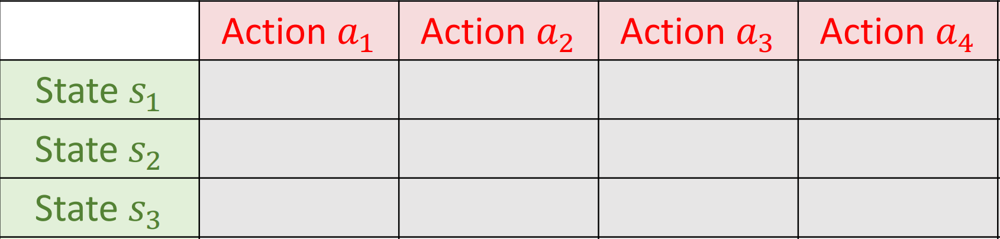
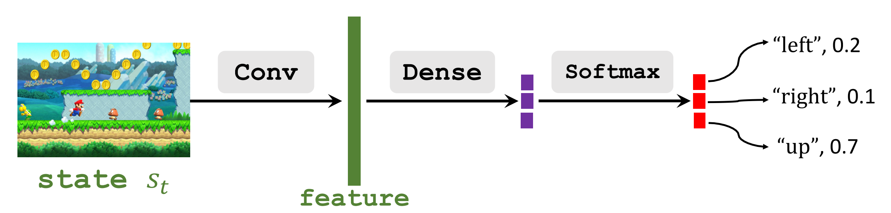

# 王树森深度强化学习课程笔记
## 基于策略的强化学习
HAVEN 2023.8.16
## 策略函数(Policy Function)
策略函数$\pi(a|s)$是一个概率密度函数，其输入是一个状态s，输出是一个向量，分别是采取每一个动作的概率值。例如：$$\pi(left|s)=0.2$$$$\pi(right|s)=0.5$$$$\pi(up|s)=0.3$$
智能体将会基于这个概率密度函数随机抽样选取一个动作并且执行。
### 能不能直接学习一个策略函数？
假如说状态和动作都比较少，那么其实完全可以用机器学习的方法对策略函数进行学习，因为要拟合的概率也很少。我们只需要画一个大表，横坐标是动作，纵坐标是状态，然后多次训练不断更新里面的概率就可以了。

但在实际情况中，往往有连续的很多个状态甚至是无限个状态。这样就不能列举出每一个状态和动作然后让机器自己去做拟合了。

### 策略网络
我们可以使用一个神经网络来近似策略函数$\pi(a|s)$,使得其即便不列举出所有的状态也依旧能够正确地做出动作的判断。用于近似的这个神经网络被称为**策略网络**$\pi(a|s;\theta)$，其中的参数$\theta$是策略网络的权重参数。

策略网络进行预测的流程应该是这样的：
- 将状态s输入进网络；
- 经过卷积层提取特征；
- 经过一个全连接层映射到三维向量；
- 经过一个激活层softmax将向量值转化为概率值。

## 状态价值函数的近似

### 动作价值函数
回顾一下，在之前我们提到过几个基本概念：

**折扣回报 Discounted Return**：$$U_t=R_t+\gamma·R_{t+1}+\gamma^2·R_{t+2}+\cdots$$，这个函数跟未来的每一个状态和动作都有关。同时，动作是随机的，因为服从策略函数$\pi(a|s)$；状态是随机的，因为服从状态转移函数$p(s'|s,a)$。

**动作价值函数 Action-Value Function**：$$Q_\pi(s_t,a_t)=E[U_t|S_t=s_t,A_t=a_t]$$，这个函数通过计算期望把$U_t$未来的随机性都消去了，所以只跟当前的状态、采取的动作和策略函数$\pi$有关。这个函数反映了当前状态执行这个动作的好坏程度。

**状态价值函数 State-Value Function**：$$V_\pi=E_A[Q_\pi(s_t,A)]=\sum_a\pi(a|s_t)·Q_\pi(s_t,a)$$,这个函数通过在$Q_\pi$的基础上对动作$A$求期望，于是就排除了动作的随机性，使得这个函数只跟当前的状态和策略函数$\pi$有关。这个函数的作用是能够反映当前这个状态本身的好坏程度。

### 基于策略的强化学习
在基于策略的强化学习中，我们要做的就是拟合出来一个非常好的策略函数$\pi$，使得在每一个状态我们都能选择尽可能好的策略。换句话说，我们希望得到一个策略函数$\pi$使得所达到的每一个状态都尽可能好。

我们采用神经网络来拟合一个策略函数$\pi$。这个网络$\pi(a|s_t;\theta)$被称为**策略网络**。

这样就能通过策略网络来近似一个状态价值函数$$V(s_t;\theta)=\sum_a\pi(a|s;\theta)·Q_\pi(s,a)$$

我们自然能够想到要利用$V$来评估策略网络的好坏。为此我们取$V$对状态的期望$$J(\theta)=E_s(V(S;\theta))$$
来做模型的评估以及更新。可以看到通过对状态求期望，把状态的随机性也给消去了。并且$J(\theta)$仍旧具有参考意义：它反映了策略函数$\pi$能够带来的状态价值的平均水准。如果$J(\theta)$越大，就说明状态的价值越高，于是就说明$\pi$越好、越能采取高质量的策略完成任务。

所以我们希望学习到一个能够让$J(\theta)$最大的模型参数$\theta$。

我们采用**策略梯度上升**的模型更新方法实现这一点。

策略梯度(Policy Gradient)是$\frac{\partial V(s;\theta)}{\partial \theta}$,也就是状态价值函数的导数。我们不采用梯度$\frac{\partial J(\theta)}{\partial \theta}$，是因为$J(\theta)$其实不可求，只是一个概念而已。但是通过用策略梯度更新，能够达到整体价值升高的趋势。

具体步骤是：

- 观测到状态$s$；
- 更新参数：$\theta\leftarrow\theta+\beta·\frac{\partial V(s;\theta)}{\partial\theta}$,其中$\beta$是学习率。

$V$是个随机的函数，因为即便消去了动作，它的输入参数$s$也依旧服从状态转移函数$p$的随机分布。但是无论$V$是多是少，我们都让其在原有的基础上进行一点梯度上升，因此在很多次训练之后，$V$还是会达到很高的水平。

下面我们将详细介绍一下策略梯度。
## 策略梯度(Policy Gradient)
在刚才，我们已经说过了什么是策略梯度：在刚才，我们使用神经网络拟合一个状态价值函数$$V(s_t;\theta)=\sum_a\pi(a|s;\theta)·Q_\pi(s,a)$$策略梯度(Policy Gradient)是状态价值函数的导数。
$$\begin{aligned}
\frac{\partial V(s;\theta)}{\partial \theta}
    &=\frac{\partial\sum_a\pi(a|s;\theta)\cdot Q_\pi(s,a)}{\partial \theta}\\
    &=\sum_a\frac{\partial\pi(a|s;\theta)\cdot Q_\pi(s,a)}{\partial \theta}\\
    &=\sum_a\frac{\partial\pi(a|s;\theta)}{\partial \theta}\cdot Q_\pi(s,a)
\end{aligned}$$
在这一步转化中，我们将求整体的偏导转化为求策略函数的偏导，并且单独提取出了公共项$Q_\pi$。那么最终我们只需要对拟合的神经网络$\pi(a|s;\theta)$进行反向传播求导就可以了(注意，我们自始至终只有$\pi$这一个神经网络，没有构建$V$的网络)。

这里其实有一点不严谨：$Q_\pi$跟策略函数$\pi$有关，$\theta$是$\pi$的参数，所以$Q_\pi$跟$\theta$还是有关的。这里这样推导只是为了便于理解为什么可以对策略网络做反向传播来求策略梯度。实际上这个公式求出的梯度跟真实梯度也是相同的。

这样，我们就得到了一个策略梯度的表达式，我们记作**形式1**：
$$\frac{\partial V(s;\theta)}{\partial \theta}=\sum_a\frac{\partial \pi(a|s;\theta)}{\partial \theta}\cdot Q_\pi(s,a) $$
在这个函数中，我们先求出来每个动作$a$的策略梯度的导数，跟相应动作价值函数相乘，然后再基于动作$a\in \mathcal{A}$把这些值都加起来。

如果动作是离散的，那么我们可以直接用形式1这个公式求出策略梯度。但是实际上我们并不经常使用形式1，而是使用形式1的**蒙特卡洛近似**来求策略梯度。

蒙特卡洛近似是一系列近似方法的统称，总体上就是用样本特征来代替总体特征。再这里我们会使用一个动作样本的计算结果来代替整个动作集合尺度的策略梯度。这里我们先给出转化过程。
$$\begin{aligned}
\frac{\partial V(s;\theta)}{\partial \theta}
&=\sum_a\frac{\partial \pi(a|s;\theta)}{\partial \theta}\cdot Q_\pi(s,a)\\
&= \sum_a \pi(a|s;\theta)\cdot\frac{\partial \log\pi(a|s;\theta)}{\partial \theta}\cdot Q_\pi(s,a)\\
&=E_A[\frac{\partial\log\pi(A|s;\theta)}{\partial \theta}\cdot Q_\pi(s,A)]
\end{aligned}$$
接下来进行一些说明。
1. 第一步到第二步：使用了转化公式$\frac{\partial f(x)}{\partial x}=f(x)\cdot\frac{\partial\log f(x)}{\partial x}$。这个公式的推导比较麻烦，但是验证很简单：右边对数的导数展开就是$\frac{1}{f(x)}$和等式左边部分。
2. 第二步到第三步：通过上一步的转化，就把原始式子转化为一个类似求期望的表达式了：$\pi$函数是一个PDF（概率密度函数），相当于右边那两项对动作来求期望，也就是第三步所展现的样子。这里的$A$指的是动作的概率分布，服从策略函数：$A\sim\pi(\cdot|s;\theta)$

我们把最终得到的函数称为**形式2**。一般我们都会用形式2来求策略梯度。

总结一下，我们得到了两种策略梯度的计算公式：
- 形式1：$\frac{\partial V(s;\theta)}{\partial \theta}=\sum_a\frac{\partial \pi(a|s;\theta)}{\partial \theta}\cdot Q_\pi(s,a) $
- 形式2：$\frac{\partial V(s;\theta)}{\partial \theta}=E_{A\sim\pi(\cdot|s;\theta)}[\frac{\partial\log\pi(A|s;\theta)}{\partial \theta}\cdot Q_\pi(s,A)]$
### 离散动作集合计算策略梯度
如果动作是个离散集合，如动作空间$\mathcal{A}=\{“left”,“right”,“up”,\cdots\}$，
我们可以使用**形式1**来求策略梯度：
$$\frac{\partial V(s;\theta)}{\partial \theta}=\sum_a\frac{\partial \pi(a|s;\theta)}{\partial \theta}\cdot Q_\pi(s,a) $$
1. 记$f(a,\theta)=\frac{\partial \pi(a|s;\theta)}{\partial \theta}\cdot Q_\pi(s,a)$，对每一个$a\in\mathcal{A}$，计算$f(a,\theta)$.
2. 对$f(a,\theta)$求和:$\frac{\partial V(s;\theta)}{\partial \theta}=f(“left”,\theta)+f(“right”,\theta)+\cdots$

需要注意的是，假如$|\mathcal{A}|$非常大，那么这种方法将开销巨大。
### 连续动作集合计算策略梯度
如果动作是个连续集合，如动作空间$\mathcal{A}=[0,1]$，
我们可以使用**形式2**来计算策略梯度：
$$\frac{\partial V(s;\theta)}{\partial \theta}=E_{A\sim\pi(\cdot|s;\theta)}[\frac{\partial\log\pi(A|s;\theta)}{\partial \theta}\cdot Q_\pi(s,A)]$$
我们使用蒙特卡洛近似来简化这个期望的求法。可以证明，样本的值是总体特征值的一种**无偏估计**，所以我们可以用一个随机抽取的动作$a$来计算函数值，用来近似总体的期望，这样就不再需要每个动作列举一遍了。
1. 基于PDF$\pi(\cdot|s;\theta)$，随机抽取动作$\hat a$.
2. 计算$g(\hat a,\theta)=\frac{\partial\log\pi(\hat a|s;\theta)}{\partial \theta}\cdot Q_\pi(s,\hat a)$

我们知道$E_A[g(A,\theta)]$就是策略梯度$\frac{\partial V(s;\theta)}{\partial \theta}$;并且$g(\hat a,\theta)$是$frac{\partial V(s;\theta)}{\partial \theta}$的无偏估计。所以：

3. 使用$g(\hat a,\theta)$作为$\frac{\partial V(s;\theta)}{\partial \theta}$的近似值。
## 用策略网络更新策略梯度
在实际运用我们刚才所学知识的时候，有些地方考虑到模型运行机制，步骤会略有不同。
算法描述如下：
1. 观测当前状态$s_t$.
2. 基于策略函数$\pi(\cdot|s;\theta)$，随机选取动作$a_t$.
3. 估算动作价值函数$q_t=Q_\pi(s_t,a_t)$.
4. 基于动作$a_t$对策略网络进行反向传播求导:$d_{\theta,t}=\frac{\partial \pi(a_t|s_t;\theta)}{\partial \theta}|_{\theta=\theta_t}$.
5. 近似计算策略梯度$\frac{\partial V(s_t;\theta)}{\partial \theta}\approx g(a_t,\theta_t)=q_t\cdot d_{\theta,t}$
6. 梯度上升法更新模型参数：$\theta_{t+1}\leftarrow\theta_t+\beta\cdot g(a_t,\theta_t)$

$Q_\pi$作为折扣回报$U_t$的期望，直接求解显然不现实，所以我们采用估算的方法来近似$Q_\pi$。
**方法1：REINFORCE**
总体思想：用某次折扣回报来近似折扣回报的期望。
1. 让agent玩一局游戏，记录下轨迹(tragectory):
$$s_1,a_1.r_1;s_2,a_2,r_2;\cdots;s_T,a_T,r_T$$
2. 计算本次折扣回报$u_t=\sum_{k=t}^{T}\gamma^{k-t}r_k$.
3. 因为$u_t$是$E[U_t]=Q_\pi$的无偏估计，所以用$u_t$来近似$Q_\pi(s_t,a_t)$
4. $q_t\leftarrow u_t$.

**方法2：Actor-Critic**
总体思想：用神经网络来近似$Q_\pi$。这样一来，整个强化学习工程将会包含两个神经网络，一个拟合$\pi$，一个拟合$Q_pi$，这就形成所谓 **Actor-Critic(AC)** 算法。
## 总结
本次学习中，我们学习了基于策略的学习方法。
1. 我们讲了动作的选取：假如策略函数$\pi(\cdot|s_t)$已知，那么使用随机抽样的方法抽取一个动作$a_t\sim \pi(\cdot|s_t)$并且执行。
2. 我们讲了基于策略的强化学习：我们使用策略网络$\pi(a|s;\theta)$来近似策略函数$\pi(a,s)$.
3. 我们介绍了策略网络的训练目标是找到一个让$J(\theta)=E_S[V(S;\theta)]$最大的参数$\theta$.
4. 我们讲了策略梯度算法：引入了策略梯度的概念，说明了算法的运行方法和正确性。

5. 我们讲了策略梯度的求法，得到了形式1和形式2两种表达式，其中形式2的使用更加广泛。
6. 我们讲了蒙特卡洛近似，也就是用样本值来代替总体的特征值。

在接下来的学习中，我们将会结合前两次课程的知识，同时使用基于策略的学习方法和基于价值的学习方法，介绍AC算法。