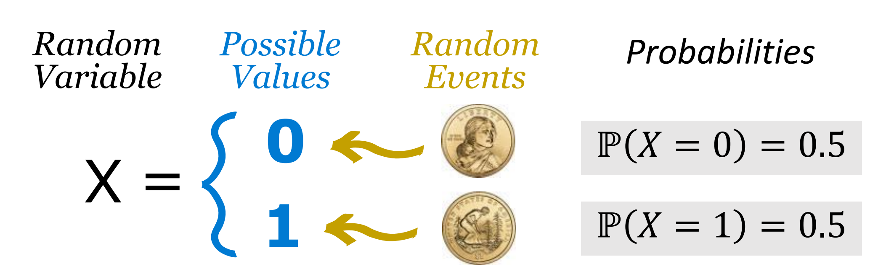
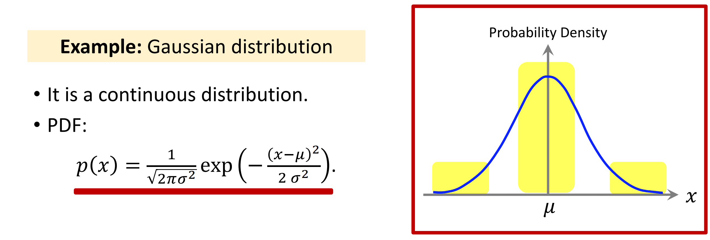
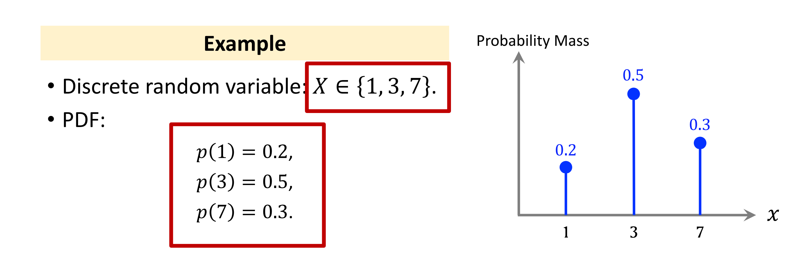
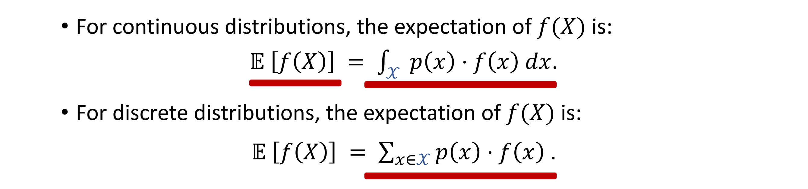
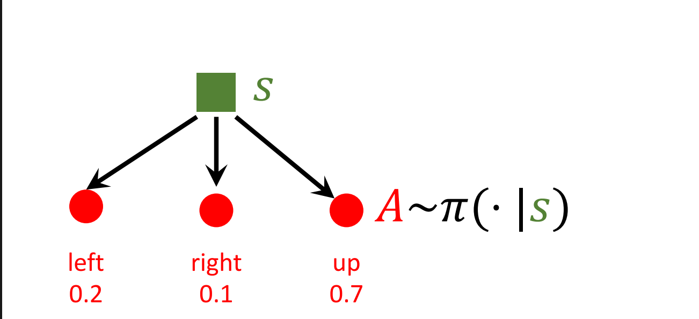
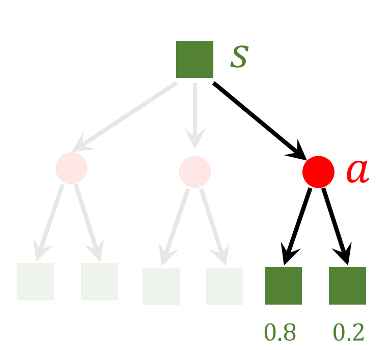
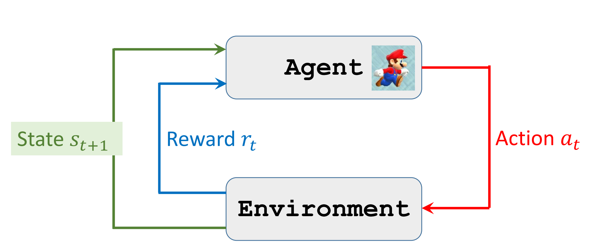
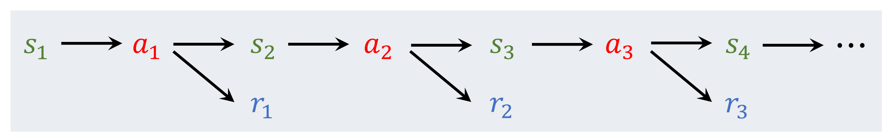
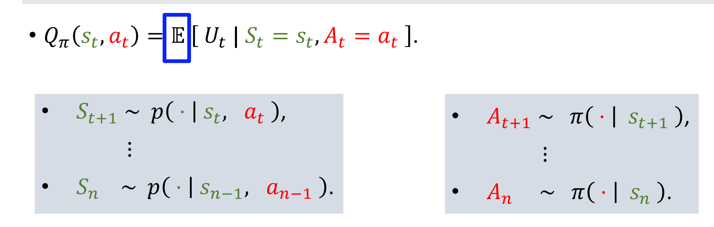
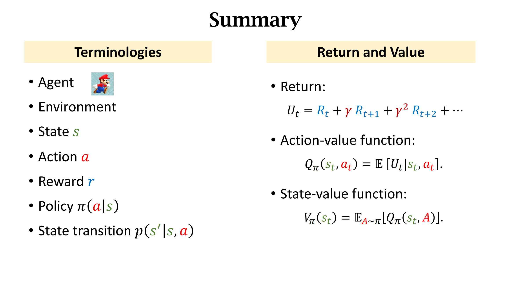

# 王树森深度强化学习基础课程笔记
HAVEN 2023.8.12
## 一 概率论基础知识
### 随机变量(random variant)
随机变量是一个不确定的量，它的值取决于随机事件发生的结果。

例如在一个抛硬币的实验中，硬币正面或反面朝上是随机事件，设硬币正面朝上是1，反面朝上是0，那么随机事件的可能值是0或者1，赋值给随机变量x。所以x为0的概率是0.5，为1的概率是0.5.

在实际表示中，我们采用大写字母$X$表示一个随机变量，使用小写字母$x$表示随机变量的观测值。例如在一次抛硬币实验中，我们有：
- $x_1=1$
- $x_2=0$
- $x_3=0$
- $x_4=1$
### 概率密度函数(Probability Density Function,PDF)
随机变量的观测值落在某一段连续的区间的概率。例如**高斯分布**概率密度函数。这是一个随机变量取值连续的概率密度函数，区间之间图像的面积就是这段区间的概率。

### 概率质量函数(Probability Mass Function,PMF)
概率质量函数描述一个离散随机变量取到某一个观测值的概率。例如已知随机变量$X\in\{1,3,7\}$,则PMF(PDF):
$p(1)=0.2$
$p(3)=0.5$
$p(7)=0.3$

**PDF和PMF的重要特征是二者所有值相加（PDF是积分）都等于1.**

**PDF和PMF都有期望值，期望值的求法是将所有可能值与对应概率或概率密度相乘之后求和。**

### 随机采样
随机采样就是从数据集中采集样本，遵循该数据集中样本的概率分布。例如，在一个箱中有10个球，其中，有2个红色、5个绿色、3个蓝色。从中随便挑一个球出来，实际就遵循:$p_红=0.2$,$p_绿=0.5$,$p_蓝=0.3$进行随机采样。

完成了这些基础知识的复习之后，就可以正式开始强化学习的入门了。
## 二 强化学习术语
### 状态和动作(state&action)
我们以马里奥游戏为例。在一局游戏的某一个瞬间，我们暂停的时候游戏画面就是一个图像，在这个图像中储存了地形、敌人、马里奥的位置、马里奥的生命值等信息，这些信息被称为一个**状态(state)**。而从这个状态出发，我们可以操纵马里奥进行一系列的动作，$Action\in\{left,right,jump\}$。马里奥作为被操纵的对象，被称为**智能体(agent)**，因为相比游戏环境，我们人类的操纵使其拥有了根据环境选择动作的能力,比如，当看到有怪正在靠近自己的时候，马里奥会选择jump动作，也就拥有了一定程度的智能。

如果我们希望用机器来操纵这个智能体，那么这种表现出来的智能用什么方式表示呢？此处我们引入概念**策略(policy)**。
### 策略(policy)
策略通常用一个函数$\pi$表示。策略函数$\pi :(s,a)\rightarrow[0,1]:$$$\pi(a|s)=\Rho(A=a|S=s)$$
$\pi(a|s)$是在给定状态$s$时采取动作$a$的概率。例如：
- $\pi(left|s)=0.2$
- $\pi(right|s)=0.5$
- $\pi(jump|s)=0.3$
值得注意的是，在观测到状态$s$之后，智能体的动作action$A$是不能直接确定的，还需要之后的奖励机制来逐步挑选出最合适的动作。

### 奖励(reward)
我们在知道机器操纵智能体的时候，为了告诉机器怎么做好，怎么做不好，通常采用奖励机制(reward)。如果机器所采取的动作符合我们的预期，我们就给予其很多的奖励，反之，如果机器所执行的动作不是我们预料中的动作，我们就给予其很小的奖励，甚至是惩罚。这样做，通过海量的训练，机器最终能够很好地按照人的意愿来操纵智能体。

奖励reward通常用大写字母$R$表示。

在马里奥游戏中，我们可以这样定义奖励：

- 马里奥获得了金币：$R=+1$
- 马里奥成功通关并且赢得了游戏：$R=+10000$ 
- 马里奥摔下了悬崖或者接触了怪物：$R=-10000$
- 什么都没有发生：$R=0$

这样，通过这种奖励实时基于机器反馈，我们就能够推动训练的进行了。
### 状态转移(state transaction)
通常情况下，在状态$S_1$采取了动作$a$，状态一定会发生转变。也就是说，旧状态通过一次动作改变为新状态，动作导致了状态的变化。例如，马里奥在怪物来临的时候采取跳跃动作，在他跳起的那一刻，游戏的状态就改变了。

虽然状态会根据动作发生变化，但是状态的转移很可能是随机的，这种随机性是游戏环境所决定的。比如，当怪物靠近马里奥，马里奥跳跃之后，游戏环境规定怪物有0.8的可能性继续往马里奥走，也有0.2的可能性原路返回。所以状态转移的概率方程为：
$$p(s'|s,a)=\Rho(S'=s'|S=s,A=a)$$

## 三 随机性的两个来源
### 动作的随机性
在给定状态s的条件下，动作可能是随机的，动作的概率服从策略函数$\pi$,即$$A\sim\pi(·|s)$$如下图所示。

- $\pi("left"|s)$=0.2
- $\pi("right"|s)=0.1$
- $\pi("up"|s)=0.7$ 
### 状态的随机性
状态的转移可能是随机的。环境通过状态转移的概率密度函数来产生新状态。
$$S'\sim p(·|s,a)$$

假设我们已经知道了原始状态s和采取的动作a，我们可以利用这个$p$函数进行随机抽样来产生新的状态。

总结一下，动作action的随机性来源于**策略函数(policy function)**：
$$A\sim\pi(·|s)$$
状态state的随机性来源于**状态转移函数(state-transition function)**：
$$S'\sim p(·|s,a)$$

## 四 智能体与环境的交互
智能体与环境的交互过程是这样的：智能体在环境$s_t$中选择采取动作$a_t$,状态转移到$s_{t+1}$同时环境给予智能体奖励$r_t$。

### 用AI玩游戏
用AI玩游戏的主要步骤是：
- 观测状态$s_t$,基于策略函数$\pi$选择动作$a_t$。
- 执行动作，环境反馈新的状态$s_{t+1}$以及奖励$r_t$.
- 如此循环往复以至游戏结束。

这样的话，一局游戏可以用一个 **轨迹(tragectory)** 来描述。轨迹的每一步都是一个三元组$(state,action,reward)$。
$$s_1,a_1,r_1,s_2,a_2,r_2,...,s_n,a_n,r_n$$

这样的话，如果这样一个轨迹开始一直到结束(游戏胜利或者Mario死亡)，那么把这个轨迹称为一个**episode**。

现在，有了表示游戏和智能体交互的方法，我们就可以确定我们的训练目标了。很直观地，我们希望最终训练出来的模型能够在一局mario游戏中选择最优的策略。因此我们可以认为：**一个好的策略肯定带来最大的总奖励值**。
$$Reward=\sum_{t=1}^{n}\gamma^{t-1}·r_t$$
我们使用$Reward$来指导机器进行策略函数$policy$的学习。
## 五 奖励和返回函数(rewards & returns)
### Return函数
##### 定义：Return 函数是当前时刻开始所有未来奖励的和。
$$U(t)=R_t+R_{t+1}+R_{t+2}+R_{t+3}+...$$
在此我们需要思考一个问题：这样做是否有需要改进的地方？

考虑下面这个例子：假如你可以选择让我现在给你100元和一年后给你100元，你会怎么选呢？如果是前者当然毫不犹豫就收下了，但是如果这笔钱在未来才能领到，那就充满不确定性了。所以前者显然是更好的。如果说可以选择我现在给你50元和一年后给你100元，这个时候貌似两种选择就拥有相同的地位了：因为如果你想拿到双倍的收益，你必须要承受不确定性带来的冲击。

这说明一年后的100元可能只值现在的50元。同样的道理放在$Return$函数中也是这样，未来的奖励因为充满了不确定性，其受到之后策略的影响非常大，所以肯定不如当下最新的奖励有说服力。所以我们说，$R_{t+1}<R_t$是必然的。

从这个角度出发，我们引入了折扣返回函数(Discounted Rewards)
### 折扣返回函数(Discounted Return)
##### 定义：Discounted Return函数是当前时刻开始所有未来奖励的加权和。
$$U(t)=R_t+\gamma^1 \times R_{t+1}+\gamma^2 \times R_{t+2}+\gamma^3 \times R_{t+3}+...$$
其中，$\gamma$被称为折扣因子(Discounted Factor)，这是一个需要人为调整的超参数。

在一局游戏结束之后，我们得到折扣返回函数$U$的观测值/计算值$u_t$.因为我们知道了所有的奖励$r_1,r_2,...r_n,...$因此代入公式我们能够得到任意一个时刻的$u_t$。

除了游戏结束之后做事后诸葛亮，我们更多是需要在后续发生之前来预估返回函数的值。在时刻$t$，其后所有的奖励$R_t,...,R_n$都是随机变量。所以折扣返回函数的值$U_t$也是一个随机变量。

简单描述一下就是这样：
- Reward$R_i$依赖$S_i$和$A_i$
- 我们知道，S基于状态转移函数随机，A基于策略函数随机。
- 所以$R_t$随机。
- $U_t$的计算依赖$R_t,...,R_n$
- 所以$U_t$依赖$S_t,A_t,S_{t+1},A_{t+1},...,S_n,A_n$。

不难发现按$U_t$的随机性了。

总结一下，$U_t$是一个随机的函数，其通过预测得到；$u_t$作为$U_t$的观测值，已经获取到了所需要的所有奖励数据，所以是一个真实值。

## 价值函数(Value Functions)
### 动作价值函数(Action-Value Function)
在之前已经定义了**折扣返回函数(Discounted return)**$U(t)$。动作价值函数的定义是：在状态和动作$s_t,a_t$已知的前提下，$U(t)$的期望。
$$Q_\pi(s_t,a_t)=E[U_t|S_t=s_t,A_t=a_t]$$
在这里，$s_t和a_t$都是观测值。刚才我们知道，$S$和$A$都遵循相关函数的随机性，所以他们应该是一系列的随机变量，都有各自对应的概率值。对接下来所发生的每一步的奖励求期望再套用到$U_t$中，就得到了$U_t$的期望，也就是$Q_\pi$。

容易发现，$Q_\pi(s_t,a_t)$函数与$\pi,p,s_t,a_t$都有关。而通过计算期望，$Q_\pi$只跟整体有关，跟之后任何一个单一的可能状态和动作都没有关系了。所以当t取不同值的时候，$Q_\pi$是彼此独立的。
### 状态价值函数(State-Value Function)
状态价值函数是动作价值函数关于动作的期望。对于有离散的几个动作的样例中，状态价值函数$V_\pi(s_t)$的表示如下：
$$V_\pi(s_t)=E_A[Q_\pi(s_t,A)]=\sum_a\pi(a|s_t)·Q_\pi(s_t,a)
$$
对于可采取动作连续的样例中，状态价值函数的定义是：
$$V_\pi(s_t)=E_A[Q_\pi(s_t,A)]=\int\pi(a|s_t)·Q_\pi(s_t,a)da$$
### 价值函数的理解
1. 动作价值函数：$Q_\pi(s_t,a_t)=E[U_t|S_t=s_t,A_t=a_t]$
    对于给定的策略函数$\pi$，$Q_\pi(s,a)$表示了在当前状态已知的情况下，智能体选择执行动作a这个决策有多好。
2. 状态价值函数：$V_\pi(s_t)=E_A[Q_\pi(s_t,A)]$
    对于一个已知的策略函数$\pi$，$V_\pi(s)$评估s这个状态好不好(比如下棋走到这个局面能判断近乎是赢了还是输了)。
3. $E[V_\pi(S)]$评估了策略函数$\pi$有多好，如果策略函数不够好还需要重新指定更好的策略函数。
## 六 总结

另外，还需要掌握智能体与环境交互的总体过程是一个执行动作、更新状态和收到反馈的过程。