# 怎么从略懂机器学习到理解CNN?
Haven 2023.10.17

---
这实际上可以作为开始做EDA比赛模型的先导知识。在这一部分，我查阅并且总结了相关资料，以便大家了解神经网络的有关知识和各个组成部件的作用。
### 1.机器学习

在机器学习这个学科，我们所希望解决的主要问题无非是有2个：分类和回归。分类就是给机器一个样本，机器能够判断它所属的类别；回归就是给机器一个样本，机器能够正确计算出它某一项指标的值。这两个任务的完成都与提供给模型的样本息息相关。计算机将样本进行分类或者回归分析的主要依据是**样本所具有的特征**。

例如，我们给计算机传入一个西瓜的样本，让计算机判断其是否成熟了，一条样本中包含“西瓜重量”“西瓜的体积”“西瓜颜色”等等，这时候计算机就会根据这几个指标来做判断。实际操作中，我们把这三个特征表示为一个向量$\overset{\rightarrow}{x}=['西瓜重量','西瓜的体积','西瓜颜色']$，所丢进的模型可以视作一个函数$f(x)$，模型的预测结果可以认为是$y$。
$$f(\overset{\rightarrow}{x})=y$$
我们使用不同的模型，就是在挑选不同形式的$f$（比如，线性方程或者非线性方程，或者又是别的什么方程）。每一个$f$有各自的优越性和局限性，有的擅长做分类任务，有的擅长回归，有的都很厉害不过速度比较慢...同时，我们也要认识到，更加复杂的函数如果参数比较特殊，也会退化为简单函数，而简单函数无法进化称为复杂函数。这跟我们数学上的直观认识是一致的。

一般我们可以通过经验，针对不同的问题选择不同的模型，这更像是一种猜测，因为谁也不清楚$x$和$y$究竟存在何种关系。但是，只要我们能够恰当地调整参数，让方程$f(x)=y$中的$f$够巧妙和合适，即使$f$不能反映真实的关系，在当前局部中还是能够“歪打正着”地给出正确的判断的。这个参数的选取过程就是模型的**训练**。在知道训练数据标签的前提下，让模型去猜，看看跟真实标签差了多少，差得多就多调整模型的参数，差的少就少改一点。如果给模型这样调整的次数足够多了，模型一定能够找到一个让每一条样本都满意的结果。这有点像是在解一个多元方程组：
$$\begin{cases}
f(x_1)=y_1\\
f(x_2)=y_2\\
\cdots\\
f(x_n)=y_n
\end{cases}$$
要求的是$f$的参数。
### 2.深度学习
在刚才的例子中，我们给出的西瓜是拥有明确可测量特征的样例。就跟人一样，我们可以通过观察西瓜的成色、测量西瓜的重量，从而公正地给出价格的判断。但是还有一些样例，我们没办法测量类似的指标，自然也就构造不出像西瓜那样简洁鲜明的特征。例如，我们希望判断一句话是褒义还是贬义，我们怎样提出特征呢？以词语为特征？如何给这些特征分派值呢？又比如，我们希望让计算机给图像分类，我们人观察到的是全局特征，而计算机只能识别一个个像素点，难道要以像素点为特征吗？这不仅让人工提取特征难如登天，又不可能保证特征完全符合人的认识。

因此我们需要深度学习。深度学习是机器学习的一个分支，旨在通过**机器自动地提取特征**从而对难分析的数据回归或者预测。也正因为如此，我们的输入$x$不需要是一个特征向量了，而可以是一切东西的数字化表示，例如，词向量、图像的编码、图等等。

那么机器是如何自动提取特征的呢？刚才我们提到了高复杂度的函数能够退化为简单的函数，所以形式上越复杂的函数，就能表示越多越复杂的关系。深度学习中所使用的神经网络就能理解为是一个极其复杂的函数，因此它能够表示的内容也无穷无尽，虽然我们的输入杂乱无章，没有我们能分析出来的直观特征，但是模型仍旧能利用复杂的函数，拟合出一个非常巧妙的函数，能让这些无意义信息跟预测结果挂钩。在这种情况下，我们就说模型**自动地提取出来了这些信息的特征**（虽然我们看不见也很难看见）。这就是深度学习的主要内涵。

然而，要想让机器很好地拟合这些无意义信息（解方程），我们必须要投入大量的数据做训练，因为对于机器来说，这项任务比常规机器学习困难得多，关系和特征也更难挖掘。
### 3.神经网络
#### 从复杂函数说起
刚才我们说，可以通过神经网络来拟合一切复杂微妙的关系，具体是怎么做的呢？

假设只有1个特征$x$，构造一个$x$的复杂函数的过程如下所示：

在先后经过平方器、指数函数器、幂函数器之后，函数已经变成一个十分复杂的函数了。不过每一次变换所做的事情并不复杂，每一个元件各司其职，它们的输入是一个函数，输出是另一个函数。可以想象，当元件足够多的时候，这个函数究竟会复杂到什么地步。

如果函数特别复杂，那么如果你希望对给定的x求值，这将会是一件繁琐而痛苦的工作。但如果找几个帮手，每一个人站在一个元器件前，只接受传到器件的数字，然后对其执行对应的计算，把计算结果给下一个人，那对每一个人来说，计算就变得快捷而简单了。我们甚至可以猜测，即使加上彼此相互传递结果的时间，这种做法也会比一个人计算快得多，而且错误的概率更低。这就是**前向传播**。
#### 梯度下降
我们刚才也说过，这个函数本身几乎一定不会是完美的，计算结果跟实际也会有较大差异，这时候我们要更新每一个计算单元的参数，让这个函数产生更贴合我们希望得到的结果。这个时候，大家也许能感觉到工作量甚至比刚才的前向传播更大。我们常见的更新参数的方法是**梯度下降**法，说白了就是让预测结果跟真实值尽量接近。我们用各种方式构建预测结果与真实结果之间的差异，然后想办法缩小这个差异。损失函数表示成下面这个样子：$$Loss=L(y,f(x))$$
**值得注意的是，在这个函数中，$x,y$是已知的，这里真正的自变量是$f$里的参数。**
首先，不管$L$是简是繁，只要有$f(x)$, $Loss$就绝对极其复杂，所以这是个复杂函数。其次，我们想让这个函数值尽可能接近0，或者说，在我们保证$Loss$非负的情况下，要让函数值尽可能小。我们当然希望能够得到这个函数的最小值啦，这样就也不需要什么模型了，可惜这需要全局的导数，还有复杂的计算，而函数太复杂了，这个办法行不通。

所以，**以找到最小的损失为目标**，我们选择求一个局部的导数，这个导数$Loss'$是$f$参数$a,b,c...$的函数，然后只要让每一个参数知道在现在的情况下，自己是增加一点能够减小梯度还是减小一点能够减小梯度（如果此处导数>0则我们希望减小导数，因为可能导数会变成负的，$Loss$就成减函数了；如果导数<0我们希望继续减小导数，因为朝着这个方向走，能尽快到达最小损失处），并且大家都这么改变一点点（不改变特别多是因为“局部导数”的作用空间很小），那么长此以往，我们总会摸到一个非常接近最小损失的参数分布。

为了完成这一点，我们需要对每一个参数分别求导。现在开始。$Loss$中每一个参数都有一个原始值。在参数$a$求导的时候，参数$b,c,...$保留原来的值，只改变参数$a$的值。这样函数就变成一个简单的一元函数了。我们此时清楚地看见为了让梯度更小，$a$应该怎么变。于是我们让$a$朝着变大/变小的方向走一个小的增量$\Delta a$。

我们让所有的参数都这么做。然后大家一起走好多次，最后会收缩到一个小区域中，此时已经接近底部，怎么走都是向上，所以大家往上走一走又回来了，参数稳定在一个较小的区间中。此时我们就能够停止训练了，参数已经找到我们希望的地方了。
#### 反向传播
明白了梯度下降的概念，我们再来看一下它在具体实际中是怎么操作的。还是看上面那张图。假设这个时候每一个元件的参数都很糟糕，我们要使用梯度下降修改它们，那我们就要对函数$y=x^{\exp^{x^2}}$求导。这种计算量简直是痴人说梦，而且，如果函数一变，我们又要重新想办法求，世界上这么多独一无二的问题，都这样做就太难受了。

所幸我们知道这个函数是我们把$x$先后送到*平方器、指数函数器、幂函数器*得到的。既然计算函数值的时候可以找几个人帮忙传递着算下去，那求导是否也可以采取相似的方法呢？答案是肯定的。

我们学过，$$\frac{d(g(f(x)))}{dx}=\frac{d(g(f(x)))}{d(f(x))}\cdot\frac{d(f(x))}{dx}$$

复合函数的导数=外导乘以内导。在每一个计算元件，我们使用这个方法把特定的计算步骤单独拎出来（这部分我们很容易求），剩下的复杂的部分的工作量我们交给后面的人平摊，这样听起来好像确实容易了。我们拿这个例子梳理一下：
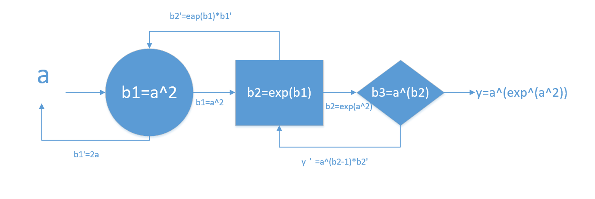
假设$a$是模型中的一个参数，它在模型前向传播的过程中被携带着算到了最后。$y$是函数的计算结果。还是要注意前提：**每一个计算元件的参数值也是已知的**。我们对$b_3$使用复合函数求导，$y'$被分成了两部分。$x^{b_2-1}$里面全部已知（我们前向传播的过程中已经算过$b_2$了），直接求出来；$b_2'$我们不知道，交给前面的人解决。在前面$b_2$运算器中，对$b_2$应用复合函数求导，$b_2$又被分成两部分，$e^{b_1}$因为之前算过$b_1$了，直接求出来；$b_1'$不知道，交给前面的人解决。在$b_1$运算器中，我们知道$b_1'=2x$，直接算出来。这下，是不是每一个未知量我们都知道了？此时我们把$b_1
'$代入$b_2'$，把$b_2'$代入$y'$，就得到了此时$y$对$a$的导数的值。
这样，我们只需要让$a$朝着$y'$减小的方向移动一个学习率$\eta$即可。
$$a=a-\eta\cdot y'$$
这样就通过反向传播的方式实现了梯度下降。
#### 神经网络
如果你能大概了解刚才的前向传播和反向传播是什么意思，我们就可以开始聊神经网络了。

首先，神经网络跟所谓“神经学”没有一点关系，即便了解神经学的人也没法直观了解神经网络。这个名字听起来吓唬人，其实这个东西没什么难的。

其次，神经网络很简单。只要你理解了刚才的那个复杂函数，就能理解神经网络。神经网络跟那个复杂函数的区别主要有两个：

- 输入的不止1个$x$，而是很多个$x$。这些$x$打包成一个向量$\overset{\rightarrow}{x}$。
- 中间的计算元件是矩阵而不是单纯的数字。除了关心它们的计算功能，还要关注到它们的**放缩功能**。因为通过矩阵乘法，输入矩阵跟输出矩阵可能长得很不一样。所以较之刚才的复杂函数元件，神经网络的元件显得更加多样，更加自由。这些元件被称为**层**，因为确实在示意图中看起来是一片一片的。
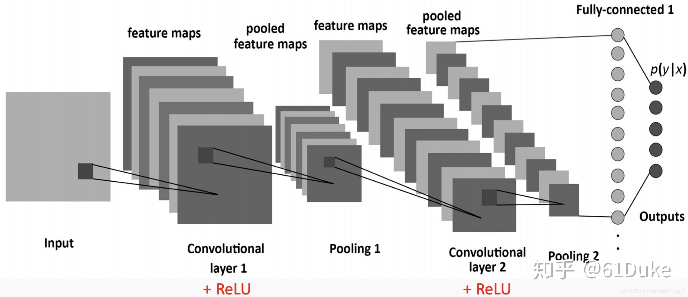

不要惊慌，矩阵一眼看去确实有点压迫感。倘若我们只盯着一个其中的一个数字看，它走过的轨迹就非常类似于我们刚才讨论了很久的复杂函数。
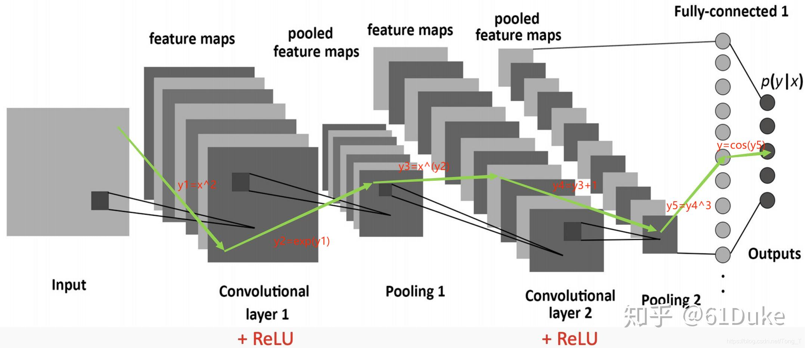
当然，实际计算的过程并不是这样的算数计算哈哈。矩阵存在的目的很直接，就是为了**批量处理数据和方便抽取特征**。因为有时候数据量太大了，一个个算实在太慢了。这样做矩阵运算能够用到擅长并行计算的GPU，能够让计算速度起飞。另外，如果把一批数据放在一个矩阵里，我们就可以用各种方式给它们建立联系，从而更好地抽取特征和构建关系。

神经网络的反向传播和前向传播，说到底还是单个数字的操作。基于上面这个计算路径，用我们刚才说到的方法，只要知道每一条路上模型做了什么，我们就能轻易地明白模型是怎么做前向传播和反向传播的。在这个模型中，不论你想修改的参数是在第一层、最后一层还是中间层，只要从它出发绘制它所走过的路线图，基于图做推导都能推出来参数更新的过程。只是这个过程的规模庞大到一定程度，人类就无法理解了。所以，只要知道要经历前向传播和反向传播就可以了。

当然，在对这些内容都比较熟悉且有一定经验之后，我们会很自然地把一个层就看作是一个单一的x。只不过，不同于刚才的单个数字，我们还得多关心一下x的长宽高，和x里面元素值的分布情况等等。

接下来，我们介绍一下神经网络常用的一些计算元件，也就是层。理解了每一种层是用来干什么的，之后你遇见新的神经网络也能很快地分析出它是在干什么，以及为什么要这样干。
#### 神经网络的层
这里只是大致介绍一下，不是详细解释，如果有任何疑问麻烦查阅相关资料确认。
##### 全连接层（fully-connected layer）
设想两个含有若干数字的向量，那把这两个向量的各个数字当作结点，绘制一个二部图，这就形成了全连接层，也可以称为FC层，显得更高端。这种层里进行的计算是纯粹的线性运算。每一个层数学表示为$W=[w_1,w_2,\cdots,w_n]$，一个输入向量$x$进去，就进行一次乘法$Wx$。从单个数字$x_i$来说，它跟每一个$w_j$都做了乘法，得到了$x_iw_1,x_iw_2,\cdots,x_iw_n$，被分发到不同的地方去。有的地方也喜欢在这个乘法之后加一个常数$b$，形成$y=Wx+b$，这长得更像是一个一次函数了。当然，实际情况比这稍微复杂一点，每一个点的来源都是前一层所有的点，所以应该表示为一堆点的线性组合$w_1x_1+w_2x_2+\cdots+w_nx_n+b_i$

早期的神经网络中，人们构建的是单纯的线性运算。这种神经网络被称为全连接神经网络、多层感知机(MLP)等。这种神经网络的特征就是，所有的层与层之间都是完全连接的。

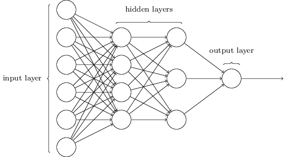

因此，一旦看到FC层，就能判断出输入的数字经过它就做了一次线性变换。

##### 激活层(activation layer)
在全连接神经网络出现不久，人们就意识到，如果每一层都只进行线性运算，那么在经过了多轮传播之后，我们其实可以合并同类项的，因为一直都是线性的函数。那这样不管传输多少层，最终的效果都等价于1层，神经网络就丧失意义了。这就生动诠释了函数复杂度过低无法拟合更加多样的关系。

为了“去线性化”，科学家提出在每一个线性层后面添加一个层，专门做非线性运算，这样就使得每一轮传播的结果不能合并，函数也就变得复杂起来了。这种层我们称为“激活层”，激活层所使用的变换函数我们称为“激活函数”。

激活层或者激活函数一般是确定的函数，不包含要学习的参数。理论上讲，只要是非线性单调增函数都能充当激活函数。而一般常用的激活函数有以下几类。
###### Sigmoid函数
$$\sigma(x)=\frac{1}{1+e^{-x}}$$
- 这个函数的值域在0和1之间，定义域是全体实数。
- 优点：单调且处处可微；导数可以用自己来表示所以反向传播很方便。$\sigma'(x)=\sigma(x)(1-\sigma(x))$
- 缺点：当输入过大或者过小的时候，$\sigma(x)$倾向于平稳。也许你的输入相差上百万，可能$\sigma(x)$相差不到0.01，而且梯度非常接近0。这是将整个值域放在（0，1）的代价。这种输入过大或过小引发的梯度特别接近0且变化极其缓慢的现象被称为**梯度饱和**。

目前sigmoid函数已经较少被使用了，通常用更加方便快捷的ReLU函数代替。
###### ReLU函数(Rectified Linear Unit,线性整流函数)
$$ReLU(x)=max(0,x)$$
- 这个函数在输入小于0的时候为0，在输入为正的时候不变。
- 优点：简单、计算高效，在输入很大的时候不会发生“梯度饱和”，有利于网络训练。
- 缺点：为负的时候输出为0，如果初始化的时候初始化为0，或者是第一次更新权重的时候更新成了0，那么在后续训练中，由于ReLU在小于0时导数为0，线性成分因为乘以了这个结点，所以也为0。这样一来，这个地方的值就永远为0了，也就是，结点死亡了。为了防止这个问题发生，有人对ReLU进行了改良，比如，将负数区置0修改为在负数区变成小于1的斜率$\alpha<1$缓慢下降的Leaky ReLU，将Leaky ReLU的$\alpha$设置为可学习参数的P-ReLU，等等。详情可以见[此连接](https://zhuanlan.zhihu.com/p/78618972)。
###### tanh函数(双曲正切函数)
$$tanh(x)=\frac{sinh(x)}{cosh(x)}=\frac{e^x-e^{-x}}{e^x+e^{-x}}$$
这个函数的形状很像Sigmoid，不过它是关于原点中心对称的，值域是（-1,1），而且它的导数同样也可以用自己来表示。$tanh(x)'=1-tanh^2(x)$
###### Softmax函数
这虽然是一个激活函数，但是它在实际应用的时候已经跟常规的非线性层有所不同了。我们更习惯直接称呼它为Softmax层。

在看见激活函数层之后，就知道——什么也不用知道。反而是在构建神经网络的时候，一旦要用到线性层或全连接层，就一定要记得加上激活函数层。

##### Softmax层
这应该是神经网络中应用最多的层之一了。它是一种非线性层，使用的是一种确定的计算方式。它的输入维度和输出维度是一样的，就像激活函数一样。不过它的作用在于将输入的一个向量变换成为一个概率分布。

在输入为向量$v=[v_1,v_2,\cdots,v_n]$时，Softmax的计算公式是这样的：
$$Distribution=(\frac{e^{v_i}}{\sum_{j=1}^{n}e^{v_j}})_{i=1}^{n}$$
简单来说就是，将输入向量$v$的每一个值取自然对数，然后再分配到0和1之间。
这个层的作用在于，把输入的向量变成了概率分布。这在分类问题中很有用，因为我们可以直接基于概率来挑选值作为预测结果；在nlp的注意力机制中也有用，可以通过Softmax计算生成这个词之后最值得生成的下一个词是什么。所以Softmax层一般都放在神经网络的最后面，它的输出往往是直接给我们看见的。

假如我们要做分类任务，一定不要忘记在网络的最后添加Softmax层。

##### dropout层
dropout层是全连接层的一种改进。全连接层有参数量多，计算速度缓慢等问题。dropout就是在全连接的基础上让部分权重参数随机失活，只保持输入和输出的维度不变。这样一来，一是简化了计算，让模型训练很快，因为有的时候一些结点对结果影响真的不大；二是增强了模型的泛化性能。因为每一个结点接受的训练减少了，所以不太容易在一个数据集上学死(过拟合)，训练完成之后，在其他场景下的可应用性会有所增加。
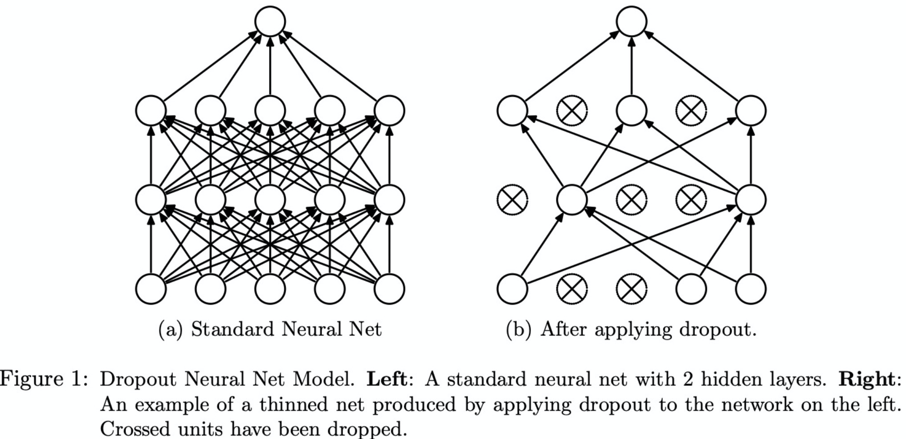

在看论文或代码的时候看见dropout，只需要当作线性层或者FC层处理就行。

##### 卷积层(Convolutional layer)
卷积层是针对图像等二维输入数据研发出来的一种层。使用了卷积层的神经网络称为**卷积神经网络(Convolutional Neural Network,CNN)**。
###### 卷积层的输入
在通常的情况下，我们会将图像的像素点进行颜色编码之后投入到卷积层进行训练。颜色编码根据灰度可以选择0\~255.如果是黑白图，那每一个像素点只有灰度。假如说图片是32像素点\*32像素点(长32个像素点，宽32个像素点)的，那么我们把图片处理为32\*32的矩阵，里面的数字是0\~255.如果这张图片是彩色的(一般是RGB三通道配色，如果用过PS应该很熟悉)，那么一张图片就会被处理成3个32\*32的矩阵的堆叠。实际情况下，是32\*32的板子，上面每一个格子里又是一个3个元素的列表，分别表示R,G,B的色度。大概就像下面这个这样：
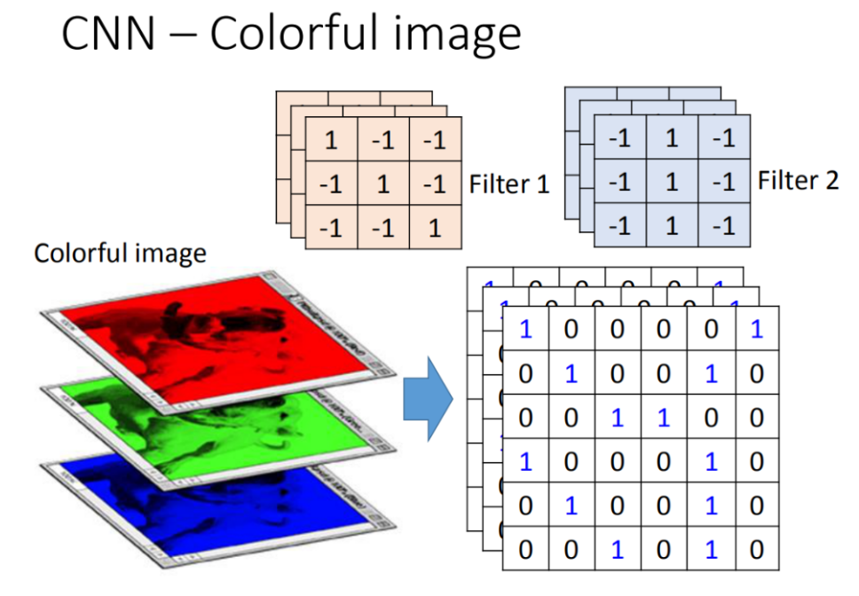

当然了，你也可以使用自己的方式来对图片编码，比如说黑白图片，你可以用1表示纯黑，0表示纯白，0\~1表示灰度等等。卷积神经网络只要求你输入2维以上的、规则的矩阵。
###### 卷积层的计算方式
顾名思义，卷积层的计算方式是求**卷积**。我们记得在信号课堂上，老师介绍过卷积是$$\int f(\tau)g(x-\tau)d\tau$$
此外，还有一种卷积适用于离散情况：$$y(n)=\sum_{i=-\infty}^{\infty}x(i)\cdot h(n-i)$$
在这个情况下，我们可以看见$x(i)$取遍了所有的值，最后得到了$y(n)$在一个地方的值。我们可以理解为，$y(n)$在点$n$处存在一个核$h(n)$，在卷积神经网络中，这个核被称为**卷积核**。卷积核在计算过程中不断地平移，与它所在的位置$n-i$互补的$x_i$会被拿来计算，也就是，做一次乘积操作，然后存起来。暴露在卷积核面前的$x$被称为是卷积操作中的**窗口**。$h(n)$不断平移，期间不停地和每一个$x_i$做乘法，在它走遍整个定义域之后，我们把存放的这些乘积相加，就得到了$y(n)$的值。

这种用一个卷积核h将输入函数的所有值映射到输出函数中的一个值，非常像一维卷积神经网络的卷积过程。只不过，CNN中是用一个卷积核h将输入函数的**部分值**映射到输出函数中的一个值。
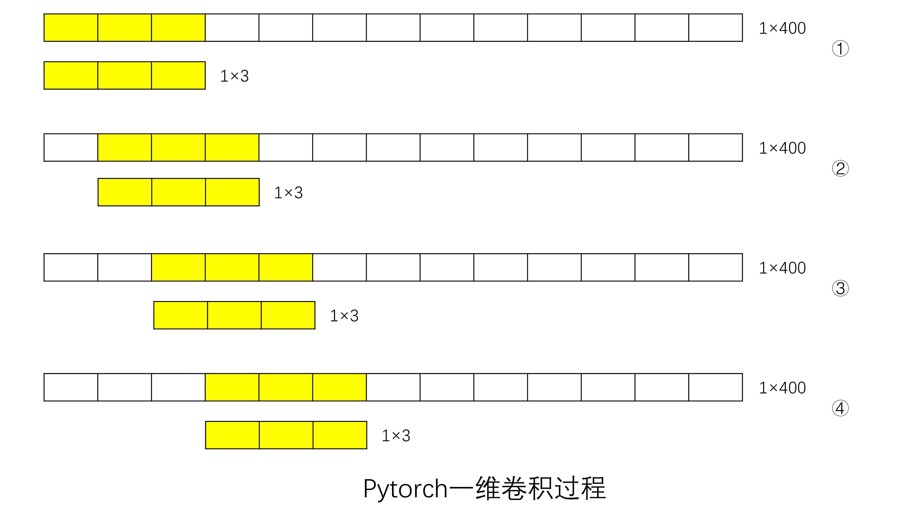
一维卷积层输入的是一个向量$x$，输出是另一个向量$y$。$y$中的每一个位置都有对应的卷积核$h$，$h$是一个长为3的向量，它一次对三个$x_i$的窗口执行相乘相加操作，得到了$y$对应坐标的值。$h$走遍整个$x$之后，就得到了整个输出向量$y$。看，是不是很像数学上的卷积呢？
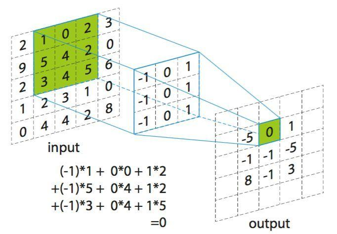
我们用相同的思考方式，将卷积从一维拓展到二维。二维卷积层的输入是一个矩阵$x$,输出是另一个矩阵$y$，y的每一个位置都有对应的卷积核$h$，$h$是一个3*3的矩阵，它一次对$x$中相邻的9个$x_{i,j}$形成的窗口执行相乘相加操作，得到$y$在特定位置的坐标的值。$h$先水平运动，当碰到边缘的时候跳到下一行的开头，然后继续运动。当$h$走遍整个$x$之后，我们就得到了整个输出的矩阵$y$。
###### 卷积层的其他特征
到此，卷积神经网络的核心就介绍完毕了。但是要注意，这只是最基本的网络架构。实际操作中，我们还会在单纯卷积的基础上做一些优化修改。下面简要介绍一些常用的方法。
- 设置多个卷积核：有时候，为了增加可表示关系的多样性，我们会同时用多个卷积核。这些核的设置有两种方式：第一种是，这些卷积核总是处在相同的位置，对相同的一系列$x_{i,j}$做加乘操作，之后再把它们相加（或者求平均等等），得到输出矩阵在某一点的值；第二种是，这些卷积核并行运行，各自控制着输出矩阵$y$的每一层，这样直观上看，$y$就不只是一个二维的矩阵了，也可以认为“变厚了”。下图中，左边的三个卷积核控制输出矩阵上面那一层的值，右边的三个控制下面那一层的值。
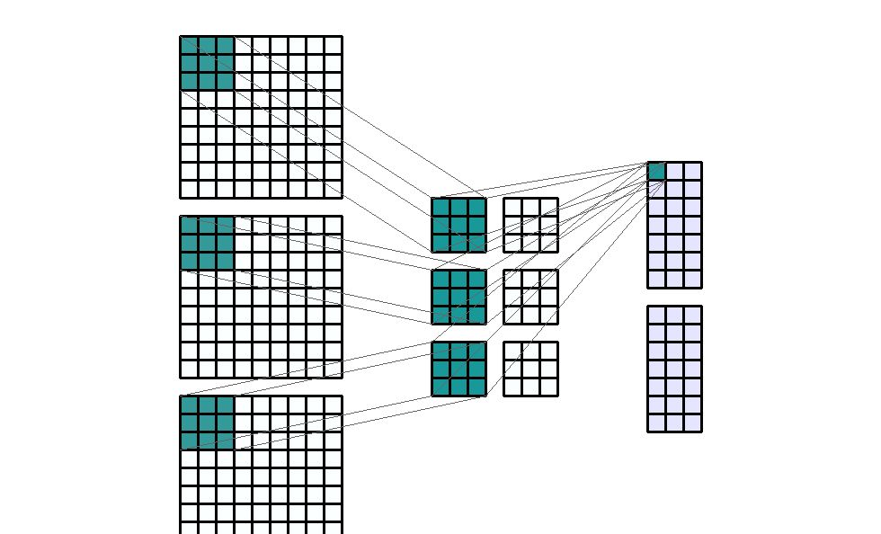

- Padding：想必大家能够想到，在卷积的过程中，靠中间的$x$可能被算好几次，但最开头和最结尾的一些$x$可能只被拿过来算了一两次。这样逻辑上存在一些问题，因为大多数情况下它们都是平等的。所以我们要确保每一个点被拿来计算的次数相同。我们通过在首尾添加无意义的填充值(padding)来确保卷积核能够同样多地覆盖到每一个$x$上。padding要在外围填多少值不仅仅取决于卷积核的大小，还取决于卷积核移动的**步长（stride）**，具体的计算方法这里就不展开说啦。总之，只要你希望你的卷积核平等地遍历到每一个值，你就能自己添加属于你的padding。
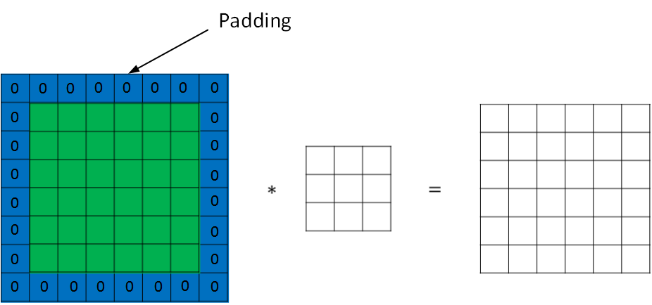

有关卷积层的论述，[这篇博客](https://zhuanlan.zhihu.com/p/35083956)讲的不错，感兴趣可以看一下。
##### 池化层(pooling)
池化层的作用是降低卷积层的维度。池化层与卷积层的关系，就如同全连接层与激活层之间的关系。它们都是紧密连接、不可分割的。

为什么要进行池化操作呢？回顾一下卷积层，可以发现它存在几个弱点：
1. 虽然卷积核把若干值映射到一个值，但是每一个点都参与运算多次，输出矩阵的规模与输入是相近的。这样一来计算量一直都很大。
2. 此外，卷积的过程可以认为是**汇聚特征**的过程，只不过汇聚的程度仅仅限于几个$x$，不够集中。
3. 如果只通过卷积层汇聚特征，那么可学习的参数将会很多，函数复杂性非常高，在训练充分的情况下可以学到数据中极其刁钻的关系，这就使得模型换场景就没法用了，也就是我们说的，容易过拟合。
4. 如果训练不够充分，那么这么多的参数可能有些根本没啥用，有时也可能因为数据匮乏导致许多参数都表征相同的信息。这时带来的高计算量是无意义的。这叫做*信息冗余*。

池化层就是为了解决这些问题而出现的。
- 首先，池化层很小，所以可学习的参数也很少，不仅计算量低，而且难出现过拟合。
- 其次，池化层在做的事情也是汇聚特征，但是因为它非常小，所以它把卷积层输出的很大一个区域的特征做了汇总：这就像人在看画一样，我们不止要近距离仔细观察画的每一个局部，还要适时地离远一些，欣赏整幅画的布局编排。池化就是在做这件事情。
- 再次，在图片相似度比较高的时候（例如物体移位、旋转），池化的结果也几乎不会发生改变。这一定程度上也意味着池化能让机器做出更接近人的判断。
###### 池化层的工作方式
池化虽然目的就是降低维度，但是有很多种计算的方式。这里我们只介绍最常用的两种方式：最大池化(max-pooling)和平均池化(average-pooling)。如果要详细理解池化，可以参考[这篇博客](https://zhuanlan.zhihu.com/p/393761765)。

- 最大池化：把卷积层划分成几个大区域，然后取这些区域的最大值组合成一个新的矩阵作为池化层的输出。
- 平均池化：把卷积层划分成几个大区域，然后取这些区域的平均值组合成一个新的矩阵作为池化层的输出。

池化层的**窗口**跟卷积层中的窗口类似。只不过，卷积层中的窗口是要拿来做一次卷积运算，池化层的窗口是要拿来取一次最大值或者平均值。

另外，池化同样也有步长(stride)的设置，控制的是每隔多远求一次最值或平均值。

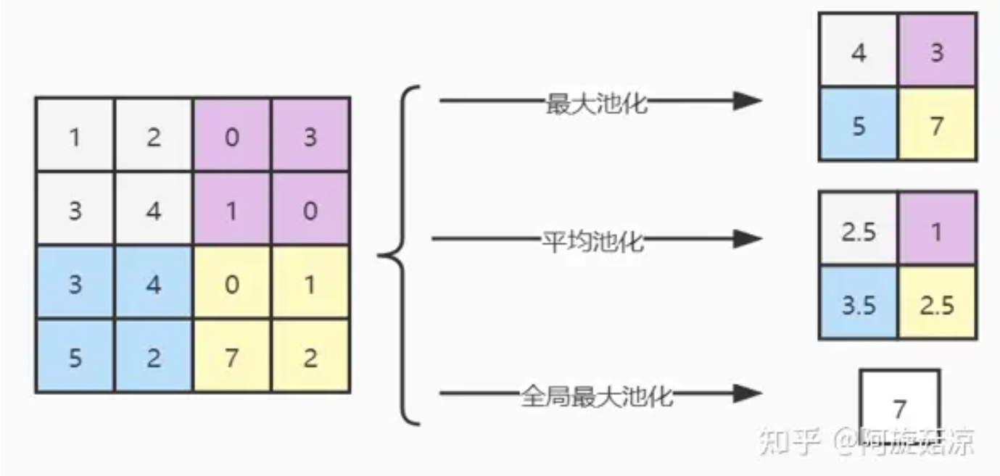
##### 批归一化层(Batch Normalization,BN)

详细的解释和推导请查看[这篇博客](https://blog.csdn.net/qq_42118719/article/details/113544673)。
不知大家是否发现，在模型的训练中有这样一个隐藏的问题：

第一个数据输入模型执行了前向传播和反向传播，其中模型中某一层的参数$W^{(t)}_i$被更新成$W^{t+1}_i$，它是根据它前面那一层$W^{t}_{i-1}$的输出来更新的。在第二个数据输入的时候，$W^{t}_{i-1}$已经更新成$W^{t+1}_{i-1}$了，那么也就意味着它的输出**分布发生改变了**。这个时候，$W^{t+1}_i$基于新的分布进行更新，也就反向说明其之前基于旧的分布做更新收效甚微。网络刚刚才适应学习了这种分布，然而下一个批次又需要学习另一种分布，像这样“推倒重来”的学习过程很不稳定，从而导致**收敛速度降低**。“内部协变量转移(Internal Covariate Shift，ICS)”就是在描述这种问题。

为了解决这个问题，我们需要让模型的一些层时刻接受到的输入都具有相同，或者至少相近的分布。为此我们在这些层的前面和后面添加一个层，来调整输入和输出的分布。一般我们直接使用**归一化层**，也就是运用基本的统计学知识，将输出的所有数字归一化成标准正态分布。归一化就是“减均值除标准差”。$$x_i^*\leftarrow \frac{x_i-\mu_B}{\sqrt{\sigma^2+\epsilon}}$$

添加了归一化层之后，模型的层就总是接受处于标准正态分布的数据了，也就避免了ICS的发生。不需要再做修改了吗？

我们说，标准正态分布就是均值为0，方差为1的分布。但是实际情况下，大部分数据都非常不像标准的正态分布。可能每一个数据都很大，分布都很分散；而且大多数数据分布肯定不像标准正态那样对称。如果粗暴地使用归一化处理，容易导致拟合的分布跟原先完全不是一个东西，这样其实不利于模型像人一样学习到可能有用的信息（因为到手的东西都变了，你还知道你要分析的是什么吗？）。

为此，我们的BN层还引入了两个可学习的参数$\gamma,\beta$,来给生成的标准正态分布进行尺度变换和偏移，以让分布不那么对称和标准，从而显得更加接近原始的数据分布。$$x_i^*\leftarrow \frac{\gamma(x_i-\mu_B)}{\sqrt{\sigma^2+\epsilon}}+\beta$$

这两个参数在训练中不断更新，随着梯度的下降，这两个参数会帮助预测结果逐渐变得更准确，这时候其实这个BN层得到的分布是更加接近原始数据的分布的。

BN层通常放在池化层、激活层、卷积层的前面。当看见的时候，我们知道它调整了输出数据的分布，从而加速结果梯度的下降。
#### 神经网络实例的分析
我们最后来一个简单神经网络稍微分析一下，加深对刚才知识的理解。
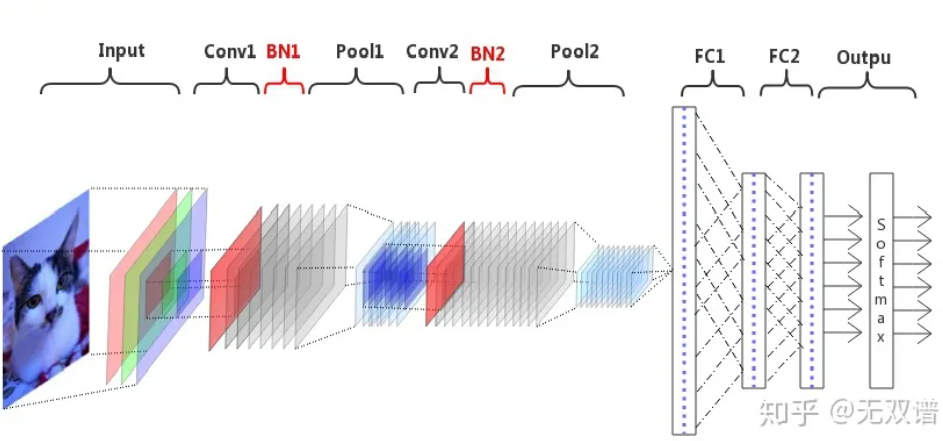
上图是我在网上随便找的一个做图像分类的卷积神经网络架构图，里面的元件还算多样。
首先，我们在输入层(Input)把一张图片按照R,G,B三色通道进行颜色编码（可以参考我们刚才在卷积层说的方法），然后投入到第一个卷积层(Conv1)进行卷积运算。可以看出Conv1里面有3*8=24个卷积核，因为从图中看出，每一个通道都有单独的一个卷积核，这些卷积核的计算结果会放到同一层，而这里一共画了8层。

Conv1的输出连接了一个批归一化层BN1，用来调整分布。之后投入到第一个池化层Pool1进行池化，特征图的尺寸明显缩小了。而层数并没有发生变化。

之后，我们把池化层的特征图输出到第二个卷积层Conv2中，使用相同的方法计算出，这个卷积层一共有8*14=92个卷积核。之后我们再使用池化操作来降低尺寸。

不知大家是否感受到了池化的作用。每经历一次卷积，特征图就会变得越厚。所以如果不池化，参数量将会大幅增加，这样一做深，再好的机器也受不了。同时，通过这种缩小变厚，让特征之间充分地融合、沟通，这也是为什么模型能够找到人类总结不出特征的原因和优势。

我们现在，将Pool2的输出展平成一维，然后经过第一个全连接层FC1，稍微缩小了一点向量的长度。然后又使用第二个输出维度不变的全连接层FC2，让特征进行最后一次充分混合。虽然没有画出来，我们当然也可以在这两个层的后面添加激活函数层。因为接下来就要接softmax了，所以推知FC2的长度就是待分类的类别数。

最后，我们通过一个Softmax层（它不改变维度）将输入的向量转化为一个概率分布，每一个概率就表示每一个类别被当作预测结果的可能性。现在就可以通过查看概率输出结果啦！

采样的方法有两种：**贪心采样**：直接把概率最高的那个作为预测结果输出；**随机采样**：基于这个softmax分布进行一次抽样，将抽到的结果作为预测结果输出。

### 4.总结
讲到这里，我们就大致梳理完神经网络的基本知识了。不过，这还只是冰山一角，因为这个介绍的出发点是为了让我们更好地理解EDA使用的机器学习技术，除了使用最频繁的卷积神经网络，我们还有适用于处理文本的循环神经网络RNN、搭载了遗忘门的循环神经网络LSTM（能够重点关注到离自己较近的上下文）、以及近五年几乎最热门的文本处理模型transformer极在其上发展的预训练大模型bert,bart,gpt,glm....

与图像分类预测有关的网络还有CLIP,BLIP，InstructBLIP等更加精确的多模态网络，以及时下很火的文生图扩散模型网络、甚至是前两天引爆世界的另一颗炸弹GPT4-v（虽然是多模态语言模型，但一出手就打败了之前的SOTA模型MMICL，BLIP等，成为新的榜首）。

除了图像和文本，我们还研制出能够接受一切稀奇古怪形式输入的神经网络：图神经网络GNN,图卷积神经网络GCN，因为一切事物都能表示成图...

除了多种多样的网络，我们基于这些基本的网络也拼出了各种各样的优秀模型架构。合适地选取模型的维度、超参数、层数，这些都是理论无法说明的事情，需要我们自己去实践和体会。

但是就目前来看，我们掌握的知识几乎已经足以解决EDA比赛中可能碰见的一切深度学习的模型了，所以，don't worry!但如果你对深度学习产生了一些想法或兴趣，那么我们可能才刚刚开始！
